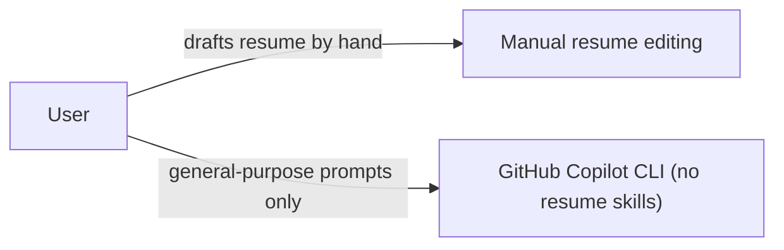
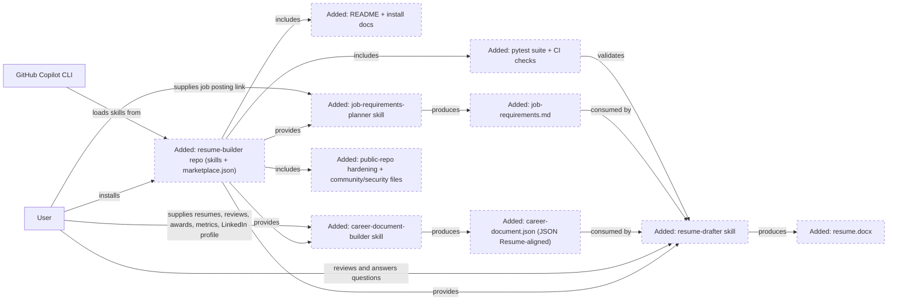
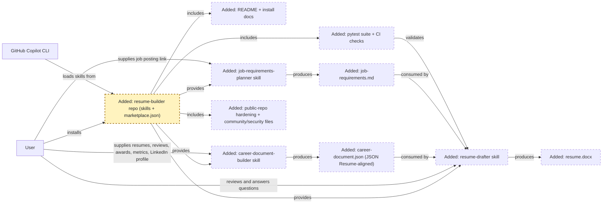
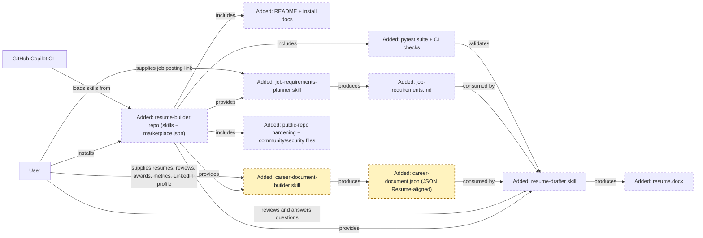
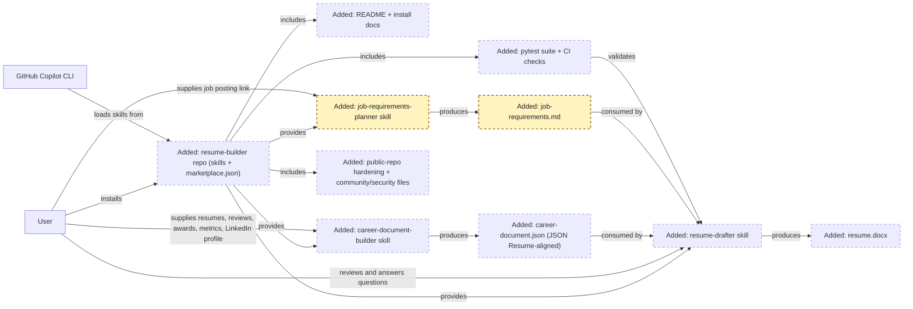
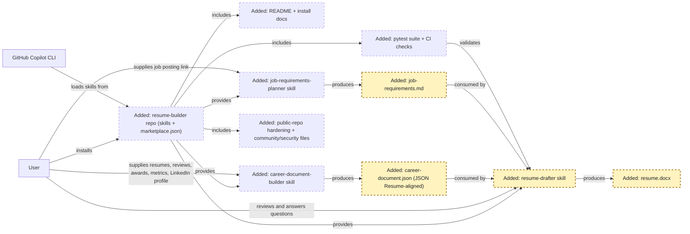
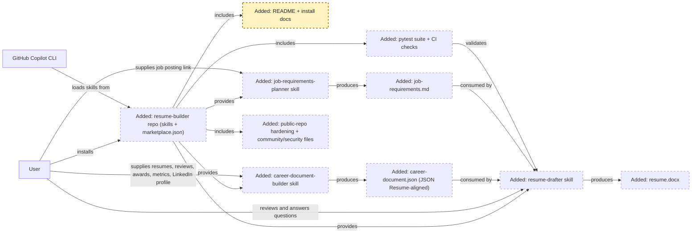
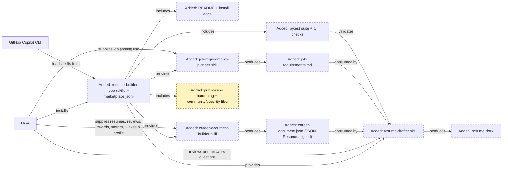
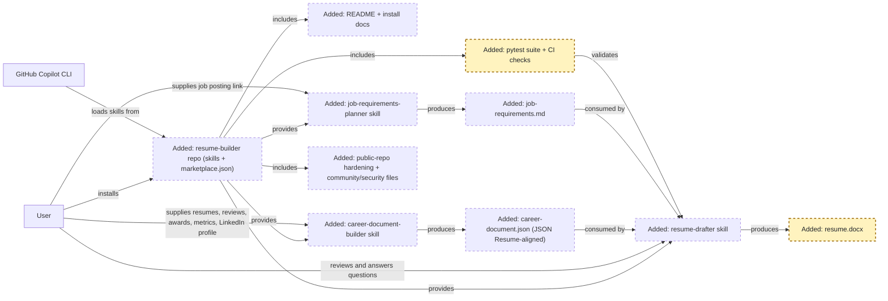

<!-- markdownlint-disable-file -->
# RPI Plan: Copilot CLI resume-building plugin

## Task Metadata

* Task ID: copilot-cli-resume-plugin
* Task slug: copilot-cli-resume-plugin
* Plan date: 2026-09-18

## Executive Summary

* Bottom line: This plan produces a new, user-owned, public GitHub repository named `resume-builder` that ships a GitHub Copilot CLI plugin with three Agent Skills — a career-document builder, a job-requirements planner, and a resume drafter — installable both as plain `.github/skills` and as an `hve-core`-style `marketplace.json` plugin bundle. The three skills mirror a research → plan → implement workflow: skill 1 gathers and verifies career evidence, skill 2 decomposes a job posting into requirements, and skill 3 drafts a Word resume that only uses what the career document actually supports. Because the repository is public, the plan also hardens it with GitHub's free security features, adds standard community-health/security assets, and adds automated `pytest`/CI test coverage so the user can safely iterate on future builds.
* Why this matters: The user wants a repeatable, trustworthy way to build resumes without an AI assistant inventing experience, and the plan's anti-fabrication and clarifying-question requirements are load-bearing across all three skills, not just the resume drafter. Because the user intends to share this repository publicly, hardening and community assets are equally load-bearing — an unhardened public repo with unclear licensing or no vulnerability-reporting channel would undercut the goal of sharing it responsibly.
* Planning result: Complete. Planning Readiness: Ready.
* Confidence and uncertainty: High confidence on packaging, schema, job-data-acquisition approach, and public-repo hardening/community-asset scope (confirmed by user decision and research). Medium confidence on exact JSON Resume schema extensions and `.docx` template styling, which are reasonably left to implementer judgment within the stated constraints. Branch-protection strictness (D7) and the depth of future eval-based testing beyond `pytest`/CI (D8) are explicitly deferred, proportionality-based calls rather than gaps in evidence.

### What You May Not Know

* The three skills are not independent utilities — they form a pipeline. The career-document builder's output (a JSON Resume-aligned file) and the job-requirements planner's output (a structured requirements list) are both consumed as input by the resume drafter. Phase sequencing in this plan reflects that dependency.
* JSON Resume's schema explicitly allows `additionalProperties: true` at every level (it is a JSON Schema, not a closed format), so extending it with fields for performance-review excerpts, award citations, and metric provenance is a supported, low-risk approach rather than a schema violation.
* No GitHub-official "plugin marketplace" format exists for Copilot CLI today; the `.github/plugin/marketplace.json` this plan uses is a convention this session's `hve-core` plugin already demonstrates working, not a guaranteed-forward-compatible GitHub standard. The plan still ships plain `.github/skills` as the primary, standards-based install path so the plugin works even where the bundle format is not recognized.
* The job-requirements planner does not scrape or crawl. It processes exactly one user-supplied link at a time through the CLI's own browser/computer-use tooling, the same access pattern as a human reading the page. This is a deliberate constraint carried through from research, not an implementation shortcut.
* GitHub's core hardening features (secret scanning with push protection, Dependabot, CodeQL, dependency graph, branch protection) are free on any public repository — none require an organization or a paid plan, so P06 does not add cost, only setup.
* The critique gate for this task was already consumed by the first planning pass (Revise verdict, resolved). Per the skill's one-shot critique-gate rule, adding P06/P07 in this second planning pass did not trigger — and could not trigger — a new critique dispatch; the new scope was reviewed through direct planner judgment instead, as recorded in Critique Disposition.

## Phase Checklist

### Before

<!-- Greenfield: no plugin repository exists yet. Shown here is the user's current unassisted process. -->



### After



Adds a `resume-builder` repository whose three skills form a pipeline: the career-document builder and job-requirements planner each produce an input artifact, and the resume drafter combines both into a Word resume without inventing unsupported claims. The repository is public, carries the standard GitHub public-repo hardening and community/security assets, and ships an automated `pytest` suite plus CI structural checks so future changes can be validated repeatably.

<!-- rpi:phase id=P01 -->
### [x] P01: Establish the repo scaffold and dual install packaging

Goals:
* A new repository structure exists that can host all three skills and is installable both as plain Agent Skills and as a named plugin bundle, before any skill content is authored.
* Shared conventions (the JSON Resume-aligned career-document schema, the job-requirements artifact contract, and the anti-fabrication contract) are defined once and referenced by every skill that needs them, instead of being redefined or left ambiguous per skill.

Dependencies:
* None



Highlighted work: create the `repo` scaffold (directories, manifest, shared conventions) that every later phase builds inside.

<!-- rpi:task id=P01-T01 -->
#### [x] P01-T01: Create the repository directory structure

Goals:
* A local Git repository named `resume-builder` exists on disk with the directory layout the remaining phases populate, and a corresponding GitHub repository and project/session are ready for implementation to push into.

Requirements:
* FR-005: repository installable both as plain Agent Skills and as a plugin bundle
* Directory layout must place each skill directly under `.github/skills/<skill-name>/SKILL.md` with no extra namespace layer between `skills/` and the skill directory, matching the officially documented discovery contract exactly (research W6: `.github/skills/<skill-name>/SKILL.md`), rather than the nested `hve-core`-style family-folder grouping, since no supplied evidence confirms that nesting is recognized by the standard skills loader:
  ```text
  resume-builder/
    .github/
      skills/
        career-document-builder/
          SKILL.md
          templates/
        job-requirements-planner/
          SKILL.md
          templates/
        resume-drafter/
          SKILL.md
          templates/
          scripts/
      plugin/
        marketplace.json
    docs/
      shared/
        career-document-schema.md
        job-requirements-schema.md
        anti-fabrication-contract.md
    README.md
    LICENSE
  ```
* Shared cross-skill conventions (schemas, the anti-fabrication contract) live under the top-level `docs/shared/` directory, outside `.github/skills`, so they are unambiguously not mistaken for a fourth skill and are not subject to per-skill discovery rules. Each skill's `SKILL.md` links to the relevant `docs/shared/*.md` file(s) by relative path.

Details:
* Use `create_project` (or the equivalent GitHub repo creation flow available to the implementer) to create a new GitHub repository named `resume-builder`, then create a matching local project/session so the working tree is a real Git checkout rather than a folder session.
* Initialize with a permissive open-source license (for example MIT, matching the `hve-core` skills this plan patterns from) unless the user specifies otherwise at implementation time; record the choice in the changes record if it is not MIT.
* Do not create the three `SKILL.md` files yet — later phases own that content. This task only needs the directories and placeholder `references/`/`templates/` folders to exist so those phases have somewhere to write.

References:
* `.github/plugin/marketplace.json` and `.github/skills/hve-core/hve-builder/SKILL.md` in the locally installed `hve-core` plugin (absolute paths under `/Users/benarculus/.copilot/installed-plugins/hve-core/hve-core/`): external reference structure to model the new repo's layout after; not part of this repo and not linkable by workspace-relative path.
* [.copilot-tracking/research/2026-09-18/copilot-cli-resume-plugin-research.md](../../research/2026-09-18/copilot-cli-resume-plugin-research.md):
  * "GitHub Copilot CLI's real extensibility surface is Skills, Custom Agents, and MCP servers" under `## Findings` establishes why `.github/skills/<name>/SKILL.md` is the required discovery contract.

Dependencies:
* None

<!-- rpi:task id=P01-T02 -->
#### [x] P01-T02: Author the plugin manifest and top-level README

Goals:
* The repository is installable as a named plugin bundle (mirroring the `hve-core` pattern already proven in this environment) in addition to plain skill discovery, and a new user can find and install either path from the README alone.

Requirements:
* FR-005: repository installable both as plain Agent Skills and as a plugin bundle
* NFR-004: a new user can install and invoke all three skills using only the repo's README, without needing support from the plugin authors
* `.github/plugin/marketplace.json` must declare `name`, `metadata.description`, `metadata.version`, `owner`, and a `plugins[]` entry with `name`, `source` (`.`), `description`, `version`, `author`, `license`, and `keywords`, matching the field set demonstrated in the `hve-core` manifest.

Details:
* Model the manifest directly on the structure already inspected in `hve-core`'s `.github/plugin/marketplace.json` (name/metadata/owner/plugins array), adjusting `name`, `description`, `keywords` (for example `resume`, `career`, `copilot-cli`, `skills`), and `author`/`repository`/`homepage` to the new repo.
* The README must document both install paths side by side: (1) copying or cloning each `.github/skills/<skill-name>/` directory into a consumer's own `.github/skills` (or `~/.copilot/skills`) per the standard Agent Skills mechanism, and (2) installing the whole repo as a plugin bundle the way this session's `hve-core` plugin was installed.
* State plainly in the README that the `marketplace.json` bundle format is this app's convention, not a GitHub-official spec, so users understand the plain-skills path is the more portable option if the bundle format ever changes.
* Include a short "How the three skills fit together" section in the README describing the research → plan → implement pipeline (career document → job requirements → resume draft), since a new user encountering three separate skills needs that framing before running any of them.

References:
* [.copilot-tracking/research/2026-09-18/copilot-cli-resume-plugin-research.md](../../research/2026-09-18/copilot-cli-resume-plugin-research.md):
  * "`hve-core` demonstrates a working plugin bundle pattern this repo can reuse" under `## Findings` for the manifest field set and its non-official status.
  * C1 and C2 in `### Evidence Log` for the exact inspected file paths and field names.

Dependencies:
* P01-T01

<!-- rpi:task id=P01-T03 -->
#### [x] P01-T03: Define the shared career-document schema, job-requirements contract, and anti-fabrication contract

Goals:
* One canonical, JSON Resume-aligned career-document schema, one canonical job-requirements artifact contract, and one canonical anti-fabrication/clarifying-question contract exist in the repo so the career-document builder (P02), job-requirements planner (P03), and resume drafter (P04) reference the same rules and interchange formats instead of each restating or reinventing them.

Requirements:
* FR-001, FR-002, FR-003, FR-006, NFR-001
* The career-document schema must extend JSON Resume's `basics`, `work`, `education`, `awards`, and `skills` sections (JSON Resume permits `additionalProperties: true` throughout) with at least: a `performanceReviews` array (excerpt, date, reviewer role, source document), an `awards` entries' `citation` field for verbatim award-citation text, and a `metrics` array (statement, value, source, verification note) so metrics carry their own provenance separate from prose bullets.
* The job-requirements artifact contract must fix a deterministic structure the resume drafter can parse without guessing: a stable set of top-level sections at minimum for `required qualifications`, `preferred qualifications`, `responsibilities`, and `constraints` (compensation, level, location when stated), each entry retaining a pointer back to its source link, expressed as either a JSON schema or a fixed-heading Markdown template — the planner is free to choose the concrete syntax as long as it is one fixed, documented shape both P03 and P04 build against.
* The anti-fabrication contract must state, as a binding rule any consuming skill can cite: a skill must not add a claim, number, title, or accomplishment to any output document unless it traces to a specific entry in the career document, a specific requirement from the job-requirements artifact, or an explicit answer the user gave in the current conversation.

Details:
* Place these as shared reference documents under `docs/shared/` (`career-document-schema.md`, `job-requirements-schema.md`, `anti-fabrication-contract.md`) rather than duplicating the rules inside each skill's own `SKILL.md`, so a future schema or contract change is a single edit; each skill's `SKILL.md` links to the relevant file(s) by relative path (for example `../../../docs/shared/anti-fabrication-contract.md` from `.github/skills/<skill-name>/SKILL.md`).
* Fetch or otherwise obtain the current JSON Resume schema (`https://github.com/jsonresume/resume-schema`) as the starting structure for the career-document schema, and clearly mark which properties are JSON Resume's own versus this plugin's additions, so the document stays distinguishable from the upstream standard as it evolves.
* JSON Resume's companion job-description schema is a reasonable starting point for the job-requirements contract but is less mature than the resume schema (per research); adapt it freely rather than treating it as binding, as long as the result is one fixed, documented shape.
* The anti-fabrication contract should explicitly cover the resume drafter's hardest case: when a job requirement has no supporting career-document entry, the contract requires the skill to say so and ask the user rather than writing a plausible-sounding but unsupported bullet.

References:
* [.copilot-tracking/research/2026-09-18/copilot-cli-resume-plugin-research.md](../../research/2026-09-18/copilot-cli-resume-plugin-research.md):
  * "A `machine-friendly career document` should align with the existing JSON Resume open standard" under `## Findings` for the rationale and the `additionalProperties: true` extensibility basis.
  * D4 in `## Decisions and Feedback` for the proposed anti-fabrication design pattern this task formalizes.
* [.copilot-tracking/reviews/plans/2026-09-18/copilot-cli-resume-plugin-plan-critique.md](../../reviews/plans/2026-09-18/copilot-cli-resume-plugin-plan-critique.md):
  * PC-002 identified the missing job-requirements contract this task now includes.

Dependencies:
* P01-T01

<!-- rpi:phase id=P02 -->
### [x] P02: Author the career-document-builder skill

Goals:
* Running this skill against a user's previous resumes, performance reviews, award citations, metrics, and LinkedIn profile produces one accurate, JSON Resume-aligned career document, with the skill asking clarifying questions whenever source material is ambiguous or incomplete instead of guessing.

Dependencies:
* P01



Highlighted work: author the `career-document-builder` skill and the `career-document.json` output it produces.

<!-- rpi:task id=P02-T01 -->
#### [x] P02-T01: Author the career-document-builder `SKILL.md`

Goals:
* A `SKILL.md` exists that tells Copilot CLI how to ingest previous resumes, performance reviews, award citations, metrics, and a LinkedIn profile, ask clarifying questions for anything ambiguous, and emit a career document conforming to the shared schema from P01-T03.

Requirements:
* FR-001, FR-006, NFR-001, NFR-003
* Frontmatter must include required `name` (`career-document-builder`) and `description` (stating what it does and when Copilot should use it), plus `license` naming the repo's chosen license; add `allowed-tools` only for any bundled script this skill ends up needing (none is anticipated for this skill, since it is primarily an interview-and-synthesis workflow rather than a script-driven one).
* The skill's flow must explicitly instruct: accept whatever mix of source materials the user provides (resume files, performance review text or files, award citation text, metrics, and a LinkedIn profile export or pasted content), extract candidate facts, and for every fact that is ambiguous, conflicting between sources, or simply missing, ask the user a clarifying question rather than inferring an answer.
* The skill must refuse to silently drop a user-supplied fact and must refuse to add any fact not present in the supplied materials or an explicit user answer.

Details:
* Base the frontmatter and body structure on the pattern already used by this environment's `rpi-research` and `hve-builder` skills (`name`, `description`, `argument-hint`, `license`, `user-invocable`, a `## Goal`, `## Flow`, `## Inputs`, `## Success Criteria`, `## Constraints` structure) for consistency and readability, adapted to this skill's much narrower, single-purpose scope.
* Because LinkedIn profile ingestion is in scope for this skill (distinct from P03's job-posting ingestion), instruct the skill to accept a user-provided export or pasted profile content directly rather than attempting to fetch or browse LinkedIn itself; the browser/computer-use ingestion pattern is reserved for the job-requirements planner (P03), not this skill, since a LinkedIn profile is personal data the user already controls and can provide directly.
* Have the skill write its output using the P01-T03 schema and validate at a basic structural level (required top-level `basics` present, every custom-extension array item has a `source` pointer back to the originating input) before presenting the result to the user for final review.
* The implementer may reasonably decide the exact clarifying-question phrasing and interview sequencing; the plan does not prescribe a fixed question script.

References:
* [.copilot-tracking/research/2026-09-18/copilot-cli-resume-plugin-research.md](../../research/2026-09-18/copilot-cli-resume-plugin-research.md):
  * "Executive Summary" and the original user request context for the ingestion sources this skill must support.
* `docs/shared/career-document-schema.md` (created in P01-T03): the schema this skill's output must conform to.
* `docs/shared/anti-fabrication-contract.md` (created in P01-T03): the binding no-invention rule this skill must follow.

Dependencies:
* P01-T03

<!-- rpi:task id=P02-T02: (folded into P02-T01; schema authored in P01-T03) -->

<!-- rpi:phase id=P03 -->
### [x] P03: Author the job-requirements-planner skill

Goals:
* Running this skill against a job posting link (and any optional supplementary reference links the user provides, such as a LinkedIn post announcing the role) produces a structured, resume-ready requirements list, using the CLI's browser/computer-use tooling to render and extract exactly the pages the user names, one at a time.

Dependencies:
* P01



Highlighted work: author the `job-requirements-planner` skill and the `job-requirements.md` output it produces.

<!-- rpi:task id=P03-T01: Author the job-requirements-planner `SKILL.md` and browser-ingestion instructions -->
#### [x] P03-T01: Author the job-requirements-planner `SKILL.md` and browser-ingestion instructions

Goals:
* A `SKILL.md` exists that accepts a job-posting link (and optional supplementary links) from the user, retrieves each page's rendered content through the CLI's own browser/computer-use tooling one link at a time, and decomposes the visible text into a structured, resume-ready requirements list.

Requirements:
* FR-002, FR-006, NFR-002, NFR-003
* Frontmatter must include required `name` (`job-requirements-planner`) and `description`, plus `license`; declare `allowed-tools` only for the browser/computer-use tool(s) actually needed, so the skill's own permission surface matches what NFR-002 allows.
* The skill must accept exactly one job-posting link and zero or more optional supplementary links (for example a LinkedIn post sharing the announcement) supplied directly by the user, and must process each link individually as a normal page load, never crawling, following unrelated links, or batching multiple postings automatically.
* Output must conform to the shared `docs/shared/job-requirements-schema.md` contract (defined in P01-T03), distinguishing at minimum required qualifications, preferred/nice-to-have qualifications, responsibilities, and any explicitly stated compensation, level, or location constraints, each retaining a pointer back to the source link it came from.

Details:
* Reuse this environment's computer-use browser tooling contract as the ingestion mechanism: the skill instructs the CLI to open the exact user-supplied URL, read the rendered page state, and extract visible text — mirroring ordinary human browsing rather than a bot-style fetch, consistent with the research finding on avoiding anti-bot-bypass techniques.
* Explicitly instruct the skill not to store or forward more than the single posting (and any explicitly supplied supplementary links) the user references in the current conversation, and not to attempt automated crawling of the source site beyond the given link.
* When a link fails to load or renders paywalled/blocked content, the skill should tell the user and ask for the visible text to be pasted directly, rather than attempting to bypass the block.
* Emit output in the exact shape `docs/shared/job-requirements-schema.md` defines; do not improvise an alternate structure, since P04's resume drafter parses this artifact deterministically against that same shared contract.

References:
* [.copilot-tracking/research/2026-09-18/copilot-cli-resume-plugin-research.md](../../research/2026-09-18/copilot-cli-resume-plugin-research.md):
  * "Assisted, link-directed browser capture is the safer design for job-posting ingestion" under `## Findings` for the ingestion approach and its risk rationale.
  * W4 in `### Evidence Log` for the LinkedIn terms/litigation context this design avoids.
* `docs/shared/anti-fabrication-contract.md` (created in P01-T03): applies here too — the requirements list must state only what the posting or user actually said, not inferred seniority or scope beyond the text.
* `docs/shared/job-requirements-schema.md` (created in P01-T03): the fixed artifact contract this skill's output must conform to, so the resume drafter (P04) can parse it deterministically.

Dependencies:
* P01-T03

<!-- rpi:phase id=P04 -->
### [x] P04: Author the resume-drafter skill

Goals:
* Running this skill against a career document and a job-requirements list produces a Word (`.docx`) resume that maps career-document evidence to job requirements, explicitly reports requirements the career document does not support, and asks the user for more information through an interactive conversation instead of inventing or embellishing content.

Dependencies:
* P02, P03



Highlighted work: author the `resume-drafter` skill; both `career-document.json` and `job-requirements.md` feed into it, and it produces `resume.docx`.

<!-- rpi:task id=P04-T01 -->
#### [x] P04-T01: Author the resume-drafter `SKILL.md` with the anti-fabrication and interactive-clarification flow

Goals:
* A `SKILL.md` exists that reads the career document and job-requirements list, drafts a resume mapping evidence to requirements, and treats every unsupported requirement or missing detail as a prompt for the user rather than an assumption.

Requirements:
* FR-003, FR-006, NFR-001, NFR-003
* Frontmatter must include required `name` (`resume-drafter`) and `description`, plus `license`; declare `allowed-tools` covering the `.docx`-generation script from P04-T03.
* The skill's flow must, for each job requirement, either (a) cite the specific career-document entry or entries it maps to, (b) ask the user a clarifying question when a plausible mapping exists but is not certain, or (c) explicitly list the requirement as unmet in a visible "requirements not addressed" note, and it must never silently omit an unmet requirement or invent a bullet to cover it.
* The skill must run as an interactive conversation: it presents draft sections or open questions to the user and incorporates the user's answers before finalizing, rather than generating a complete resume in one pass without checkpoints.

Details:
* Cite and apply the anti-fabrication contract from P01-T03 directly rather than restating its rules inside this skill's own instructions, so the single source of truth stays in one place.
* Instruct the skill to structure its output resume with conventional sections (contact/basics, summary, experience, education, skills, and optionally awards/certifications), pulling section content only from career-document entries that map to at least one job requirement or that the user explicitly asks to include.
* When the user's career document lacks enough content to cover a requirement at all, the skill should say so plainly (for example, in a short "requirements this draft does not address" summary alongside the resume) instead of quietly leaving a thin resume with no explanation.
* Leave exact resume visual formatting (fonts, section ordering conventions, one-page vs. two-page defaults) to implementer judgment informed by common ATS-safe resume practices; this is illustrative guidance, not a binding contract.

References:
* [.copilot-tracking/research/2026-09-18/copilot-cli-resume-plugin-research.md](../../research/2026-09-18/copilot-cli-resume-plugin-research.md):
  * "A resume builder which takes information from the career document to satisfy the job requirements" context in the original user request, and the `## Recommendation and Alternatives` table entry rejecting fabrication-permitting designs.
* `docs/shared/anti-fabrication-contract.md` (created in P01-T03): the binding no-invention rule this skill enforces most directly.
* `docs/shared/job-requirements-schema.md` (created in P01-T03): the fixed artifact contract this skill parses P03's output against.
* `.github/skills/career-document-builder/SKILL.md` (created in P02-T01) and `.github/skills/job-requirements-planner/SKILL.md` (created in P03-T01): the two upstream output formats this skill must parse.

Dependencies:
* P01-T03, P02-T01, P03-T01

<!-- rpi:task id=P04-T02 -->
#### [x] P04-T02: Implement the `.docx` generation script

Goals:
* The resume-drafter skill can turn its finalized, user-approved resume content into an actual Microsoft Word (`.docx`) file without depending on any single host application's built-in document canvas, so the plugin works in a plain terminal Copilot CLI session.

Requirements:
* FR-004
* The script must accept the finalized resume content (structure to be defined by the implementer, for example a JSON or Markdown intermediate representation the skill produces) and emit a valid `.docx` file using `python-docx`.
* The skill's `allowed-tools` frontmatter (from P04-T01) must list whatever tool invocation (for example `shell`) is needed to run this script, following the documented Agent Skills `allowed-tools` pre-approval pattern.

Details:
* Add a Python script (for example `.github/skills/resume-drafter/scripts/build_docx.py`) using `python-docx`'s `Document()`/`add_paragraph()`/`add_heading()`/`save()` API to render the standard resume sections into a `.docx` file.
* Document the script's expected input shape and invocation directly in the skill's `SKILL.md`, per the standard Agent Skills pattern for skill-bundled scripts, including any dependency the consuming environment must have installed (`pip install python-docx`).
* Where this plugin later runs inside a host that offers a native Word canvas (as this chat app does), the skill may optionally mention that path as an alternative for that specific surface, but the script-based path must remain the default so the skill works in a plain terminal session.

References:
* [.copilot-tracking/research/2026-09-18/copilot-cli-resume-plugin-research.md](../../research/2026-09-18/copilot-cli-resume-plugin-research.md):
  * "`python-docx` is the practical, portable choice for generating the Word-format resume" under `## Findings`, and W7 in `### Evidence Log`.
  * The open question on script vs. native canvas under `## Risks and Open Questions`, resolved here in favor of the portable script as the default.

Dependencies:
* P04-T01

<!-- rpi:phase id=P05 -->
### [x] P05: Documentation and cross-skill validation

Goals:
* A new user can discover, install, and correctly sequence all three skills using only the repository's own documentation, and the repository's basic mechanical integrity (valid frontmatter, valid manifest, working script) is checked before the plugin is considered done.

Dependencies:
* P02, P03, P04



Highlighted work: finalize `docs` (README/install/usage) and validate the whole assembled repo.

<!-- rpi:task id=P05-T01 -->
#### [x] P05-T01: Finalize the README usage walkthrough

Goals:
* The README documents a complete end-to-end usage sequence (career document → job requirements → resume draft) so a new user knows what order to run the three skills in and what each one expects as input.

Requirements:
* NFR-004
* README must include: install instructions (both paths from P01-T02), a "Quickstart" walkthrough naming each skill invocation in sequence, and an explicit statement of the anti-fabrication guarantee (that the plugin will not invent resume content) so users understand the tool's behavior before using it.

Details:
* Keep the quickstart illustrative (example commands, not a rigid transcript) since exact invocation phrasing depends on final skill descriptions from P02–P04.
* Cross-link the README to each skill's own `SKILL.md` for detail rather than duplicating each skill's instructions in the README.

References:
* [.copilot-tracking/research/2026-09-18/copilot-cli-resume-plugin-research.md](../../research/2026-09-18/copilot-cli-resume-plugin-research.md): overall plugin framing carried into the README's introduction.

Dependencies:
* P01-T02, P02-T01, P03-T01, P04-T01

<!-- rpi:task id=P05-T02 -->
#### [x] P05-T02: Validate repository mechanics

Goals:
* The assembled repository's mechanical building blocks are confirmed to work: every `SKILL.md`'s frontmatter is well-formed, the plugin manifest is valid JSON matching the field set from P01-T02, and the `.docx` generation script runs successfully against a sample input.

Requirements:
* FR-005, FR-004, NFR-003
* Every `SKILL.md` frontmatter must include, at minimum, valid `name` and `description` fields, with `name` matching its directory name.
* `marketplace.json` must parse as valid JSON.
* `build_docx.py` (from P04-T02) must produce a non-empty, openable `.docx` file when run against one representative sample resume content payload.
* One representative job-requirements artifact produced against `docs/shared/job-requirements-schema.md`'s contract must parse successfully as input to the resume-drafter's own parsing logic (from P04-T01), confirming the producer/consumer contract actually round-trips.

Details:
* This is a mechanical smoke check, not a full test suite: parse each `SKILL.md`'s YAML frontmatter, parse `marketplace.json` with a standard JSON parser, run the docx script once against fixture content committed alongside the script (for example under `scripts/fixtures/`), and exercise one fixture job-requirements artifact through whatever parsing step P04-T01 defines.
* If the implementer adds a lightweight script or `npm`/`make` target to run these checks together, document the exact command in the README so it is repeatable; this plan does not mandate a specific runner.

References:
* `.github/plugin/marketplace.json` (created in P01-T02): the manifest this task validates.
* `.github/skills/resume-drafter/scripts/build_docx.py` (created in P04-T02): the script this task exercises.
* `docs/shared/job-requirements-schema.md` (created in P01-T03): the contract this task's round-trip check validates.

Dependencies:
* P01-T02, P02-T01, P03-T01, P04-T02

<!-- rpi:phase id=P06 -->
### [x] P06: Harden the public repository and add community/security assets

Goals:
* The public `resume-builder` repository has GitHub's free, evidence-backed hardening features enabled and documented, and carries the standard community-health files so contributors and users can find licensing, contribution, and vulnerability-reporting expectations without asking the maintainer.

Dependencies:
* P01



Highlighted work: add `hardening` — the public-repo hardening features and community/security files.

<!-- rpi:task id=P06-T01 -->
#### [x] P06-T01: Enable GitHub-native repository hardening

Goals:
* The repository uses GitHub's free public-repo security features and baseline access controls so common risks (leaked secrets, known-vulnerable dependencies, unreviewed direct pushes to the default branch) are caught automatically rather than relying on maintainer memory.

Requirements:
* NFR-005
* Secret scanning and push protection, Dependabot alerts, and Dependabot version updates must be enabled for the repository.
* A CodeQL scanning workflow must run against the repository's Python code (the `.docx`-generation script from P04-T02) on push and pull request.
* A `.github/CODEOWNERS` file must name the repository owner as reviewer for all paths.
* The default branch must have baseline branch protection requiring pull requests before merge.

Details:
* Model the CodeQL workflow and `CODEOWNERS` file directly on the locally installed `hve-core` plugin's equivalents (`.github/workflows/codeql-analysis.yml`, `.github/CODEOWNERS`) rather than inventing a new structure, since these are evidence-backed working examples.
* All of these features are free on public GitHub repositories and do not require an organization or paid plan; enable them through repository settings and committed workflow/config files as appropriate to each feature.
* Exact branch-protection strictness (for example whether the owner is exempt from the pull-request requirement) is deferred to implementer judgment per D7 — a solo maintainer may reasonably start with a lighter rule and tighten it later.

References:
* Locally installed `hve-core` plugin (`/Users/benarculus/.copilot/installed-plugins/hve-core/hve-core/`, absolute path outside this repository): reference implementation for `CODEOWNERS` and the CodeQL workflow.
* [.copilot-tracking/research/2026-09-18/copilot-cli-resume-plugin-research.md](../../research/2026-09-18/copilot-cli-resume-plugin-research.md): Findings on public-repo free hardening features and branch-protection scope.

Dependencies:
* P01-T01

<!-- rpi:task id=P06-T02 -->
#### [x] P06-T02: Add community-health and security-policy files

Goals:
* A visitor to the repository can find its license, code of conduct, contribution process, and vulnerability-reporting channel directly from GitHub's own community-profile surfacing, without needing to ask the maintainer.

Requirements:
* FR-007
* The repository must include a top-level `LICENSE`, `CODE_OF_CONDUCT.md`, `CONTRIBUTING.md`, and `SECURITY.md`, plus an issue template and a pull-request template under `.github/`.
* `SECURITY.md` must state how to privately report a vulnerability (for example via GitHub's private vulnerability reporting) rather than only a public issue tracker.
* `CONTRIBUTING.md` must reference this repository's actual layout (the flattened `.github/skills/<skill-name>/` structure from P01-T01) so contributor instructions match reality.

Details:
* Model each file directly on the locally installed `hve-core` plugin's equivalents (`LICENSE`, `SECURITY.md`, `CONTRIBUTING.md`, `CODE_OF_CONDUCT.md`) rather than drafting from scratch, adapting only repository-specific details (name, layout, contact path).
* License choice (for example MIT, Apache-2.0) is left to the user during implementation since it is a legal/ownership decision this plan does not make on the user's behalf; record whatever the user selects in the changes record.

References:
* Locally installed `hve-core` plugin (`/Users/benarculus/.copilot/installed-plugins/hve-core/hve-core/`, absolute path outside this repository): reference implementation for all four community-health files.
* [.copilot-tracking/research/2026-09-18/copilot-cli-resume-plugin-research.md](../../research/2026-09-18/copilot-cli-resume-plugin-research.md): community-health-file checklist findings (GitHub community-profile documentation).

Dependencies:
* P01-T01

<!-- rpi:phase id=P07 -->
### [x] P07: Add automated test coverage for the resume-drafter script and skill structure

Goals:
* Future changes to the `.docx`-generation script and to the repository's skill/manifest structure are checked automatically on every push and pull request, so regressions are caught before merge instead of relying on the one-time manual smoke check from P05-T02.

Dependencies:
* P04, P05



Highlighted work: add `tests` — the `pytest` suite and CI structural checks that validate `resume` output.

<!-- rpi:task id=P07-T01 -->
#### [x] P07-T01: Author a `pytest` suite for the `.docx`-generation script

Goals:
* The `.docx`-generation script's core behavior (producing a well-formed, openable resume document from career-document and job-requirements input) is verified automatically by an executable test suite rather than only the one-time manual check from P05-T02.

Requirements:
* FR-008
* A `pytest` suite must exercise `build_docx.py` (from P04-T02) against the fixture content already established in P05-T02, asserting the output is a non-empty, openable `.docx` file with the expected top-level sections.
* A CI workflow must run the `pytest` suite on every push and pull request.

Details:
* Build directly on the fixture content P05-T02 establishes under `scripts/fixtures/`; do not create a second, divergent fixture set.
* Use `python-docx` itself (already a dependency per the Dependencies section) to open and assert on the generated file's structure in tests, since it is the same library the script uses to write it.
* This suite formalizes and supersedes P05-T02's manual `.docx` smoke check going forward; P05-T02 remains the one-time validation that established the fixture, this task makes that check repeatable.

References:
* `.github/skills/resume-drafter/scripts/build_docx.py` (created in P04-T02): the script under test.
* [.copilot-tracking/research/2026-09-18/copilot-cli-resume-plugin-research.md](../../research/2026-09-18/copilot-cli-resume-plugin-research.md): test-coverage-strategy findings (`pytest` plus CI, evals deferred).

Dependencies:
* P04-T02, P05-T02

<!-- rpi:task id=P07-T02 -->
#### [x] P07-T02: Add automated CI structural validation

Goals:
* The repository's mechanical integrity checks (frontmatter validity, manifest JSON validity, producer/consumer schema round-trip) run automatically on every push and pull request instead of depending on a maintainer remembering to run them manually.

Requirements:
* FR-008
* A CI workflow must parse every `SKILL.md`'s YAML frontmatter and fail if any is missing a `name` or `description`, or if `name` does not match its directory name.
* The same or a companion CI workflow must parse `.github/plugin/marketplace.json` as JSON and fail on invalid JSON.
* The same or a companion CI workflow must run the producer/consumer round-trip check P05-T02 first established (one fixture job-requirements artifact parsing successfully as resume-drafter input) as a repeatable step, not only a one-time manual pass.

Details:
* This task turns P05-T02's manual checks into CI automation; it supersedes the "manual smoke check" framing of P05-T02 as the repository's ongoing validation method, while leaving P05-T02 itself as the task that first proves those checks work.
* A single CI workflow file combining frontmatter, manifest, and round-trip checks alongside the P07-T01 `pytest` run is acceptable; splitting into multiple workflow files is also acceptable. Either way, document the workflow's trigger and checks in the README.

References:
* `.github/plugin/marketplace.json` (created in P01-T02): one of the files this task's CI validates.
* `docs/shared/job-requirements-schema.md` (created in P01-T03): the contract this task's CI round-trip check validates.
* [.copilot-tracking/research/2026-09-18/copilot-cli-resume-plugin-research.md](../../research/2026-09-18/copilot-cli-resume-plugin-research.md): test-coverage-strategy findings (CI structural checks alongside `pytest`).

Dependencies:
* P05-T02, P07-T01

## User Decisions and Requirements

### Confirmed User Direction

* Create a new, user-owned GitHub repository to publish a GitHub Copilot CLI plugin for resume building, following a research → plan → implement workflow across its three skills.
* Repository name: `resume-builder`. Create a new GitHub repo and a matching local project/session for it during implementation (not this planning session's working directory).
* Skill 1 (career-document builder): consumes previous resumes, performance reviews, award citations, metrics, and a LinkedIn profile; asks clarifying questions and avoids assumptions or jumping to conclusions; goal is an accurate career document.
* Skill 2 (job-requirements planner): decomposes a job description into requirements for the resume build; accepts the job description and other associated references (for example a LinkedIn post sharing the announcement) as input.
* Job-posting content acquisition: give the CLI the link, then use the CLI's own browser/computer-use tooling to open and export that single page's content — no automated scraping or anti-bot-bypass techniques.
* Skill 3 (resume drafter): maps career-document content to job requirements with a hard-line stance against assuming or inventing information; explicitly acknowledges that not all job requirements will typically be met; produces the resume as a Word document; runs as an interactive chat that prompts for more information rather than assuming.
* Packaging: ship both a plain Agent Skills layout (`.github/skills`) and an `hve-core`-style `.github/plugin/marketplace.json` bundle, so the repo is installable either way.
* Career-document schema: align with the open JSON Resume schema, extended with custom fields for performance-review excerpts, award citations, and metric provenance (source: [.copilot-tracking/research/2026-09-18/copilot-cli-resume-plugin-research.md](../../research/2026-09-18/copilot-cli-resume-plugin-research.md), Findings — "machine-friendly career document should align with... JSON Resume").
* The repository is public so it can be shared with others, and must be sufficiently hardened; it must include licensing, contribution, security, and other standard community-health assets; and the resume-drafter script must have automated unit test coverage so the user can iterate on future builds.

### Planning Decisions and Feedback

| Group | Decision or feedback item                                                                                     | Status    | Owner | Rationale or input needed                                                                | Evidence                                                                                                             | Planning impact                                       |
|-------|------------------------------------------------------------------------------------------------------------------|-----------|-------|----------------------------------------------------------------------------------------------|------------------------------------------------------------------------------------------------------------------------|--------------------------------------------------------|
| D1    | Job-requirements planner acquires postings via a single user-supplied link opened through CLI browser/computer-use tooling, never automated scraping | confirmed | user  | User's explicit choice, carried from research                                                | [research](../../research/2026-09-18/copilot-cli-resume-plugin-research.md) `## Decisions and Feedback` D1            | P03-T01 requirements and Details                        |
| D2    | Repo ships both plain `.github/skills` and a `.github/plugin/marketplace.json` bundle                          | confirmed | user  | User's explicit choice, carried from research                                                | [research](../../research/2026-09-18/copilot-cli-resume-plugin-research.md) `## Decisions and Feedback` D2            | P01-T01, P01-T02, P05-T01                              |
| D3    | New GitHub repo named `resume-builder`, created via a new project/session during implementation                | confirmed | user  | Current session's working directory is not a Git repository; a real repo target is needed for implementation | Confirmed directly with user during this planning session (no prior artifact; verified `git status` shows no repo here) | P01-T01                                                |
| D4    | Career-document schema aligns with JSON Resume, extended with custom fields for performance reviews, award citations, and metric provenance | confirmed | user  | User's explicit choice after reviewing JSON Resume's structure and extensibility              | Confirmed directly with user during this planning session; JSON Resume schema (`jsonresume.org`, `additionalProperties: true`) | P01-T03, P02-T01, P04-T01                              |
| D5    | Exact `.docx` visual formatting (fonts, section order defaults, one- vs. two-page conventions)                 | deferred  | downstream | Not decision-critical for planning; reasonable ATS-safe defaults are implementer judgment    | none                                                                                                                    | P04-T01 Details (marked as implementer judgment, not a binding contract) |
| D6    | Repository is public, hardened with GitHub's free security features, and ships standard community-health assets (license, contributing, security policy, code of conduct, issue/PR templates) | confirmed | user  | User's explicit new instruction to make the repo shareable and sufficiently hardened          | [research](../../research/2026-09-18/copilot-cli-resume-plugin-research.md) `## Decisions and Feedback` D5             | P06-T01, P06-T02                                       |
| D7    | Exact branch-protection strictness for a possibly-solo maintainer (for example whether the owner is exempt from the pull-request requirement) | deferred  | downstream | Not decision-critical for planning; a lighter initial rule is reasonable and can tighten later | [research](../../research/2026-09-18/copilot-cli-resume-plugin-research.md) `## Decisions and Feedback` D6            | P06-T01 Details (marked as implementer judgment, not a binding contract) |
| D8    | Test-coverage scope: a `pytest` suite plus CI structural checks now; a full scenario-based behavior eval suite (mirroring `hve-core`'s `evals/` pattern) deferred as a stretch item | confirmed (scope), deferred (evals) | user/downstream | User asked for unit test coverage to iterate on future builds; a full eval suite is a larger investment better tracked as follow-up work | [research](../../research/2026-09-18/copilot-cli-resume-plugin-research.md) `## Decisions and Feedback` D7           | P07-T01, P07-T02; scenario-based evals recorded in Follow-Up Items |

## Planning Readiness and Next Step

| Field                            | Record                                                                                                                                                              |
|----------------------------------|------------------------------------------------------------------------------------------------------------------------------------------------------------------|
| Planning execution and readiness | Complete and Ready                                                                                                                                                  |
| Decision participation           | user-owned (standalone `rpi-plan` invocation)                                                                                                                      |
| Planning delegation              | adaptive (default); kept inline in the primary planner because all seven phases share the P01-T03 schema/contract and benefit from one consistent authoring pass, and the new P06/P07 scope was applied via direct planner judgment (see Critique Disposition) rather than a fresh subagent dispatch |
| Blockers                         | none                                                                                                                                                                |
| Latest critique                  | [.copilot-tracking/reviews/plans/2026-09-18/copilot-cli-resume-plugin-plan-critique.md](../../reviews/plans/2026-09-18/copilot-cli-resume-plugin-plan-critique.md) — Revise, resolved by direct planner correction (PC-001, PC-002, PC-003); the later P06/P07 hardening/testing expansion was applied by direct planner judgment under the one-shot critique-gate rule, without a second critique dispatch |
| Relevant research                | [.copilot-tracking/research/2026-09-18/copilot-cli-resume-plugin-research.md](../../research/2026-09-18/copilot-cli-resume-plugin-research.md)                    |
| Plan                             | `.copilot-tracking/plans/2026-09-18/copilot-cli-resume-plugin-plan.md`                                                                                             |
| Changes-record role              | `.copilot-tracking/changes/2026-09-18/copilot-cli-resume-plugin-changes.md` is implementation evidence                                                             |
| Continuation owner               | user                                                                                                                                                                |
| Required gates or confirmations  | passed — critique findings PC-001/PC-002/PC-003 resolved via direct planner correction (no user decision required per critique's own decision route); all material decisions (D1–D4, D6) confirmed with user; D7/D8's deferred portions are honest deferrals to implementer judgment and Follow-Up Items, not blockers |
| Next action                      | Run `/rpi-implement` to build the repository, its three skills, and its public-repo hardening/community/test-coverage assets |

## Goals

* Ship a working, installable GitHub Copilot CLI plugin (repo `resume-builder`) with three skills that together let a user build an accurate career document, decompose a job posting into requirements, and draft a fabrication-free Word resume.
* Make every skill's no-invention/clarifying-question behavior consistent and auditable by grounding it in one shared contract rather than three independent implementations.
* Keep the plugin's job-data acquisition method aligned with ordinary human browsing access, avoiding automated/bulk scraping risk.
* Publish the repository publicly with GitHub's standard free hardening features and community-health assets enabled, and with an automated test suite so the user can safely iterate on future builds.

## Scope and Non-Goals

### In Scope

* Repository scaffold, shared schema/contract references, and dual install packaging (`.github/skills` plus `.github/plugin/marketplace.json`).
* Three `SKILL.md` files (career-document-builder, job-requirements-planner, resume-drafter) and their supporting reference/template content.
* A `.docx`-generation script for the resume drafter.
* README documentation covering install and end-to-end usage.
* A basic mechanical validation pass (frontmatter, manifest JSON, script smoke test).
* Public-repo hardening (secret scanning + push protection, Dependabot, CodeQL, CODEOWNERS, baseline branch protection) and community-health assets (license, code of conduct, contributing guide, security policy, issue/PR templates).
* An automated `pytest` suite for the `.docx`-generation script plus a CI workflow running structural validation on every push and pull request.

### Non-Goals

* Building a hosted marketplace, package registry submission, or CI/CD pipeline for the plugin's distribution (not requested; may become a follow-up).
* Automated or bulk browser scraping of job boards or LinkedIn (explicitly excluded per D1).
* A GUI, web app, or standalone service — this plan is scoped to Copilot CLI Agent Skills only.
* Resume content/formatting decisions beyond reasonable ATS-safe defaults (left to implementer judgment per D5).
* A full scenario-based behavior eval suite (mirroring `hve-core`'s `evals/` pattern); deferred as a stretch item in Follow-Up Items per D8.

## Functional Requirements

* FR-001: The career-document-builder skill ingests previous resumes, performance reviews, award citations, metrics, and a LinkedIn profile (export or pasted content), asks clarifying questions for ambiguous or missing facts, and outputs a JSON Resume-aligned career document.
* FR-002: The job-requirements-planner skill accepts a job-posting link and optional supplementary reference links, retrieves each page's content via the CLI's browser/computer-use tooling one link at a time, and outputs a structured, resume-ready requirements list.
* FR-003: The resume-drafter skill maps career-document entries to job requirements, refuses to invent or embellish unsupported claims, explicitly reports unmet requirements, and runs interactively — asking for missing information rather than assuming it.
* FR-004: The resume-drafter skill produces the final resume as a Microsoft Word (`.docx`) document.
* FR-005: The repository is installable both as plain Agent Skills (`.github/skills`) and as a named plugin bundle via `.github/plugin/marketplace.json`.
* FR-006: The three skills reflect a research (career document) → plan (job requirements) → implement (resume draft) workflow, each skill producing an artifact the next skill consumes.
* FR-007: The repository includes standard community-health assets — `LICENSE`, `CODE_OF_CONDUCT.md`, `CONTRIBUTING.md`, `SECURITY.md`, and issue/PR templates — matching GitHub's community-profile checklist.
* FR-008: The `.docx`-generation script and the repository's structural integrity (frontmatter, manifest JSON, schema round-trip) are checked by an automated `pytest` suite and CI workflow on every push and pull request.

## Non-Functional Requirements

* NFR-001: No skill fabricates, assumes, or extrapolates a fact beyond what supplied source material or an explicit user answer states.
  * Objective threshold or evaluation condition: every unresolved or ambiguous fact in the career document or resume draft produces an explicit clarifying question in the skill's instructions rather than a filled-in default; reviewed by inspecting each `SKILL.md`'s flow for any instruction that would permit inference presented as fact.
* NFR-002: Job-posting content acquisition never performs automated/bulk scraping or anti-bot-bypass techniques; it processes one user-supplied link at a time through the CLI's own browser/computer-use tooling.
  * Objective threshold or evaluation condition: the job-requirements-planner `SKILL.md` names only single-link, tool-mediated page reads as its acquisition method and explicitly disclaims crawling/bulk automation.
* NFR-003: Every skill's `SKILL.md` conforms to the Agent Skills frontmatter contract (required `name`, `description`; optional `license`, `allowed-tools`).
  * Objective threshold or evaluation condition: each `SKILL.md`'s frontmatter parses as valid YAML with `name` matching its directory and a non-empty `description`, verified in P05-T02.
* NFR-004: A new user can install and invoke all three skills using only the repository's README, without needing support from the plugin authors.
  * Objective threshold or evaluation condition: the README documents both install paths and a complete quickstart sequence naming all three skills in order, verified in P05-T01.
* NFR-005: The public repository has GitHub's free hardening features enabled: secret scanning with push protection, Dependabot alerts and version updates, CodeQL scanning of the repository's Python code, a `CODEOWNERS` file, and baseline branch protection on the default branch.
  * Objective threshold or evaluation condition: each feature is either enabled in repository settings or present as a committed workflow/config file, verified in P06-T01.
* NFR-006: The repository's structural integrity and the `.docx`-generation script's core behavior are validated automatically, not only by a one-time manual check.
  * Objective threshold or evaluation condition: a CI workflow runs the `pytest` suite and structural checks (frontmatter, manifest JSON, schema round-trip) on every push and pull request, verified in P07-T01 and P07-T02.

## Risks and Open Questions

| Priority | Type          | Risk, question, or planning item                                                                 | Affected work | Impact                                                                 | Smallest action or evidence needed                                             | Owner      |
|----------|---------------|------------------------------------------------------------------------------------------------------|----------------|--------------------------------------------------------------------------|-----------------------------------------------------------------------------------|------------|
| M        | risk          | Even single-link, human-directed browser capture of LinkedIn content carries residual ToS/legal risk that this plan cannot fully resolve | P03-T01        | Could affect account standing if scope of capture ever grows beyond a single user-directed link | Keep the skill's instructions explicit about the one-link, no-crawl boundary; revisit if scope changes | user       |
| L        | open question | Whether JSON Resume's schema (even extended) fully captures every input type the user wants (performance reviews, award citations, metrics) | P01-T03, P02-T01 | Could require schema rework mid-implementation if real sample inputs do not fit well | Validate the extended schema against 1–2 real sample documents early in P02-T01's implementation | downstream |
| L        | further planning | Exact `.docx` visual formatting conventions (fonts, section order, page-length defaults)          | P04-T01, P04-T02 | Cosmetic only; does not affect correctness or the anti-fabrication guarantee | Implementer judgment using common ATS-safe resume practices                        | downstream |
| L        | further planning | Exact branch-protection strictness for a possibly-solo maintainer (D7)                            | P06-T01        | Could feel like unnecessary friction if set too strict for a solo maintainer, or too permissive if not | Implementer judgment; start light and tighten later if collaborators join         | downstream |
| L        | open question  | Whether a full scenario-based behavior eval suite (mirroring `hve-core`'s `evals/` pattern) is worth building now versus later (D8) | P07-T01, P07-T02 | Deferring keeps initial scope proportional; revisit if regressions in skill behavior (not just script output) become a problem | Track as a Follow-Up Item; revisit once the `pytest`/CI baseline is in place        | user       |

## Dependencies

* GitHub repository creation (or equivalent local project/session creation) capability, to give P01-T01 a real target before any file is written.
* `python-docx` (PyPy package) availability in the implementation environment, for P04-T02's `.docx` generation script and P07-T01's tests.
* CLI browser/computer-use tooling availability in the implementation and runtime environment, for P03-T01's job-posting ingestion.
* `pytest` availability in the implementation environment, for P07-T01's test suite.
* GitHub repository settings/API access sufficient to enable secret scanning, push protection, Dependabot, CodeQL, and branch protection, for P06-T01.

## Sources

* [.copilot-tracking/research/2026-09-18/copilot-cli-resume-plugin-research.md](../../research/2026-09-18/copilot-cli-resume-plugin-research.md): primary evidence base for packaging model, job-data acquisition method, career-document schema direction, `.docx`-generation approach, public-repo hardening, community-health-file checklist, and test-coverage strategy.
* Locally installed `hve-core` plugin (`/Users/benarculus/.copilot/installed-plugins/hve-core/hve-core/`, absolute path outside this repository): reference implementation for `marketplace.json` structure, `SKILL.md` frontmatter conventions, and the community-health/security files (`LICENSE`, `SECURITY.md`, `CONTRIBUTING.md`, `CODE_OF_CONDUCT.md`, `CODEOWNERS`, CodeQL workflow) modeled by P06.
* User responses during this planning session: repository name and creation approach; JSON Resume schema alignment decision; public/hardened/tested repository direction.

## Critique Disposition

* Critique candidate identity: copilot-cli-resume-plugin; plan revision saved 2026-09-18, sha256 `47f92ef2b8fabbbf6d63f4b57a636d17c5eac813ce757b04f08c0a17b0d3a080`
* Critique depth and provenance: standard; default (no explicit user request for deep)
* Critique execution: Complete
* Initial attempt consumed: yes
* Recovery attempt consumed: no
* Attempt provenance: attempt ID `copilot-cli-resume-plugin-critique-01`, kind `initial`, candidate hash boundary = sha256 above (plan content only), current-dispatch: standalone `rpi-plan` parent immediately dispatching a fresh general-purpose critique worker in this same uninterrupted execution, output at `.copilot-tracking/reviews/plans/2026-09-18/copilot-cli-resume-plugin-plan-critique.md`
* Recovery eligibility and consent: not applicable (no interruption occurred; the dispatch completed cleanly with a terminal Revise verdict, so no further critique attempt is permitted)
* Verdict: Revise; resolved through direct planner correction of all three findings (no user decision required — the critique itself classified each as a direct planner correction). No closure critique was run, consistent with the skill's prohibition on re-critiquing after corrections.
* Post-critique scope expansion: the user separately re-invoked `rpi-research` and `rpi-plan` to add public-repo hardening, community-health assets, and test-coverage scope (P06, P07; FR-007, FR-008; NFR-005, NFR-006; D6-D8). Per this task's one-shot critique-gate rule, the terminal critique execution above already consumed the sole critique attempt for `copilot-cli-resume-plugin`; no interruption occurred, so no new critique dispatch is permitted for this expansion. The new phases and requirements were added through direct planner judgment, applying the same rigor (evidence-grounded tasks citing research Findings 6-8 and Evidence C3-C6/W8-W10, no premature readiness claims) rather than a second critique subagent invocation.

| Critique run and finding | Disposition | Action owner | Exact resolving evidence | Decision route | Plan response or residual risk |
|---------------------------|--------------|----------------|----------------------------|------------------|-----------------------------------|
| PC-001 (High): plain-skills layout incorrectly nested each skill under `.github/skills/resume-builder/<skill>/SKILL.md`, contradicting the evidence-backed `.github/skills/<skill-name>/SKILL.md` discovery contract | resolved | planner (direct correction) | P01-T01 directory tree and all cross-references (P01-T02, P01-T03, P02-T01, P03-T01, P04-T01, P04-T02, P05-T02) flattened to `.github/skills/<skill-name>/...`; shared reference docs relocated to `docs/shared/` | direct planner correction | No residual risk: layout now matches the sole documented discovery contract (research W6) |
| PC-002 (High): the job-requirements artifact (P03 output, P04 input) had no pinned shared schema, unlike the career document | resolved | planner (direct correction) | P01-T03 expanded to also define `docs/shared/job-requirements-schema.md`; P03-T01 Requirements/Details now require conformance to it; P04-T01 References cite it; P05-T02 adds a producer/consumer round-trip smoke check | direct planner correction | No residual risk: P03 and P04 now share one deterministic interface instead of an underspecified "structured enough" contract |
| PC-003 (Medium): `## Planning Readiness and Next Step` prematurely stated critique "Pass" and gates "passed" before the critique existed | resolved | planner (direct correction) | `## Planning Readiness and Next Step` now records the actual Revise verdict and its resolution via direct correction, matching this section | direct planner correction | No residual risk: the readiness table now reflects the true critique history |

## Artifact Self-Check

* [x] Executive Summary, What You May Not Know, and the Phase Checklist come first and are understandable without reading the supporting sections.
* [x] Confirmed direction, grouped decisions, readiness, goals, scope, requirements, risks, and dependencies are current and consistent with the Phase Checklist.
* [x] Planning decision participation and provenance are recorded; user-owned groups (D1–D4, D6) have persisted answers; D5, D7, and the deferred portion of D8 are honest deferrals to implementer judgment or Follow-Up Items, not guesses presented as fact.
* [x] Planning delegation and provenance are recorded (adaptive, kept inline with rationale).
* [x] Functional and non-functional requirements are current, and every `FR-nnn` and `NFR-nnn` is cited by at least one task's Requirements.
* [x] Every `Pxx` has Goals, Dependencies, and a phase diagram highlighting its part of After. Every `Pxx-Txx` has Goals, Requirements, Details, References, and Dependencies.
* [x] Task Goals describe observable outcomes without prescribing unsupported implementation steps; formatting/schema-detail examples are marked illustrative where appropriate.
* [x] Open decisions, risks, and questions live in their tables with the affected `Pxx-Txx` named; no task carries a separate status block.
* [x] Code, commands, symbols, and not-yet-created paths use backticks; existing/created files use workspace-relative Markdown links where they resolve within this repo's tracking structure; the external `hve-core` reference paths are plain backticked text since they sit outside this workspace.
* [x] Before reflects the evidence-backed greenfield baseline (no plugin exists yet); After reflects the intended pipeline result; phase diagrams reuse the same stable node IDs.
* [x] Every diagram's initialization object uses `themeVariables.fontFamily: "Arial, Helvetica, sans-serif"` and `themeVariables.fontSize: "16px"`; dual-theme rendering was not independently previewed in this text-only session and is recorded as unverified rather than assumed correct.
* [x] Risks, open questions, and the deferred D5/D7/D8 items have owners and next actions.
* [x] Critique depth, attempt provenance, and disposition are recorded; all three findings (PC-001, PC-002, PC-003) are disposed as resolved via direct planner correction; the P06/P07 hardening/testing expansion added after that critique is recorded as reviewed via direct planner judgment under the one-shot critique-gate rule, with no new dispatch.
* [x] Planning execution, readiness, continuation owner, gates, next action, and implementation paths are complete and consistent with the resolved critique.
* [x] Follow-Up Items remain outside active plan completion and acceptance claims.
* Checked sections: Task Metadata, Executive Summary, Phase Checklist (Before/After/all phase diagrams and tasks), User Decisions and Requirements, Planning Readiness and Next Step, Goals, Scope and Non-Goals, Functional Requirements, Non-Functional Requirements, Risks and Open Questions, Dependencies, Sources, Follow-Up Items, Handoff
* Missing or limited sections: none; Critique Disposition is now complete with all three findings disposed.

## Follow-Up Items

* A full scenario-based behavior eval suite (mirroring `hve-core`'s `evals/agent-behavior` / `evals/script-validation` pattern) to test each skill's clarifying-question and anti-fabrication behavior against realistic scenarios, beyond the `pytest`/CI structural coverage this plan adds (D8, deferred).

## Handoff

* Authoritative implementation handoff: Planning Readiness and Next Step
