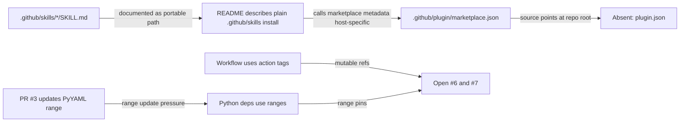
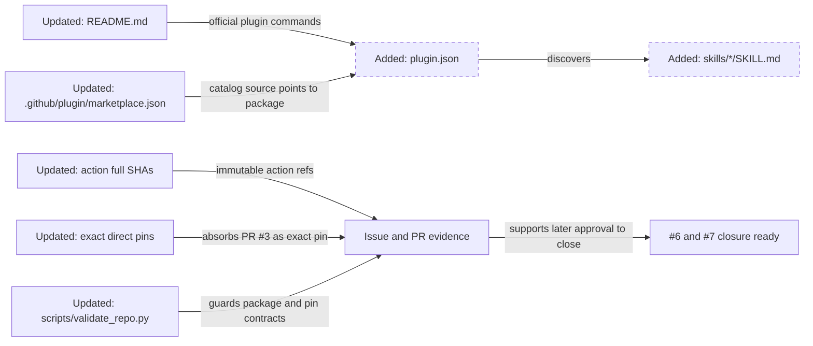
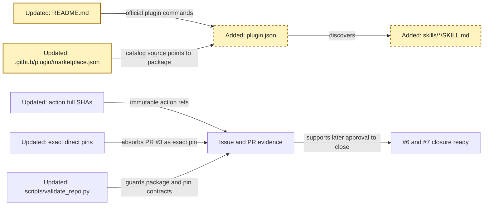
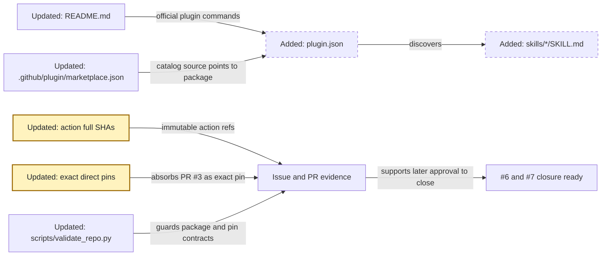
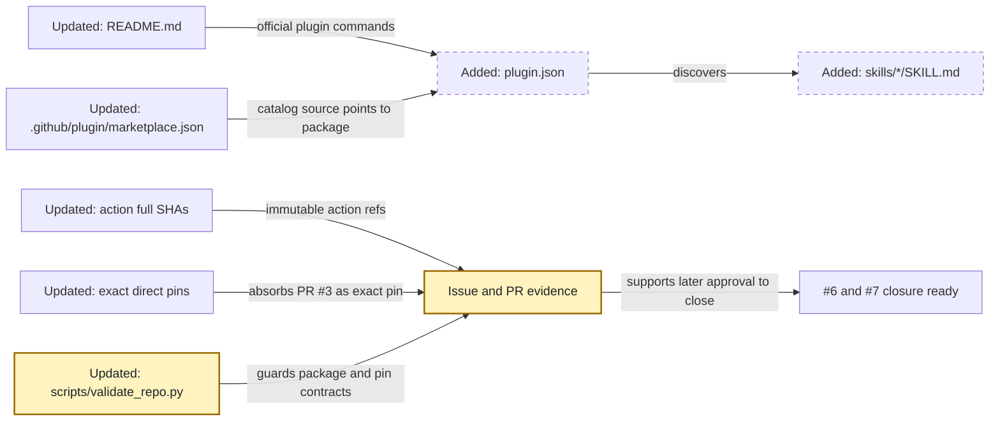

<!-- markdownlint-disable-file -->
# RPI Plan: Issue 6, issue 7, and PR 3 release readiness

## Task Metadata

* Task ID: issue-6-7-pr3-release-readiness
* Task slug: issue-6-7-pr3-release-readiness
* Plan date: 2026-09-18

## Executive Summary

* Bottom line: This plan prepares one release-readiness change set for `benarculus/resume-builder#6`, `benarculus/resume-builder#7`, and the dependency signal in `benarculus/resume-builder#3`. It updates the repository to the current Copilot CLI plugin model, pins GitHub Actions to full commit SHAs, converts direct Python dependencies to exact pins, and validates the resulting package and dependency contracts.
* Why this matters: #6 cannot close while the README says `.github/plugin/marketplace.json` is not an official GitHub path and the repo lacks a root `plugin.json`/root `skills/` plugin layout. #7 cannot close while workflows use mutable action tags and Python dependencies use ranges. PR #3 shows the active PyYAML range update that should be resolved as an exact direct pin rather than another broad range.
* Planning result: Blocked. This plan is a clean candidate, but its initial standard critique returned a terminal Blocked result because the parent and worker used different byte-boundary conventions for the newline immediately before `## Critique Disposition`.
* Confidence and uncertainty: High confidence on #6 because the research artifact records the current GitHub plugin reference and the user selected Agent Plugins 1.0. High confidence on #7 because the issue asks for SHA-pinned workflows and the user selected exact direct Python pins without hashes. Medium uncertainty remains only around the exact upstream action commit SHAs and exact direct Python versions, which implementation must resolve and validate.

### What You May Not Know

* GitHub's current Copilot CLI model treats `.github/plugin/marketplace.json` as marketplace metadata, while installable plugin packages need a root `plugin.json`.
* Agent Plugins 1.0 expects skills in immediate root `skills/<skill-name>/SKILL.md` directories. The current `.github/skills/*` layout is not the selected canonical plugin layout.
* Exact direct Python pins intentionally do not mean pip hash mode, generated lockfiles, or transitive dependency locking. The user selected direct `==` pins only, so implementation should not expand the scope unless later directed.
* PR #3 updates `PyYAML` to a range allowing `6.0.3`; this plan should absorb that signal by selecting an exact compatible direct pin, normally `PyYAML==6.0.3` if validation passes.

## Phase Checklist

### Before



### After



The intended end state is an installable plugin package with official documentation, deterministic direct dependency entry points, and local validation that protects both issue-closure claims.

<!-- rpi:phase id=P01 -->
### [ ] P01: Align plugin packaging and documentation with the official CLI reference

Goals:
* The repository presents one canonical Agent Plugins 1.0 package and marketplace entry so #6 can be resolved against the current GitHub plugin reference.

Dependencies:
* User decision D1 selecting Agent Plugins 1.0.
* Issue #6 research readiness.



Highlighted work: create the official plugin manifest and root skill layout, then make the README and marketplace metadata describe that package.

<!-- rpi:task id=P01-T01 -->
#### [ ] P01-T01: Add Agent Plugins 1.0 manifest and root skill layout

Goals:
* The repository root is a valid Agent Plugins 1.0 plugin package with the three resume skills discoverable under root `skills/`.

Requirements:
* FR-001
* NFR-001
* Add root `plugin.json` with this contractual manifest shape:

```json
{
  "$schema": "https://agent-plugins.org/schemas/1.0.0/plugin.schema.json",
  "name": "resume-builder",
  "version": "0.1.0",
  "description": "Anti-fabrication GitHub Copilot CLI skills for evidence-based resume building",
  "author": {
    "name": "benarculus",
    "url": "https://github.com/benarculus"
  },
  "homepage": "https://github.com/benarculus/resume-builder",
  "repository": "https://github.com/benarculus/resume-builder",
  "license": "MIT",
  "keywords": ["resume", "career", "copilot-cli", "skills"]
}
```

* Root `skills/career-document-builder/SKILL.md`, `skills/job-requirements-planner/SKILL.md`, and `skills/resume-drafter/SKILL.md` must exist as immediate Agent Plugins 1.0 skill subdirectories.
* Existing skill content, scripts, fixtures, and relative references must still work after the layout change.

Details:
* Prefer moving the current [.github/skills](../../../.github/skills) tree into root `skills/` as the canonical plugin layout unless implementation evidence shows mirroring is safer for compatibility.
* If mirroring is used instead of moving, validation must guard against drift between canonical and mirrored skill surfaces.
* Do not add legacy configurable skill-path fields to the schema-bearing `plugin.json`; the confirmed direction is Agent Plugins 1.0.

References:
* [.copilot-tracking/research/2026-09-18/issue-6-copilot-cli-plugin-reference-research.md](../../research/2026-09-18/issue-6-copilot-cli-plugin-reference-research.md):
  * `## Decisions and Feedback` records the user-selected Agent Plugins 1.0 direction.
  * The findings establish root `plugin.json` and root `skills/` requirements.
* [.github/plugin/marketplace.json](../../../.github/plugin/marketplace.json): current marketplace metadata that points at the plugin source.
* [.github/skills](../../../.github/skills): current skill content to move or mirror.

Dependencies:
* None

<!-- rpi:task id=P01-T02 -->
#### [ ] P01-T02: Update marketplace metadata and README install guidance

Goals:
* A new user can install or discover the plugin with official `copilot plugin` commands, and the README no longer describes official marketplace metadata as host-specific only.

Requirements:
* FR-002
* FR-003
* NFR-002
* NFR-004
* [README.md](../../../README.md) must document direct install with `copilot plugin install benarculus/resume-builder`.
* [README.md](../../../README.md) must document marketplace registration with `copilot plugin marketplace add benarculus/resume-builder`.
* [README.md](../../../README.md) must document marketplace install with `copilot plugin install resume-builder@resume-builder`, unless implementation evidence changes the marketplace or plugin name.
* [README.md](../../../README.md) must document verification with `copilot plugin list`, `/plugin list`, and `/skills list`.
* [README.md](../../../README.md) must remove or replace statements that call `.github/plugin/marketplace.json` merely host-specific or not official.

Details:
* Keep [.github/plugin/marketplace.json](../../../.github/plugin/marketplace.json) because the research confirms that GitHub Docs document that path for marketplace metadata.
* Ensure `plugins[].source` points to the actual plugin directory containing `plugin.json`. If the plugin remains rooted at `.`, keep `"source": "."`; if implementation creates a nested plugin directory, update the source accordingly.
* Keep the anti-fabrication workflow explanation, but update skill links from `.github/skills/*` to `skills/*` when the canonical layout moves.
* Keep a plain skill fallback only if the final file layout still supports a simple documented copy path.

References:
* [README.md](../../../README.md): current install guidance to revise.
* [.github/plugin/marketplace.json](../../../.github/plugin/marketplace.json): marketplace metadata to reconcile with `plugin.json`.
* [.copilot-tracking/research/2026-09-18/issue-6-copilot-cli-plugin-reference-research.md](../../research/2026-09-18/issue-6-copilot-cli-plugin-reference-research.md):
  * Research basis for the official plugin and marketplace command requirements.

Dependencies:
* P01-T01

<!-- rpi:phase id=P02 -->
### [ ] P02: Pin dependency entry points for issue #7 and PR #3

Goals:
* Workflow action refs and direct Python requirements become deterministic within the user's selected scope, and PR #3's PyYAML update signal is represented as an exact direct pin.

Dependencies:
* User decision D2 selecting exact direct Python pins without hashes.



Highlighted work: replace mutable workflow action tags and ranged Python requirements with pinned references.

<!-- rpi:task id=P02-T01 -->
#### [ ] P02-T01: Pin GitHub Actions to full commit SHAs

Goals:
* CI and CodeQL workflows no longer depend on mutable action version tags.

Requirements:
* FR-004
* NFR-003
* Every `uses:` entry in [.github/workflows/ci.yml](../../../.github/workflows/ci.yml) and [.github/workflows/codeql-analysis.yml](../../../.github/workflows/codeql-analysis.yml) must use a full-length commit SHA.
* Each SHA-pinned action line must retain a nearby human-readable action/version comment so maintainers can see the intended upstream major version.
* Pinning must not introduce `pull_request_target`, `workflow_run`, `write-all` permissions, or broader token permissions.

Details:
* Resolve current commit SHAs from the upstream tags used today: `actions/checkout@v4`, `actions/setup-python@v5`, and `github/codeql-action/{init,autobuild,analyze}@v4`.
* Keep workflow behavior otherwise unchanged unless validation reveals a pin-specific issue.
* This task covers GitHub Actions only; Python package pins are handled in P02-T02.

References:
* [.github/workflows/ci.yml](../../../.github/workflows/ci.yml): current mutable action tags.
* [.github/workflows/codeql-analysis.yml](../../../.github/workflows/codeql-analysis.yml): current mutable action tags.
* Issue `benarculus/resume-builder#7`: requested SHA-pinned workflows.

Dependencies:
* None

<!-- rpi:task id=P02-T02 -->
#### [ ] P02-T02: Convert direct Python dependencies to exact version pins

Goals:
* Runtime and dev/test Python dependency files express deterministic direct dependency versions and incorporate the PR #3 PyYAML update as an exact pin.

Requirements:
* FR-005
* NFR-003
* [requirements.txt](../../../requirements.txt) must replace direct dependency ranges with exact `==` pins.
* [requirements-dev.txt](../../../requirements-dev.txt) must replace direct dependency ranges with exact `==` pins while preserving its inclusion of [requirements.txt](../../../requirements.txt).
* [requirements-dev.txt](../../../requirements-dev.txt) should use `PyYAML==6.0.3` if repository validation passes with that version, because `benarculus/resume-builder#3` requests the PyYAML `6.0.3` update.
* Do not add pip hash mode, generated lockfiles, or transitive hash pinning in this plan because the user explicitly chose exact direct pins only.

Details:
* Choose current compatible exact versions that pass the existing tests and validation under the repository's supported Python version.
* Keep direct pins maintainable with the existing Dependabot pip configuration. If Dependabot cannot update exact pins as expected, record that implementation evidence and route the smallest follow-up.
* Treat PR #3 as a dependency input, not as permission to mutate the Dependabot branch. The implementation should update this working branch and later decide whether PR #3 is superseded, mergeable, or closeable after validation.

References:
* [requirements.txt](../../../requirements.txt): runtime dependency range to pin.
* [requirements-dev.txt](../../../requirements-dev.txt): dev/test dependency ranges to pin.
* [.github/dependabot.yml](../../../.github/dependabot.yml): existing update mechanism for pip and GitHub Actions.
* `benarculus/resume-builder#3`: Dependabot PR updating `PyYAML` to permit `6.0.3`.

Dependencies:
* None

<!-- rpi:phase id=P03 -->
### [ ] P03: Validate issue and PR closure evidence

Goals:
* The repository can objectively show that #6 and #7 are ready to close and that PR #3's dependency signal was handled, while actual external closure remains gated on user approval.

Dependencies:
* P01
* P02



Highlighted work: make validation guard the planned contracts and collect the commands and mapping needed for later closure.

<!-- rpi:task id=P03-T01 -->
#### [ ] P03-T01: Extend repository validation for packaging and pinning

Goals:
* Local validation fails when the official plugin packaging or issue #7 pinning guarantees regress.

Requirements:
* FR-006
* NFR-001
* NFR-003
* [scripts/validate_repo.py](../../../scripts/validate_repo.py) must validate `plugin.json`, Agent Plugins 1.0 root `skills/` discovery, [.github/plugin/marketplace.json](../../../.github/plugin/marketplace.json), and exact direct Python pins.
* Validation must fail when workflow `uses:` entries are mutable tags instead of full commit SHAs.
* Validation must preserve existing checks for skill frontmatter, manifest JSON, and the job-requirements producer/consumer contract.

Details:
* Add focused tests in [tests/test_structure.py](../../../tests/test_structure.py) when validator behavior changes warrant test coverage.
* Keep validation local and deterministic. Do not make [scripts/validate_repo.py](../../../scripts/validate_repo.py) depend on network access to resolve current action SHAs.

References:
* [scripts/validate_repo.py](../../../scripts/validate_repo.py): structural validator to extend.
* [tests/test_structure.py](../../../tests/test_structure.py): existing structural tests.

Dependencies:
* P01-T01
* P01-T02
* P02-T01
* P02-T02

<!-- rpi:task id=P03-T02 -->
#### [ ] P03-T02: Run validation and prepare closure evidence

Goals:
* Implementation can prove the issues and PR dependency signal are resolved before asking for external closure.

Requirements:
* FR-006
* NFR-004
* The implementation changes record must include passed results for `python3 scripts/validate_repo.py`, `python3 -m pytest -q`, and `git diff --check`.
* If the `copilot` CLI is available, validate plugin packaging with `copilot plugin install ./`, `copilot plugin list`, and skill visibility through `/skills list` or the closest available non-interactive command. If unavailable, record the exact unavailability reason and retain repository structural validation as the local gate.
* Closure evidence must explicitly map #6 to official plugin-reference packaging and documentation changes, #7 to workflow SHA pins plus exact direct Python pins, and PR #3 to the chosen exact PyYAML pin.

Details:
* This task does not close issues or PRs during implementation unless the user explicitly approves closure after validation.
* Keep closure comments concise and cite changed files plus validation commands.

References:
* `benarculus/resume-builder#6`: marketplace/plugin reference issue.
* `benarculus/resume-builder#7`: dependency pinning issue.
* `benarculus/resume-builder#3`: Dependabot PyYAML update PR.
* [.copilot-tracking/research/2026-09-18/issue-6-copilot-cli-plugin-reference-research.md](../../research/2026-09-18/issue-6-copilot-cli-plugin-reference-research.md): #6 research basis.

Dependencies:
* P03-T01

## User Decisions and Requirements

### Confirmed User Direction

* Plan a clean candidate for `benarculus/resume-builder#7` and `benarculus/resume-builder#6` before `/rpi-implement`.
* Preserve the settled choice to use Agent Plugins 1.0 with a root `skills/` layout for #6.
* Preserve the settled choice to use exact direct Python pins only, with no hash mode, transitive lockfiles, or generated lockfiles.
* Include `benarculus/resume-builder#3` as dependency evidence for the PyYAML exact pin.
* Pass critique before advising `/rpi-implement`.
* Do not close issues or PRs until implementation validation exists and the user explicitly approves closure.

### Planning Decisions and Feedback

| Group | Decision or feedback item | Status | Owner | Rationale or input needed | Evidence | Planning impact |
|---|---|---|---|---|---|---|
| D1 | Use Agent Plugins 1.0 instead of the smaller legacy `plugin.json` compatibility route for #6 | confirmed | user | User selected the Agent Plugins 1.0 migration during research closeout | [.copilot-tracking/research/2026-09-18/issue-6-copilot-cli-plugin-reference-research.md](../../research/2026-09-18/issue-6-copilot-cli-plugin-reference-research.md) `## Decisions and Feedback` | Drives `P01` layout and README requirements |
| D2 | Python dependency pinning strictness for #7 and PR #3 | confirmed | user | User selected exact direct-version pins only and rejected hash-locked transitive requirements | Planning intake and [.copilot-tracking/walkthroughs/2026-09-18/issue-6-7-planning-recovery-decisions.md](../../walkthroughs/2026-09-18/issue-6-7-planning-recovery-decisions.md) | Drives `P02-T02`, validation, and CI install behavior |
| D3 | Use a new clean candidate instead of reusing blocked plan artifacts | confirmed | user | User requested a clean candidate and prior walkthrough recorded that blocked critique provenance must not feed implementation | [.copilot-tracking/walkthroughs/2026-09-18/issue-6-7-planning-recovery-decisions.md](../../walkthroughs/2026-09-18/issue-6-7-planning-recovery-decisions.md) | Drives this plan path and fresh critique path |
| D4 | Whether implementation may close #6, #7, or PR #3 automatically | unresolved | user | Closing externally visible GitHub items should happen only after validation and explicit approval | Caller asked earlier whether issues could close; current prompt requests planning | Does not block implementation planning; blocks actual closure |

## Planning Readiness and Next Step

| Field | Record |
|---|---|
| Planning execution and readiness | Blocked: plan content is drafted as a clean candidate, but the initial standard critique was consumed by a candidate-boundary mismatch and did not assess implementation readiness |
| Decision participation | user-owned; standalone manual RPI invocation |
| Planning delegation | adaptive; default provenance, no planning subagent used because phases are tightly coupled and evidence is already available |
| Blockers | `PC-001`: the reserved boundary excluded the newline before `## Critique Disposition`, while the critique worker included it; implementation readiness is not established |
| Latest critique | [.copilot-tracking/reviews/plans/2026-09-18/issue-6-7-pr3-release-readiness-plan-critique.md](../../reviews/plans/2026-09-18/issue-6-7-pr3-release-readiness-plan-critique.md) with Blocked verdict |
| Relevant research | [.copilot-tracking/research/2026-09-18/issue-6-copilot-cli-plugin-reference-research.md](../../research/2026-09-18/issue-6-copilot-cli-plugin-reference-research.md) |
| Plan | `.copilot-tracking/plans/2026-09-18/issue-6-7-pr3-release-readiness-plan.md` |
| Changes-record role | `.copilot-tracking/changes/2026-09-18/issue-6-7-pr3-release-readiness-changes.md` is implementation evidence |
| Continuation owner | user |
| Required gates or confirmations | Standard critique failed as Blocked; issue and PR closure approval remains deferred until after implementation validation |
| Next action | Do not run `/rpi-implement` from this plan; create a new clean candidate with an explicit boundary convention or use an approved RPI recovery path if supported |

## Goals

* Resolve #6 by aligning plugin packaging and README guidance with GitHub's current Copilot CLI plugin reference.
* Resolve #7 by pinning workflow actions to full commit SHAs and converting direct Python dependency ranges to exact pins.
* Incorporate PR #3's PyYAML update as an exact direct pin if validation supports it.
* Preserve anti-fabrication resume skill behavior while changing packaging, documentation, dependency pins, and validation.
* Produce objective implementation evidence before any issue or PR closure action.

## Scope and Non-Goals

### In Scope

* Root `plugin.json` and root `skills/` Agent Plugins 1.0 package layout.
* README install and verification guidance using official `copilot plugin` commands.
* Marketplace metadata reconciliation in [.github/plugin/marketplace.json](../../../.github/plugin/marketplace.json).
* Full-SHA pins for workflow `uses:` actions.
* Exact direct pins in [requirements.txt](../../../requirements.txt) and [requirements-dev.txt](../../../requirements-dev.txt).
* Validation updates and changes-record evidence.

### Non-Goals

* No pip hash mode, transitive lockfile, generated dependency lock, or hash-locked install workflow.
* No unrelated skill behavior redesign.
* No automatic closure of #6, #7, or PR #3 during implementation without explicit user approval.
* No changes to the Dependabot branch for PR #3 from this planning step.

## Functional Requirements

* FR-001: The repository root provides a valid Agent Plugins 1.0 plugin manifest and root `skills/` directories for all three resume-builder skills.
* FR-002: Marketplace metadata points to the plugin package that contains `plugin.json` and remains consistent with README install guidance.
* FR-003: README install guidance documents official direct install, marketplace registration, marketplace install, and verification commands.
* FR-004: Workflow `uses:` entries in CI and CodeQL workflows use full commit SHAs instead of mutable version tags.
* FR-005: Direct Python dependencies are exact `==` pins, including a PyYAML pin that resolves PR #3's update signal if validation supports it.
* FR-006: Repository validation checks plugin package shape, marketplace consistency, workflow SHA pins, exact direct Python pins, and existing structural contracts.

## Non-Functional Requirements

* NFR-001: Packaging changes preserve existing skill content and anti-fabrication behavior.
  * Objective threshold or evaluation condition: Existing structural validation and tests continue to pass after path changes.
* NFR-002: Documentation remains accurate to official GitHub plugin semantics and does not describe official marketplace metadata as merely host-specific.
  * Objective threshold or evaluation condition: README commands and metadata descriptions match the current research artifact and final package layout.
* NFR-003: Pinning choices remain maintainable through Dependabot where possible.
  * Objective threshold or evaluation condition: Dependabot configuration remains present for `pip` and `github-actions`, and implementation records any incompatibility found.
* NFR-004: Closure actions remain human-gated.
  * Objective threshold or evaluation condition: Changes record prepares closure evidence but does not close issues or PRs without explicit approval.

## Risks and Open Questions

| Priority | Type | Risk, question, or planning item | Affected work | Impact | Smallest action or evidence needed | Owner |
|---|---|---|---|---|---|---|
| M | risk | Exact upstream action SHAs must be resolved correctly from the intended tags | P02-T01 | Wrong SHA could change workflow behavior or pin an unintended revision | Resolve SHAs from upstream repositories during implementation and preserve version comments | downstream implementer |
| M | risk | Moving instead of mirroring `.github/skills` may affect hosts that still consume the old path | P01-T01, P01-T02 | Could reduce compatibility outside the selected Agent Plugins 1.0 target | Prefer move for canonical layout, but mirror only if implementation evidence shows it is needed and validation prevents drift | downstream implementer |
| L | open question | Whether PR #3 should be closed as superseded after implementation | P03-T02 | External closure is visible and may need a final user decision | Ask after validation with evidence that `PyYAML==6.0.3` or another selected exact pin landed | user |

## Dependencies

* GitHub issue `benarculus/resume-builder#6`: Defines the marketplace/plugin documentation problem.
* GitHub issue `benarculus/resume-builder#7`: Defines workflow SHA and Python dependency pinning scope.
* GitHub PR `benarculus/resume-builder#3`: Provides current PyYAML update evidence.
* [.copilot-tracking/research/2026-09-18/issue-6-copilot-cli-plugin-reference-research.md](../../research/2026-09-18/issue-6-copilot-cli-plugin-reference-research.md): Supplies #6 plugin reference evidence and Agent Plugins 1.0 decision.
* [.copilot-tracking/walkthroughs/2026-09-18/issue-6-7-planning-recovery-decisions.md](../../walkthroughs/2026-09-18/issue-6-7-planning-recovery-decisions.md): Supplies recovery direction after previous blocked plan critiques.

## Sources

* [README.md](../../../README.md): Current install and validation documentation.
* [.github/plugin/marketplace.json](../../../.github/plugin/marketplace.json): Current marketplace metadata.
* [.github/skills](../../../.github/skills): Current skill layout.
* [.github/workflows/ci.yml](../../../.github/workflows/ci.yml): Current CI action refs.
* [.github/workflows/codeql-analysis.yml](../../../.github/workflows/codeql-analysis.yml): Current CodeQL action refs.
* [requirements.txt](../../../requirements.txt): Runtime dependency range.
* [requirements-dev.txt](../../../requirements-dev.txt): Dev/test dependency ranges.
* [.github/dependabot.yml](../../../.github/dependabot.yml): Existing dependency update mechanism.
* [scripts/validate_repo.py](../../../scripts/validate_repo.py): Validator to extend.
* [tests/test_structure.py](../../../tests/test_structure.py): Structural tests to extend if needed.
* [.copilot-tracking/research/2026-09-18/issue-6-copilot-cli-plugin-reference-research.md](../../research/2026-09-18/issue-6-copilot-cli-plugin-reference-research.md): Current #6 research and Agent Plugins 1.0 decision.
* [.copilot-tracking/walkthroughs/2026-09-18/issue-6-7-planning-recovery-decisions.md](../../walkthroughs/2026-09-18/issue-6-7-planning-recovery-decisions.md): Clean-candidate recovery decision.
* GitHub issue `benarculus/resume-builder#6`: User-supplied issue target.
* GitHub issue `benarculus/resume-builder#7`: User-supplied issue target.
* GitHub PR `benarculus/resume-builder#3`: User-supplied PR target and PyYAML update evidence.

## Critique Disposition

Record the latest critique findings, their disposition, and any explicitly accepted residual risk. Keep this section outside user decisions and current planning synthesis.

* Critique candidate identity: task `issue-6-7-pr3-release-readiness`; plan-content-before-`## Critique Disposition` sha256 `d30f4f74c7eb627823138afdadc7137e005a8bd0913052b34ccc77c6d7286cd3`; boundary byte length `30147`.
* Critique depth and provenance: `standard`; default from RPI Plan because the user did not request deep critique.
* Critique execution: Blocked
* Initial attempt consumed: yes
* Recovery attempt consumed: no
* Attempt provenance: attempt `PCLEAN-001`; kind `initial`; output `.copilot-tracking/reviews/plans/2026-09-18/issue-6-7-pr3-release-readiness-plan-critique.md`; current dispatch is this uninterrupted parent execution immediately after reservation persistence; canonical planning reference `/Users/benarculus/.copilot/installed-plugins/hve-core/hve-core/.github/skills/rpi/rpi-plan/references/planning.md`.
* Recovery eligibility and consent: not applicable

| Critique run and finding | Disposition | Action owner | Exact resolving evidence | Decision route | Plan response or residual risk |
|---|---|---|---|---|---|
| PC-001 (Critical): reserved candidate boundary does not match the current plan | open | planning parent | Critique expected `30147` bytes / `d30f4f74c7eb627823138afdadc7137e005a8bd0913052b34ccc77c6d7286cd3`; worker computed `30148` bytes / `7a4e2bc77655cc636a3f46648e68c8359d3caef5a63747b51530c067ad6592de` by including the newline before `## Critique Disposition` | direct planner correction in a future clean candidate or approved recovery path | Terminal Blocked critique result consumes this attempt; implementation readiness is not established |

## Artifact Self-Check

* [x] Executive Summary, What You May Not Know, and the Phase Checklist come first and are understandable without reading the supporting sections.
* [x] Confirmed direction, grouped decisions, readiness, goals, scope, requirements, risks, and dependencies are current and consistent with the Phase Checklist.
* [x] Planning decision participation and provenance are recorded; user-owned groups have persisted answers or deferred closure approval.
* [x] Planning delegation and provenance are recorded; adaptive behavior was followed without overriding phase boundaries.
* [x] Functional and non-functional requirements are current, and every `FR-nnn` and `NFR-nnn` is cited by at least one task's Requirements.
* [x] Every `Pxx` has Goals, Dependencies, and a phase diagram that highlights its part of After with any labeled removal context. Every `Pxx-Txx` has Goals, Requirements, Details, References, and Dependencies.
* [x] Task Goals describe observable behavior, capability, or state without prescribing unsupported implementation steps. Details and References ground the implementer; examples are illustrative unless a requirement or contract makes them binding.
* [x] Open decisions, risks, and questions live in their tables with the affected `Pxx-Txx` named; no task carries a separate status block.
* [x] Code, commands, and symbols use `backticks`. Existing files and folders are Markdown links whose text is the workspace-relative path and whose destination resolves from this plan file.
* [x] Before reflects the evidence-backed pre-change baseline; After reflects the intended result of all phases. Corresponding elements and phase diagrams reuse stable node IDs, with added and removed work distinguishable without color.
* [x] Every emitted initialization object has the prescribed string values for themeVariables.fontFamily and themeVariables.fontSize. Diagrams use theme-aware styling, with explicit text colors on custom fills.
* [x] Risks, open questions, blockers, critique findings, and accepted residual risks have owners and next actions.
* [x] Critique depth, attempt provenance and current-dispatch ownership are recorded; terminal results were not retried, and all findings are disposed without a closure critique.
* [x] Planning execution, readiness, continuation owner, gates, next action, and implementation paths are complete and consistent.
* [x] Follow-Up Items remain outside active plan completion and acceptance claims.
* Checked sections: Task Metadata, Executive Summary, Phase Checklist, User Decisions and Requirements, Planning Readiness and Next Step, Goals, Scope and Non-Goals, Functional Requirements, Non-Functional Requirements, Risks and Open Questions, Dependencies, Sources, Critique Disposition, Artifact Self-Check, Follow-Up Items, Handoff.
* Missing or limited sections: substantive standard critique did not run because the terminal critique result was Blocked; dual-theme rendered Mermaid preview was not available in this CLI session.

## Follow-Up Items

* None

## Handoff

* Authoritative implementation handoff: Planning Readiness and Next Step
* Planned changes record path: `.copilot-tracking/changes/2026-09-18/issue-6-7-pr3-release-readiness-changes.md`
