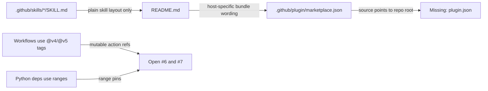
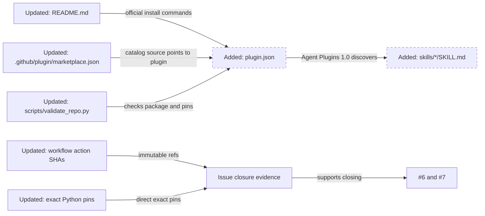
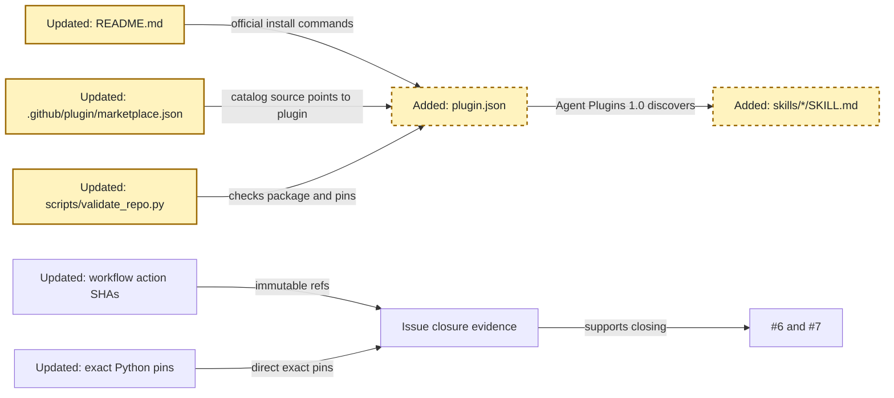
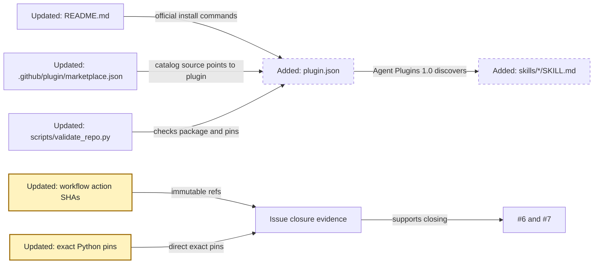
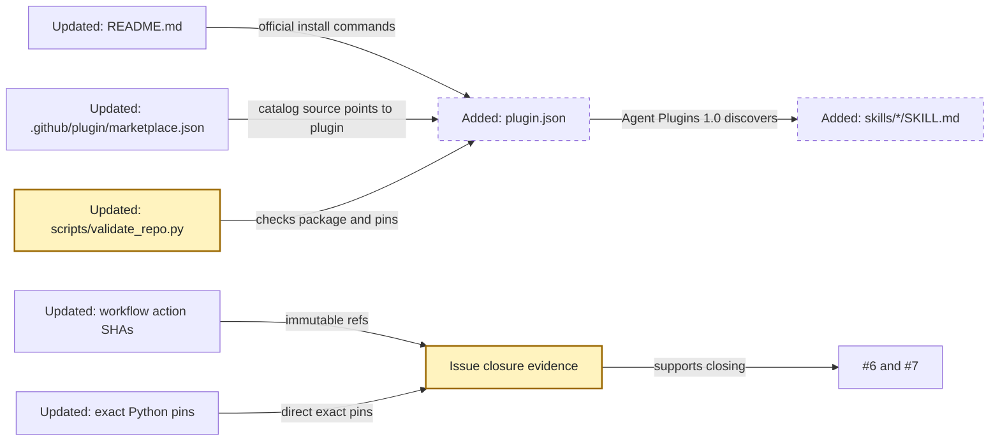

<!-- markdownlint-disable-file -->
# RPI Plan: Issue 6 and 7 release readiness

## Task Metadata

* Task ID: issue-6-7-release-readiness
* Task slug: issue-6-7-release-readiness
* Plan date: 2026-09-18

## Executive Summary

* Bottom line: This plan closes `benarculus/resume-builder#6` and `benarculus/resume-builder#7` with one bounded release-readiness change set. It migrates the plugin packaging and README to GitHub's current Copilot CLI Agent Plugins 1.0 model, then pins dependency entry points by replacing mutable GitHub Actions tags with full commit SHAs and replacing direct Python dependency ranges with exact version pins.
* Why this matters: #6 cannot close while the repo describes `.github/plugin/marketplace.json` as host-specific and has no `plugin.json`/root `skills/` plugin layout. #7 cannot close while workflows use mutable action tags and Python dependencies are ranged.
* Planning result: Blocked. The plan content is drafted, but the standard critique returned a terminal Blocked result before a substantive readiness assessment.
* Confidence and uncertainty: High confidence on #6 because the research artifact cites current GitHub Docs and the user selected Agent Plugins 1.0. High confidence on #7 because the issue names SHA-pinned workflow actions and the user selected exact direct Python pins without hashes. Medium uncertainty remains around exact upstream action SHAs, which implementation must resolve from upstream tags.

### What You May Not Know

* GitHub's current Copilot CLI docs make `.github/plugin/marketplace.json` official marketplace metadata, while the plugin itself needs root `plugin.json`.
* Agent Plugins 1.0 fixes portable skill locations at root `skills/<skill-name>/SKILL.md`. The existing `.github/skills/*` layout should move or mirror into that root layout, with validation guarding whichever canonical surface implementation chooses.
* #7 deliberately excludes pip hash mode and transitive lockfiles. The user selected exact direct pins only, so implementation should not add generated locks or hash-locked installs unless a later decision changes scope.

## Phase Checklist

### Before



### After



The end state is a package that follows the official plugin model, documents official install commands, and has validation evidence for the two issue-specific closure criteria.

<!-- rpi:phase id=P01 -->
### [ ] P01: Align plugin packaging with the official CLI reference

Goals:
* The repository becomes a valid Agent Plugins 1.0 plugin and marketplace entry while preserving the three existing resume-building skills.

Dependencies:
* User decision D1 confirming Agent Plugins 1.0.
* Issue #6 research readiness.



Highlighted work: create the official plugin manifest and root skill layout, then update docs and validation around that package model.

<!-- rpi:task id=P01-T01 -->
#### [ ] P01-T01: Add Agent Plugins 1.0 manifest and root skill layout

Goals:
* The repository root is a valid Agent Plugins 1.0 plugin directory with the three skills discoverable from root `skills/`.

Requirements:
* FR-001
* NFR-001
* Add root `plugin.json` with this contractual manifest shape:

```json
{
  "$schema": "https://agent-plugins.org/schemas/1.0.0/plugin.schema.json",
  "name": "resume-builder",
  "version": "0.1.0",
  "description": "Anti-fabrication GitHub Copilot CLI skills for evidence-based resume building",
  "author": {
    "name": "benarculus",
    "url": "https://github.com/benarculus"
  },
  "homepage": "https://github.com/benarculus/resume-builder",
  "repository": "https://github.com/benarculus/resume-builder",
  "license": "MIT",
  "keywords": ["resume", "career", "copilot-cli", "skills"]
}
```

* Root `skills/career-document-builder/SKILL.md`, `skills/job-requirements-planner/SKILL.md`, and `skills/resume-drafter/SKILL.md` must exist as immediate Agent Plugins 1.0 skill subdirectories.
* Existing skill content, scripts, fixtures, and relative references must still work after the layout change.

Details:
* Prefer moving the current `.github/skills/*` tree into root `skills/*` as the canonical plugin layout unless implementation evidence shows mirroring is safer for compatibility.
* If mirroring is used instead of moving, validation must guard against silent drift between the canonical and mirrored skill surfaces.
* Agent Plugins 1.0 does not use configurable `skills` paths, so do not add legacy `skills` path fields to the schema-bearing `plugin.json`.

References:
* [.copilot-tracking/research/2026-09-18/issue-6-copilot-cli-plugin-reference-research.md](../../research/2026-09-18/issue-6-copilot-cli-plugin-reference-research.md):
  * `## Recommendation and Alternatives` records the user-selected Agent Plugins 1.0 direction.
  * W1 and W2 establish root `plugin.json` and root `skills/` requirements.
* [.github/plugin/marketplace.json](../../../.github/plugin/marketplace.json): current marketplace entry that points to the plugin source.

Dependencies:
* None

<!-- rpi:task id=P01-T02 -->
#### [ ] P01-T02: Update marketplace metadata and README install guidance

Goals:
* A new user can understand direct plugin install, marketplace registration, marketplace plugin install, and plain skill fallback, then follow official Copilot CLI commands from the README.

Requirements:
* FR-002
* FR-003
* NFR-002
* NFR-004
* `README.md` must document direct install with `copilot plugin install benarculus/resume-builder`.
* `README.md` must document marketplace registration with `copilot plugin marketplace add benarculus/resume-builder`.
* `README.md` must document marketplace install with `copilot plugin install resume-builder@resume-builder`, unless implementation evidence changes the marketplace name.
* `README.md` must document verification with `copilot plugin list`, `/plugin list`, and `/skills list`.
* `README.md` must remove or replace statements that call `.github/plugin/marketplace.json` merely host-specific or not official.

Details:
* Keep `.github/plugin/marketplace.json` as marketplace metadata because GitHub Docs document that location for plugin marketplaces.
* Ensure `plugins[].source` points to the actual plugin directory containing `plugin.json`. If the plugin remains rooted at `.`, keep `"source": "."`; if implementation creates a nested plugin directory, update the source accordingly.
* Keep the "How the skills fit together" and anti-fabrication quickstart content, but update links if skill paths move from `.github/skills/*` to `skills/*`.
* Keep a plain skill fallback only if the final file layout still supports a simple documented copy path.

References:
* [README.md](../../../README.md): current install section to revise.
* [.github/plugin/marketplace.json](../../../.github/plugin/marketplace.json): marketplace metadata to reconcile with plugin layout.
* [.copilot-tracking/research/2026-09-18/issue-6-copilot-cli-plugin-reference-research.md](../../research/2026-09-18/issue-6-copilot-cli-plugin-reference-research.md):
  * Findings on `marketplace.json`, `plugin.json`, and README command requirements.

Dependencies:
* P01-T01

<!-- rpi:phase id=P02 -->
### [ ] P02: Pin dependencies for issue #7

Goals:
* Workflow action and direct Python dependency references become stable and reviewable enough to satisfy #7 without adding hash-locking outside the user's selected scope.

Dependencies:
* User decision D2 confirming exact direct Python pins without hashes.



Highlighted work: replace mutable workflow action tags and Python dependency ranges with selected pinned forms.

<!-- rpi:task id=P02-T01 -->
#### [ ] P02-T01: Pin GitHub Actions to full commit SHAs

Goals:
* CI and CodeQL workflows no longer depend on mutable action version tags.

Requirements:
* FR-004
* NFR-003
* Every `uses:` entry in [.github/workflows/ci.yml](../../../.github/workflows/ci.yml) and [.github/workflows/codeql-analysis.yml](../../../.github/workflows/codeql-analysis.yml) must use a full-length commit SHA.
* Each SHA-pinned action line must retain a nearby human-readable action/version comment so maintainers can see the intended upstream major version.
* No workflow should introduce `pull_request_target`, `workflow_run`, `write-all` permissions, or broader token permissions while pinning.

Details:
* Resolve current commit SHAs from the upstream tags used today: `actions/checkout@v4`, `actions/setup-python@v5`, and `github/codeql-action/{init,autobuild,analyze}@v4`.
* Keep workflow behavior otherwise unchanged unless validation reveals a pin-specific issue.
* This task covers GitHub Actions only; Python package pins are handled in P02-T02.

References:
* [.github/workflows/ci.yml](../../../.github/workflows/ci.yml): current mutable action tags.
* [.github/workflows/codeql-analysis.yml](../../../.github/workflows/codeql-analysis.yml): current mutable action tags.
* OpenSSF Scorecard `Pinned-Dependencies` guidance from the supply-chain-security skill: SHA-pinned actions are part of the relevant supply-chain posture.

Dependencies:
* None

<!-- rpi:task id=P02-T02 -->
#### [ ] P02-T02: Convert direct Python dependencies to exact version pins

Goals:
* Runtime and dev/test Python dependency files express deterministic direct dependency versions within the scope the user selected.

Requirements:
* FR-005
* NFR-003
* [requirements.txt](../../../requirements.txt) must replace direct dependency ranges with exact `==` pins.
* [requirements-dev.txt](../../../requirements-dev.txt) must replace direct dependency ranges with exact `==` pins while preserving its inclusion of [requirements.txt](../../../requirements.txt).
* Do not add pip hash mode, generated lockfiles, or transitive hash pinning in this plan because the user explicitly chose exact direct pins only.

Details:
* Choose current compatible versions that pass the existing tests and validation in the repository's supported Python version.
* Keep direct pins maintainable with Dependabot's existing pip ecosystem configuration. If Dependabot cannot update exact pins as expected, record that as implementation evidence and route the smallest follow-up.

References:
* [requirements.txt](../../../requirements.txt): runtime dependency range to pin.
* [requirements-dev.txt](../../../requirements-dev.txt): dev/test dependency ranges to pin.
* [.github/dependabot.yml](../../../.github/dependabot.yml): existing update mechanism for pip dependencies.

Dependencies:
* None

<!-- rpi:phase id=P03 -->
### [ ] P03: Validate closure evidence for both issues

Goals:
* The repository has objective evidence that #6 and #7 are ready to close, while actual issue closure remains gated on user approval.

Dependencies:
* P01
* P02



Highlighted work: update validation to check the new packaging and pinning contracts, then collect issue-closure evidence.

<!-- rpi:task id=P03-T01 -->
#### [ ] P03-T01: Extend repository validation for packaging and pinning

Goals:
* Local validation fails when the official plugin packaging or issue #7 pinning guarantees regress.

Requirements:
* FR-006
* NFR-001
* NFR-003
* [scripts/validate_repo.py](../../../scripts/validate_repo.py) must validate `plugin.json`, Agent Plugins 1.0 root `skills/` discovery, `.github/plugin/marketplace.json`, and exact direct Python pins.
* Validation must fail when workflow `uses:` entries are mutable tags instead of full commit SHAs.
* Validation must preserve existing checks for skill frontmatter, manifest JSON, and the job-requirements producer/consumer contract.

Details:
* Add focused tests in [tests/test_structure.py](../../../tests/test_structure.py) when validator behavior changes warrant test coverage.
* Keep validation local and deterministic. Do not make the validation script depend on network access to resolve current action SHAs.

References:
* [scripts/validate_repo.py](../../../scripts/validate_repo.py): structural validator to extend.
* [tests/test_structure.py](../../../tests/test_structure.py): existing structural test coverage.

Dependencies:
* P01-T01
* P01-T02
* P02-T01
* P02-T02

<!-- rpi:task id=P03-T02 -->
#### [ ] P03-T02: Run validation and prepare issue closure evidence

Goals:
* Implementation can prove both issues are resolved before asking to close them.

Requirements:
* FR-006
* NFR-004
* The implementation changes record must include passed results for `python3 scripts/validate_repo.py`, `python3 -m pytest -q`, and `git diff --check`.
* If the `copilot` CLI is available, validate plugin packaging with `copilot plugin install ./`, `copilot plugin list`, and skill visibility through `/skills list` or the closest available non-interactive command. If unavailable, record the exact unavailability reason and retain repository structural validation as the local gate.
* Issue closure evidence must explicitly map #6 to the official plugin-reference changes and #7 to workflow SHA pins plus exact direct Python pins.

Details:
* This task does not close issues during implementation unless the user explicitly approves closing them after validation. It prepares the evidence needed for that external action.
* Keep closure comments concise and cite the changed files and validation commands.

References:
* `benarculus/resume-builder#6`: marketplace/plugin reference issue.
* `benarculus/resume-builder#7`: dependency pinning issue.
* [.copilot-tracking/research/2026-09-18/issue-6-copilot-cli-plugin-reference-research.md](../../research/2026-09-18/issue-6-copilot-cli-plugin-reference-research.md): #6 research basis.

Dependencies:
* P03-T01

## User Decisions and Requirements

### Confirmed User Direction

* Close `benarculus/resume-builder#6` by revising the repository against GitHub's current Copilot CLI plugin reference.
* Close `benarculus/resume-builder#7` by improving dependency pinning, including SHA-pinned GitHub Actions.
* Use Agent Plugins 1.0 with a root `skills/` layout for #6, as selected during issue #6 research.
* For #7, use exact direct-version Python pins only, with no pip hash mode or transitive hash-lock files.
* Plan #6 and #7 together because they are related release-readiness work, while keeping their acceptance criteria separately checkable.

### Planning Decisions and Feedback

| Group | Decision or feedback item | Status | Owner | Rationale or input needed | Evidence | Planning impact |
|---|---|---|---|---|---|---|
| D1 | Use Agent Plugins 1.0 instead of the smaller legacy `plugin.json` compatibility route for #6 | confirmed | user | User selected the Agent Plugins 1.0 migration during research closeout | [.copilot-tracking/research/2026-09-18/issue-6-copilot-cli-plugin-reference-research.md](../../research/2026-09-18/issue-6-copilot-cli-plugin-reference-research.md) `## Decisions and Feedback` | Drives `P01` layout and README requirements |
| D2 | Python dependency pinning strictness for #7 | confirmed | user | User selected exact direct-version pins only and rejected hash-locked transitive requirements | Planning intake on 2026-09-18; [requirements.txt](../../../requirements.txt); [requirements-dev.txt](../../../requirements-dev.txt); OpenSSF Scorecard `Pinned-Dependencies` guidance | Drives `P02-T02`, validation, and CI install behavior |
| D3 | Whether implementation may close issues automatically | unresolved | user | Closing issues is externally visible and should happen only after validation and explicit user approval | Issue #6 and #7 closure request | Does not block implementation; blocks actual issue closure |

## Planning Readiness and Next Step

| Field | Record |
|---|---|
| Planning execution and readiness | Blocked: plan content is drafted, but the consumed standard critique attempt returned Blocked and did not assess implementation readiness |
| Decision participation | user-owned; standalone manual RPI invocation |
| Planning delegation | adaptive; default provenance, no planning subagent used because the plan is small and tightly coupled |
| Blockers | `PC-001`: critique artifact reports a candidate-boundary mismatch and did not assess the plan. Parent recomputed the current pre-`## Critique Disposition` hash as `1e76aabfb153793464470b3d27111dfb54d124cdf0f2a091019d8dbd38d472e5`, matching the reservation, but the terminal critique result still means implementation readiness is not established. |
| Latest critique | [.copilot-tracking/reviews/plans/2026-09-18/issue-6-7-release-readiness-plan-critique.md](../../reviews/plans/2026-09-18/issue-6-7-release-readiness-plan-critique.md) with Blocked verdict |
| Relevant research | [.copilot-tracking/research/2026-09-18/issue-6-copilot-cli-plugin-reference-research.md](../../research/2026-09-18/issue-6-copilot-cli-plugin-reference-research.md) |
| Plan | `.copilot-tracking/plans/2026-09-18/issue-6-7-release-readiness-plan.md` |
| Changes-record role | `.copilot-tracking/changes/2026-09-18/issue-6-7-release-readiness-changes.md` is implementation evidence |
| Continuation owner | user |
| Required gates or confirmations | new clean planning/critique path or explicitly approved process recovery; validation during implementation; explicit user approval before closing #6/#7 |
| Next action | do not implement from this blocked planning record; establish a valid critique path before `/rpi-implement` |

## Goals

* Bring the repository's plugin packaging and installation documentation into conformance with GitHub's current Copilot CLI plugin and marketplace references.
* Pin dependency entry points enough to close #7: immutable full-SHA GitHub Actions references and exact direct Python package pins.
* Keep the existing resume-builder behavior intact while changing packaging, documentation, and validation surfaces.
* Produce issue-closure evidence that maps changes and validation directly to #6 and #7.

## Scope and Non-Goals

### In Scope

* `benarculus/resume-builder#6`: Agent Plugins 1.0 packaging, official plugin/marketplace README guidance, marketplace metadata reconciliation, and validation.
* `benarculus/resume-builder#7`: SHA-pinned GitHub Actions, exact direct Python dependency pins, and validation that detects regression to mutable references.
* Updates to README links and tests needed because skill paths move or mirror into root `skills/`.

### Non-Goals

* Changing the substance of the three resume skills, job-requirements schema, career-document schema, anti-fabrication rules, parser behavior, or Word-renderer behavior except for path/reference updates required by packaging migration.
* Adding pip hash mode, generated lockfiles, transitive dependency hash pinning, SBOM generation, release signing, fuzzing, dependency review, or new vulnerability scanners.
* Closing GitHub issues without validated implementation and explicit user approval.

## Functional Requirements

* FR-001: The repository root is installable as an Agent Plugins 1.0 plugin with root `plugin.json` and immediate root `skills/<skill-name>/SKILL.md` directories.
* FR-002: `.github/plugin/marketplace.json` remains official marketplace metadata and points at the actual plugin directory.
* FR-003: `README.md` documents official Copilot CLI plugin installation, marketplace registration, marketplace plugin installation, and verification commands.
* FR-004: GitHub Actions workflow `uses:` entries are pinned to full commit SHAs instead of mutable version tags.
* FR-005: Direct Python dependencies in `requirements.txt` and `requirements-dev.txt` are exact `==` pins, preserving `requirements-dev.txt`'s runtime inclusion.
* FR-006: Repository validation and implementation evidence prove #6 and #7 closure criteria before issues are closed.

## Non-Functional Requirements

* NFR-001: Existing skill behavior and test coverage remain intact after packaging path changes.
  * Objective threshold or evaluation condition: existing pytest coverage and structural validation still pass.
* NFR-002: User-facing install documentation is accurate against GitHub's current Copilot CLI plugin reference.
  * Objective threshold or evaluation condition: README uses `copilot plugin` commands and no longer describes `.github/plugin/marketplace.json` as unofficial host-only metadata.
* NFR-003: Dependency pinning is maintainable by Dependabot and transparent to human maintainers.
  * Objective threshold or evaluation condition: SHA-pinned action lines include readable upstream action/version comments, and Python direct pins remain in `requirements*.txt`.
* NFR-004: Issue closure remains evidence-led and externally visible actions are not taken without approval.
  * Objective threshold or evaluation condition: changes record maps validation and changed files to each issue; issue closure waits for user approval.

## Risks and Open Questions

| Priority | Type | Risk, question, or planning item | Affected work | Impact | Smallest action or evidence needed | Owner |
|---|---|---|---|---|---|---|
| M | risk | Agent Plugins 1.0 migration may make `.github/skills` no longer the repo's canonical skill path | P01-T01, P01-T02, P03-T01 | Existing README links and project-local skill discovery assumptions may need careful migration or mirroring | Implementer chooses move versus mirror based on validation and records the chosen canonical path | implementer |
| M | risk | Upstream GitHub Action SHAs must correspond to the intended major tags | P02-T01 | Incorrect SHAs could pin the wrong action revision | Resolve SHAs from upstream tags during implementation and keep comments naming the intended tag | implementer |
| L | open question | `copilot` CLI may not be available in the implementation environment | P03-T02 | Plugin install validation may need to be marked unavailable rather than passed | Run the command if available; otherwise record exact unavailability and rely on structural validation | implementer |
| L | open question | Actual closing of #6 and #7 requires explicit approval | P03-T02 | Implementation can be ready while issue closure remains pending | Ask user after validation before closing issues | user |

## Dependencies

* GitHub Copilot CLI plugin reference: source of truth for #6 packaging and commands.
* GitHub repositories for Actions tags: needed during implementation to resolve full commit SHAs.
* Existing test dependencies: needed to prove behavior still passes after exact Python pins.
* User decisions D1 and D2: both are confirmed and drive the implementation shape.

## Sources

* [README.md](../../../README.md): current install guidance needing #6 correction.
* [.github/plugin/marketplace.json](../../../.github/plugin/marketplace.json): current marketplace metadata.
* [.github/workflows/ci.yml](../../../.github/workflows/ci.yml): current mutable GitHub Actions references.
* [.github/workflows/codeql-analysis.yml](../../../.github/workflows/codeql-analysis.yml): current mutable GitHub Actions references.
* [requirements.txt](../../../requirements.txt): current runtime Python dependency range.
* [requirements-dev.txt](../../../requirements-dev.txt): current development Python dependency ranges.
* [.github/dependabot.yml](../../../.github/dependabot.yml): existing dependency update mechanism.
* [.copilot-tracking/research/2026-09-18/issue-6-copilot-cli-plugin-reference-research.md](../../research/2026-09-18/issue-6-copilot-cli-plugin-reference-research.md): issue #6 research and Agent Plugins 1.0 decision.
* [.copilot-tracking/walkthroughs/2026-09-18/issue-closure-route-decisions.md](../../walkthroughs/2026-09-18/issue-closure-route-decisions.md): route decision to research #6 and plan #6/#7 together.
* GitHub issue `benarculus/resume-builder#6`: marketplace/plugin documentation request.
* GitHub issue `benarculus/resume-builder#7`: dependency pinning request.
* GitHub Copilot CLI plugin reference and related GitHub Docs pages retrieved in the #6 research artifact.
* OpenSSF Scorecard `Pinned-Dependencies` mapping from the loaded supply-chain-security skill.

## Critique Disposition

* Critique candidate identity: task `issue-6-7-release-readiness`; plan-content-before-critique sha256 `1e76aabfb153793464470b3d27111dfb54d124cdf0f2a091019d8dbd38d472e5`
* Critique boundary: plan content before `## Critique Disposition`; this excludes the reservation section to avoid self-referential hash changes
* Critique depth and provenance: standard; default
* Critique execution: Blocked
* Initial attempt consumed: yes
* Recovery attempt consumed: no
* Attempt provenance: `issue-6-7-release-readiness-critique-01`, kind=initial, current-dispatch reserved by this standalone `rpi-plan` invocation for `.copilot-tracking/reviews/plans/2026-09-18/issue-6-7-release-readiness-plan-critique.md`
* Recovery eligibility and consent: not applicable

| Critique run and finding | Disposition | Action owner | Exact resolving evidence | Decision route | Plan response or residual risk |
|---|---|---|---|---|---|
| PC-001 (High): critique artifact reports candidate boundary changed after saved reservation | open | planning parent | Critique artifact reports current pre-disposition hash `591582b3af0bfa86f86b4d623f945575dcb5d7096a731e8c2e8f75766212e6d0`; parent recomputed current pre-disposition hash as `1e76aabfb153793464470b3d27111dfb54d124cdf0f2a091019d8dbd38d472e5`, matching the reservation | process recovery needed; no replacement critique dispatched in this invocation | terminal Blocked critique result consumes this attempt; implementation readiness is not established despite the parent hash check |

## Artifact Self-Check

* [x] Executive Summary, What You May Not Know, and the Phase Checklist come first and are understandable without reading the supporting sections.
* [x] Confirmed direction, grouped decisions, readiness, goals, scope, requirements, risks, and dependencies are current and consistent with the Phase Checklist.
* [x] Planning decision participation and provenance are recorded; user-owned groups have persisted answers for D1 and D2, while D3 is recorded as an issue-closure gate that does not block implementation.
* [x] Planning delegation and provenance are recorded; adaptive behavior was followed without overriding phase boundaries.
* [x] Functional and non-functional requirements are current, and every `FR-nnn` and `NFR-nnn` is cited by at least one task's Requirements.
* [x] Every `Pxx` has Goals, Dependencies, and a phase diagram that highlights its part of After. Every `Pxx-Txx` has Goals, Requirements, Details, References, and Dependencies.
* [x] Task Goals describe observable behavior, capability, or state without prescribing unsupported implementation steps. Details and References ground the implementer; examples are illustrative unless a requirement or contract makes them binding.
* [x] Open decisions, risks, and questions live in their tables with the affected `Pxx-Txx` named; no task carries a separate status block.
* [x] Code, commands, and symbols use backticks. Existing files and folders are Markdown links whose text is the workspace-relative path and whose destination resolves from this plan file.
* [x] Before reflects the evidence-backed pre-change baseline; After reflects the intended result of all phases. Corresponding elements and phase diagrams reuse stable node IDs, with added work distinguishable without color.
* [x] Every emitted initialization object has the prescribed string values for themeVariables.fontFamily and themeVariables.fontSize. Preview rendering was not performed in this planning pass.
* [x] Risks, open questions, blockers, critique findings, and accepted residual risks have owners and next actions.
* [x] Critique depth, attempt provenance and current-dispatch ownership are recorded; terminal critique result is Blocked.
* [x] Planning execution, readiness, continuation owner, gates, next action, and implementation paths are complete and consistently blocked.
* [x] Follow-Up Items remain outside active plan completion and acceptance claims.
* Checked sections: Task Metadata, Executive Summary, Phase Checklist, User Decisions and Requirements, Planning Readiness and Next Step, Goals, Scope and Non-Goals, Functional Requirements, Non-Functional Requirements, Risks and Open Questions, Dependencies, Sources, Critique Disposition, Artifact Self-Check, Follow-Up Items, Handoff.
* Missing or limited sections: substantive standard critique is missing because the terminal critique result was Blocked.

## Follow-Up Items

* None

## Handoff

* Authoritative implementation handoff: Planning Readiness and Next Step
