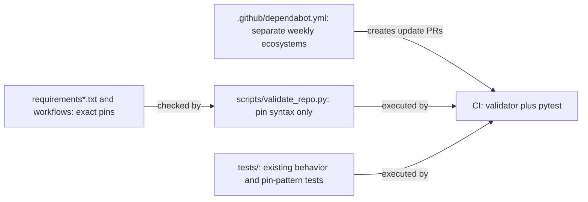
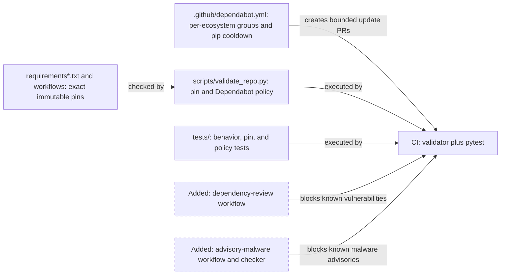
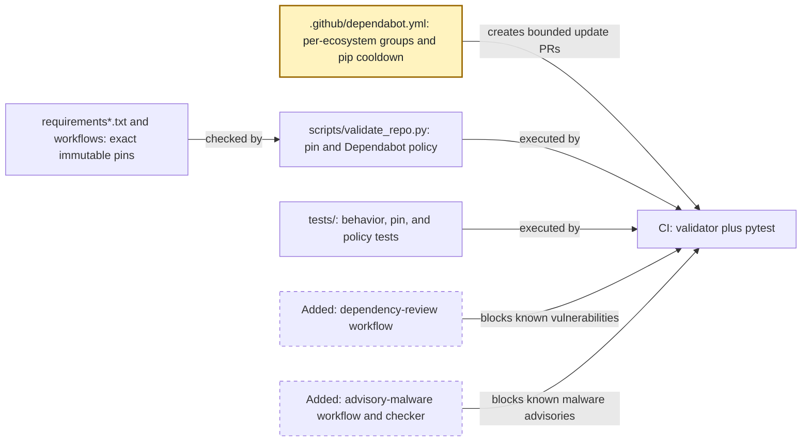
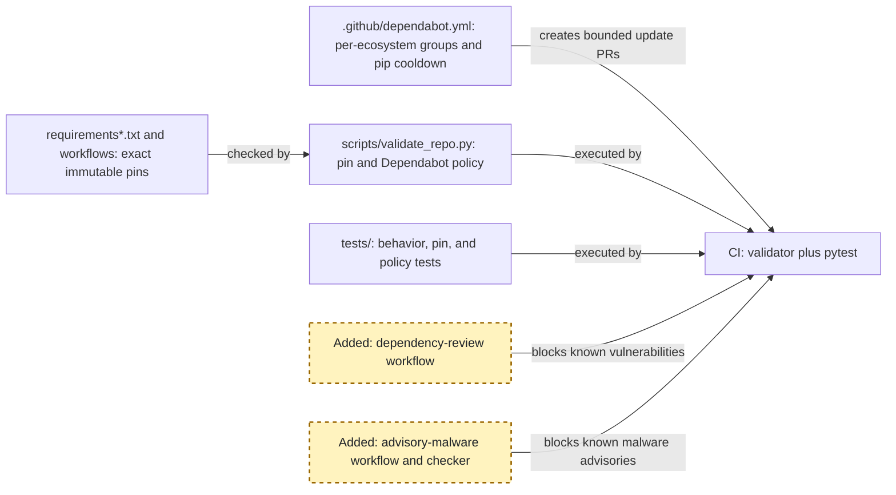
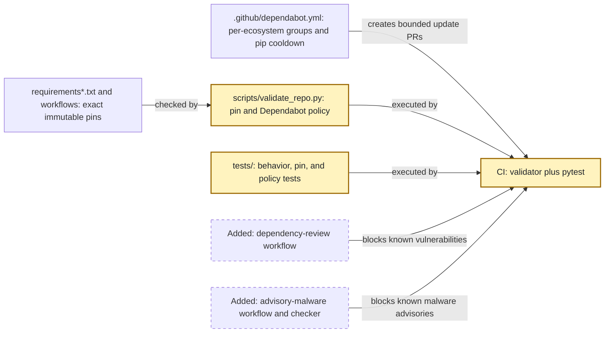

<!-- markdownlint-disable-file -->
# RPI Plan: Dependabot hardening

## Task Metadata

* Task ID: dependabot-hardening
* Task slug: dependabot-hardening
* Plan date: 2026-09-19

## Executive Summary

* Bottom line: The plan will use independent `pip` and `github-actions` Dependabot groups, delay non-security Python patch/minor releases 14 days and major releases 30 days, preserve exact version and SHA pinning, and add two pull-request gates: Dependency Review for every known vulnerability across all scopes and a fixture-tested GitHub Advisory Database malware check that fails on matches.
* Why this matters: The approach reduces routine update-review volume without coupling unrelated ecosystems, gives newly released Python packages time for public reporting, and prevents known vulnerable or malware-advisory matches from entering through any pull request—not only Dependabot updates.
* Planning result: Complete and implementation-ready. The completed standard critique passed after the plan fixed the malware-check contract and clarified that workflow validation is not branch-protection enforcement.
* Confidence and uncertainty: High for Dependabot grouping/cooldown and Dependency Review behavior. The advisory-malware check necessarily detects only published GitHub advisory records, not unknown malicious packages; that residual limit is explicit in the planned result.

### What You May Not Know

* Dependabot security updates bypass the selected cooldown, and security groups cannot span `pip` and `github-actions`. The per-ecosystem choice therefore keeps security and version behavior consistent.
* Existing direct Python pins do not constitute a transitive dependency lock. The planned gates improve known-advisory checks for the available dependency graph but do not create a complete indirect-resolution inventory.
* A GitHub Advisory Database malware match is known-advisory evidence, not a safety verdict; a passing workflow run is also not evidence that GitHub branch protection has been configured to require it.

## Phase Checklist

### Before

### After

The final state preserves the existing functional CI gate, makes Dependabot policy structurally testable, and adds independent advisory-based pull-request checks.

<!-- rpi:phase id=P01 -->
### [x] P01: Define deterministic Dependabot update policy

Goals:
* The repository receives grouped update pull requests that remain attributable to one ecosystem, and non-security Python releases wait the user-selected reporting period without delaying security remediation.

Dependencies:
* None

Highlighted work: update `.github/dependabot.yml` with the selected grouping and release-age policy.

<!-- rpi:task id=P01-T01 -->
#### [x] P01-T01: Configure per-ecosystem update groups and Python release cooldowns

Goals:
* Dependabot creates grouped `pip` and grouped `github-actions` pull requests independently, and a non-security Python release is eligible only after its configured age.

Requirements:
* FR-001
* FR-002
* FR-003
* The `pip` and `github-actions` entries must each define separate version-update and security-update groups that match their ecosystem's dependencies.
* The `pip` entry must define the selected cooldown policy: `default-days: 14`, `semver-patch-days: 14`, `semver-minor-days: 14`, and `semver-major-days: 30`.
* The configuration must not use `target-branch`, must retain weekly scheduling and existing labels, and must not configure a cooldown intended to delay security updates.

Details:
* Dependabot assigns an update to the first matching group, so group patterns and order must be unambiguous. Use all-dependency patterns only where they preserve the confirmed per-ecosystem boundary.
* Keep version and security groups distinct because GitHub does not mix those update types. The group identifiers and comments should make the distinction visible to maintainers.
* Dependabot must continue changing `uses:` references as full SHA pins and Python dependencies as exact `==` pins; do not relax existing validator rules to accommodate automated changes.

References:
* [.github/dependabot.yml](../../../.github/dependabot.yml): current weekly `pip` and `github-actions` configuration.
* [.copilot-tracking/research/2026-09-19/dependabot-hardening-research.md](../../research/2026-09-19/dependabot-hardening-research.md):
  * `## Findings` establishes per-ecosystem grouping and the version-update-only cooldown limit.

Dependencies:
* None

<!-- rpi:phase id=P02 -->
### [x] P02: Gate dependency changes on known advisory evidence

Goals:
* Any pull request that introduces a known vulnerable dependency, or a dependency with a matching GitHub malware advisory, fails before merge with a bounded, interpretable reason.

Dependencies:
* P01-T01

Highlighted work: add least-privilege workflows for known-vulnerability review and known malware-advisory matching.

<!-- rpi:task id=P02-T01 -->
#### [x] P02-T01: Add a SHA-pinned Dependency Review required-check workflow

Goals:
* Pull requests fail when they introduce any known vulnerability in runtime, development, or unknown dependency scopes.

Requirements:
* FR-004
* NFR-002
* A new `.github/workflows/dependency-review.yml` must run on `pull_request` with only the documented read permissions it needs.
* It must invoke `actions/dependency-review-action` using a full commit SHA with a readable intended-version comment.
* Its configuration must fail on `low` severity and include `runtime`, `development`, and `unknown` scopes; it must not use warning-only mode or an advisory allowlist without a recorded future decision.

Details:
* Resolve the action SHA from the intended upstream release during implementation and preserve the repository convention for full-SHA action pins.
* Do not use `pull_request_target`, `pull-requests: write`, or a workflow token with broader write permissions. The workflow should let repository branch protection require its check after the workflow is added; enabling that repository setting is outside this plan.
* This action is the known-vulnerability gate. It does not by itself provide the user-selected malware-specific matching policy.

References:
* [.github/workflows/ci.yml](../../../.github/workflows/ci.yml): current minimal-permission workflow and SHA-pinned action pattern.
* [.github/workflows/codeql-analysis.yml](../../../.github/workflows/codeql-analysis.yml): existing security workflow permission pattern.
* [.copilot-tracking/research/2026-09-19/dependabot-hardening-research.md](../../research/2026-09-19/dependabot-hardening-research.md):
  * `Dependency Review is the GitHub-native vulnerability gate` under `## Findings`.

Dependencies:
* P01-T01

<!-- rpi:task id=P02-T02 -->
#### [x] P02-T02: Add a fail-closed GitHub Advisory Database malware matcher

Goals:
* A pull request fails when its changed direct Python dependency set matches a GitHub Advisory Database malware record, while results explicitly identify the match as advisory-based evidence.

Requirements:
* FR-005
* NFR-001
* NFR-002
* NFR-004
* Add `.github/workflows/advisory-malware.yml` and the repository-owned checker `scripts/check_malware_advisories.py`. The checker must compare the base and head revisions for direct dependency changes in `requirements.txt` and `requirements-dev.txt`, query GitHub's public advisory data for each changed package, and exit nonzero on a matching `type:malware` advisory.
* The workflow must use only read-scoped permissions and must not expose secrets, execute dependency code, or use `pull_request_target`.
* The check output must identify the matching package/advisory and include the exact fragment `GitHub Advisory Database malware advisory match`; it must say that it detects known advisory records rather than proving package safety. Exit `0` only when every changed dependency has no match, exit `1` for one or more matches, and surface request/response failures as explicit nonzero errors.

Details:
* Keep parsing and advisory-response interpretation separated so focused tests in `tests/test_check_malware_advisories.py` can exercise changed-package discovery, no-match, match, malformed-response, and API-failure behavior without live network calls.
* Fail closed when the checker finds a malware-advisory match, as confirmed by the user. Surface network/API errors explicitly rather than converting them into a passing safety result; choose the repository-standard failure message and document any unavoidable GitHub API availability limitation.
* The implementation may use GitHub's REST advisory endpoint with the workflow token or unauthenticated public access as supported at implementation time. It must keep request data limited to package name/ecosystem and avoid external third-party scanning services.

References:
* [requirements.txt](../../../requirements.txt): runtime direct dependency source.
* [requirements-dev.txt](../../../requirements-dev.txt): development direct dependency source.
* [.github/workflows/ci.yml](../../../.github/workflows/ci.yml): workflow convention to follow for checkout and Python execution.
* [.copilot-tracking/research/2026-09-19/dependabot-hardening-research.md](../../research/2026-09-19/dependabot-hardening-research.md):
  * `Dependency Review is the GitHub-native vulnerability gate` and its advisory-malware limitations under `## Findings`.

Dependencies:
* P02-T01

<!-- rpi:phase id=P03 -->
### [x] P03: Make the policy and gates verifiable

Goals:
* The repository's required checks verify the application, immutable-pin contract, Dependabot policy, and the advisory matcher’s fail-closed behavior without relying on live services in unit tests.

Dependencies:
* P01-T01
* P02-T01
* P02-T02

Highlighted work: extend structural and fixture-based test coverage, then collect the implementation validation evidence.

<!-- rpi:task id=P03-T01 -->
#### [x] P03-T01: Extend structural validation for Dependabot and workflow policy

Goals:
* Local repository validation rejects drift from the confirmed group/cooldown policy, required dependency-check workflows, or immutable action and Python pin forms.

Requirements:
* FR-003
* FR-004
* FR-006
* NFR-001
* NFR-002
* The validator must parse `.github/dependabot.yml` and assert separate `pip`/`github-actions` version and security group behavior, the exact selected pip cooldown values, weekly schedule retention, and absence of a `target-branch`.
* The validator must assert that every workflow action remains full-SHA pinned with an intended-version comment, including each new dependency-check workflow.
* It must assert the Dependency Review workflow event, permissions, severity, and scope policy without contacting GitHub.

Details:
* Reuse PyYAML and the existing `validate_repo.py` pattern rather than introducing a separate configuration checker.
* Keep the deterministic validator scoped to committed file content. Network/API response behavior belongs to checker-specific fixture tests under `P03-T02`.
* Extend the existing structural-test module with positive and negative assertions that prove the new checks would reject weakened policy.

References:
* [scripts/validate_repo.py](../../../scripts/validate_repo.py): existing structural validation and pin regular expressions.
* [tests/test_structure.py](../../../tests/test_structure.py): current positive and negative validator coverage.
* [.github/dependabot.yml](../../../.github/dependabot.yml): policy target to validate.

Dependencies:
* P01-T01
* P02-T01

<!-- rpi:task id=P03-T02 -->
#### [x] P03-T02: Test advisory matcher behavior and validate the required-check suite

Goals:
* The malware matcher has deterministic regression coverage for both safe and blocking outcomes, and the final changes record can show the complete status-check evidence.

Requirements:
* FR-005
* FR-006
* NFR-001
* NFR-003
* NFR-004
* Add focused tests in `tests/test_check_malware_advisories.py` for package-change detection, no known-malware-advisory result, matching advisory result, malformed API response, and API/request failure. Tests must not make live advisory requests.
* The implementation changes record must capture passing results for `python3 scripts/validate_repo.py`, `python3 -m pytest -q`, and `git diff --check`.
* Fixture-based tests must assert the checker exit code and the exact `GitHub Advisory Database malware advisory match` fragment together with the affected package and advisory identifier; test names and checker output must distinguish a known advisory match from a comprehensive malware determination.

Details:
* Keep existing DOCX-generation and parser tests unchanged except where shared validation scaffolding needs extension.
* The implementation must use the CI-supported Python interpreter consistently; if the workflow retains `python`, record why that remains equivalent to the locally available `python3`, or update the workflow with the smallest compatible change.
* Passing workflow runs are code-level validation evidence only. Any GitHub repository setting that marks them as required branch protection remains a separate, explicit user-approved repository-setting action and is not assumed to exist in this phase.

References:
* [tests/test_build_docx.py](../../../tests/test_build_docx.py): existing behavioral-test pattern.
* [tests/test_structure.py](../../../tests/test_structure.py): existing repository-policy test pattern.
* [.github/workflows/ci.yml](../../../.github/workflows/ci.yml): required functional CI commands.
* [.copilot-tracking/research/2026-09-19/dependabot-hardening-research.md](../../research/2026-09-19/dependabot-hardening-research.md):
  * `The current CI status check is useful but not sufficient` under `## Findings`.

Dependencies:
* P02-T02
* P03-T01

## User Decisions and Requirements

### Confirmed User Direction

* Update Dependabot to use grouped updates.
* Use independent per-ecosystem groups rather than a combined Python-and-Actions version-update group.
* Apply a 14-day cool-down to non-security Python patch and minor releases and a 30-day cool-down to non-security Python major releases.
* Preserve full GitHub Actions SHA pins and exact Python version pins in Dependabot-generated changes.
* Make unit-test/status-check coverage sufficient to safely evaluate dependency updates.
* Fail the pull request when a new or updated dependency matches a GitHub Advisory Database malware advisory.
* Block any known dependency vulnerability across runtime, development, and unknown scopes.
* Keep this planning phase evidence-based; do not implement production/configuration changes.

### Planning Decisions and Feedback

| Group | Decision or feedback item | Status | Owner | Rationale or input needed | Evidence | Planning impact |
|-------|---------------------------|--------|-------|---------------------------|----------|-----------------|
| D1 | Dependabot grouping granularity | confirmed | user | User selected independent per-ecosystem groups on 2026-09-19. Security updates remain per ecosystem, and failures remain attributable to Python or Actions changes. | [.copilot-tracking/research/2026-09-19/dependabot-hardening-research.md](../../research/2026-09-19/dependabot-hardening-research.md) `## Findings` | Defines `P01-T01`. |
| D2 | Release cool-down policy | confirmed | user | User selected 14 days for non-security pip patch/minor releases and 30 days for major releases on 2026-09-19; security updates remain exempt. | Research finding on Dependabot `cooldown` | Defines `P01-T01` and `P03-T01`. |
| D3 | Malware-advisory response | confirmed | user | User selected automatic failure for a new or updated dependency that matches a GitHub Advisory Database malware advisory on 2026-09-19. | Research finding on GitHub Advisory Database limits | Defines `P02-T02` and `P03-T02`. |
| D4 | Known-vulnerability severity and scope policy | confirmed | user | User selected blocking of every known vulnerability at all severities across runtime, development, and unknown scopes on 2026-09-19. | Research finding on Dependency Review inputs | Defines `P02-T01` and `P03-T01`. |

## Planning Readiness and Next Step

| Field | Record |
|-------|--------|
| Planning execution and readiness | Complete and Ready for implementation. The sole standard critique completed with a Pass verdict and its planner-owned findings are resolved. |
| Decision participation | user-owned; standalone RPI Plan invocation. |
| Planning delegation | adaptive; default provenance. The three dependent, tightly coupled phases were drafted inline by the primary planner. |
| Blockers | none |
| Latest critique | [.copilot-tracking/reviews/plans/2026-09-19/dependabot-hardening-plan-critique.md](../../reviews/plans/2026-09-19/dependabot-hardening-plan-critique.md); Complete / Pass against saved candidate `db8f175f66d5332459809b00fe312cb76bd0c5e9b8ca241816e1cdc84aa36469`. |
| Relevant research | [.copilot-tracking/research/2026-09-19/dependabot-hardening-research.md](../../research/2026-09-19/dependabot-hardening-research.md) |
| Plan | `.copilot-tracking/plans/2026-09-19/dependabot-hardening-plan.md` |
| Changes-record role | `.copilot-tracking/changes/2026-09-19/dependabot-hardening-changes.md` will be implementation evidence. |
| Continuation owner | user |
| Required gates or confirmations | Implementation validation passed. Any GitHub setting that makes these workflows required remains a separate, explicit user-approved repository-setting action. |
| Next action | `/rpi-review` to assess the completed full-plan implementation. |

## Goals

* Reduce Dependabot review volume without making security-update behavior opaque or coupling unrelated failures unnecessarily.
* Delay adoption of new non-security Python dependency releases by the selected, documented period.
* Preserve immutable workflow-action references and exact direct Python dependency versions after automated updates.
* Ensure dependency-change checks validate the policy, functional behavior, known vulnerabilities, and known malware-advisory boundary.

## Scope and Non-Goals

### In Scope

* [.github/dependabot.yml](../../../.github/dependabot.yml): per-ecosystem groups and Python release-age policy.
* New least-privilege dependency review and malware-advisory workflows.
* Repository-owned advisory matcher, structural validation, and fixture-based tests.
* Existing CI command/runtime consistency where required to make the expected status checks reliable.

### Non-Goals

* Claiming that cool-downs, Dependency Review, or advisory lookups prove a package is malware-free.
* Replacing exact direct Python pins with hash-locked transitive dependencies.
* Delaying security-update pull requests.
* Changing unrelated plugin, skill, resume-generation, or CodeQL behavior.
* Enabling GitHub repository settings or required branch checks without explicit approval and observed implementation evidence.

## Functional Requirements

* FR-001: Dependabot must group dependency updates per ecosystem while keeping security-update behavior distinct from version updates.
* FR-002: Dependabot must apply a 14-day delay to non-security Python patch/minor releases and a 30-day delay to major releases, while security updates remain exempt.
* FR-003: Automated updates must preserve full GitHub Actions commit-SHA pins with intended-version comments and exact direct Python `==` pins.
* FR-004: A pull-request Dependency Review check must reject every known vulnerability across runtime, development, and unknown dependency scopes.
* FR-005: A pull-request advisory checker must fail when changed direct Python dependencies match a GitHub Advisory Database malware record and clearly state advisory-coverage limits.
* FR-006: Tests and repository validation must detect regression in Dependabot policy, gate configuration, and immutable pin invariants.

## Non-Functional Requirements

* NFR-001: Dependency policy and advisory-matcher unit tests must be deterministic and not make runtime network calls.
  * Objective threshold or evaluation condition: committed configuration is structurally checked and advisory API cases use fixtures/mocks.
* NFR-002: Dependency pull-request checks must use least-privilege permissions and ordinary `pull_request` events.
  * Objective threshold or evaluation condition: workflow permissions are read-scoped and neither `pull_request_target` nor write scopes are present.
* NFR-003: Existing application behavior must remain covered while dependency automation changes.
  * Objective threshold or evaluation condition: `python3 scripts/validate_repo.py` and `python3 -m pytest -q` pass using the CI-supported interpreter.
* NFR-004: Known-malware results must be described as Advisory Database matches, never as a comprehensive malware verdict.
  * Objective threshold or evaluation condition: checker/workflow output includes the detection boundary.

## Risks and Open Questions

| Priority | Type | Risk, question, or planning item | Affected work | Impact | Smallest action or evidence needed | Owner |
|----------|------|----------------------------------|---------------|--------|------------------------------------|-------|
| H | residual risk | Cooldown does not delay security fixes or initial package additions, and known-advisory gates cannot identify unknown malicious code. | P01-T01, P02-T02 | Maintainers could overestimate the controls’ protection. | Preserve explicit output/documentation boundaries and human review. | implementer |
| M | residual risk | Failing every known vulnerability across all scopes can block updates for development-only issues. | P02-T01 | Update PRs can need manual remediation or an explicit future policy exception. | Preserve the user-selected policy; record only deliberate future exceptions. | implementer |
| M | residual risk | The repository has no Python lock file, limiting indirect-resolution visibility. | P02-T01, P02-T02 | Transitive package evidence may be incomplete. | Keep direct-dependency boundary explicit; plan a lockfile only in future scope. | user |
| M | risk | Local environment has `python3` but no `python`, while CI invokes `python`. | P03-T02 | Local and CI status-check behavior may diverge. | Verify or align interpreter invocation during implementation. | implementer |

## Dependencies

* GitHub Dependabot configuration: source of group and cooldown semantics.
* GitHub Dependency Review Action: source of known-vulnerability pull-request gate.
* GitHub Advisory Database REST data: source of known malware-advisory matching.
* Existing CI, validation script, and test suite: baseline regression evidence.

## Sources

* [.copilot-tracking/research/2026-09-19/dependabot-hardening-research.md](../../research/2026-09-19/dependabot-hardening-research.md): canonical evidence, alternatives, and limitations.
* [.github/dependabot.yml](../../../.github/dependabot.yml): current update configuration.
* [.github/workflows/ci.yml](../../../.github/workflows/ci.yml): current SHA-pinned functional CI.
* [.github/workflows/codeql-analysis.yml](../../../.github/workflows/codeql-analysis.yml): security-workflow permission pattern.
* [scripts/validate_repo.py](../../../scripts/validate_repo.py): current structural validator.
* [tests/test_structure.py](../../../tests/test_structure.py): current pin-policy tests.
* [tests/test_build_docx.py](../../../tests/test_build_docx.py): current behavioral tests.

## Critique Disposition

* Critique candidate identity: task `dependabot-hardening`; saved candidate SHA-256 `db8f175f66d5332459809b00fe312cb76bd0c5e9b8ca241816e1cdc84aa36469` before reservation metadata.
* Critique depth and provenance: standard; default.
* Critique execution: Complete / Pass.
* Initial attempt consumed: yes.
* Recovery attempt consumed: no.
* Attempt provenance: `2026-09-19-dependabot-hardening-standard-initial`, kind=initial, output=`.copilot-tracking/reviews/plans/2026-09-19/dependabot-hardening-plan-critique.md`, current-dispatch provenance=uninterrupted parent reservation-to-dispatch sequence.
* Recovery eligibility and consent: not applicable.

| Critique run and finding | Disposition | Action owner | Exact resolving evidence | Decision route | Plan response or residual risk |
|--------------------------|-------------|--------------|--------------------------|----------------|-------------------------------|
| PC-001 (Medium): Clarify malware-check file and output contract | resolved | planning parent | `P02-T02` names `scripts/check_malware_advisories.py`, `.github/workflows/advisory-malware.yml`, explicit exit behavior, and required output fragment; `P03-T02` requires matching fixture assertions. | direct planner correction | Implementation has one auditable checker contract and tests. |
| PC-002 (Low): Separate workflow validation from required-status enforcement | resolved | planning parent | `P03-T02` and `Planning Readiness and Next Step` state that passing workflows are code-level validation only and branch protection remains a separate approval-gated action. | direct planner correction | No repository-setting change is implied by implementation validation. |

## Artifact Self-Check

* [x] Executive Summary, What You May Not Know, and the Phase Checklist come first and are understandable without supporting sections.
* [x] Confirmed direction, decisions, readiness, goals, scope, requirements, risks, and dependencies are current and consistent with the Phase Checklist.
* [x] User-owned decisions D1–D4 are confirmed and reconciled with affected phases and requirements.
* [x] Adaptive delegation was selected by default and followed by retaining tightly coupled phase drafting in the parent.
* [x] Every `FR-nnn` and `NFR-nnn` is cited by at least one task's Requirements.
* [x] Every `Pxx` has Goals, Dependencies, and a phase diagram; every `Pxx-Txx` has Goals, Requirements, Details, References, and Dependencies.
* [x] Task goals describe observable behavior and local implementation judgment remains in Details.
* [x] Risks are outside task blocks and name affected work.
* [x] Paths, commands, and symbols follow formatting conventions; diagrams use required source styling. Dual-theme rendering was not previewed.
* [x] The sole initial standard critique completed with a Pass verdict; PC-001 and PC-002 were resolved without a closure critique.
* [x] Planning readiness and implementation handoff are synchronized with the critique disposition.
* Checked sections: Full plan candidate, critique disposition, user direction, requirements-to-task coverage, and implementation handoff.
* Missing or limited sections: No rendered Mermaid preview, real Dependabot PR, live advisory query, or repository branch-protection setting was available in planning scope; these are acknowledged boundaries rather than readiness blockers.

## Follow-Up Items

* None

## Handoff

* Authoritative implementation handoff: Planning Readiness and Next Step.
