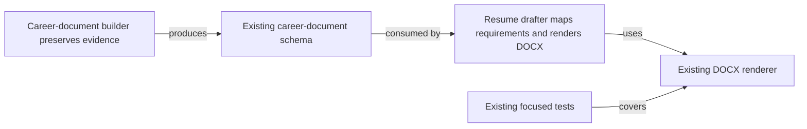
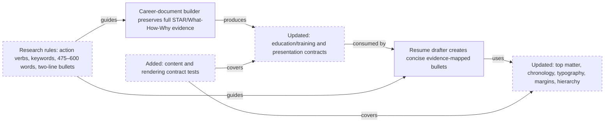

<!-- markdownlint-disable-file -->
# RPI Plan: Resume writing guidance

## Task Metadata

* Task ID: resume-writing-guidance
* Task slug: resume-writing-guidance
* Plan date: 2026-09-19

## Executive Summary

* Bottom line: Update the resume-building guidance so the career-document builder preserves complete, source-linked evidence while the resume drafter creates concise, job-tailored output. The implementation will add evidence-safe STAR/What–How–Why bullet rules, accurate action verbs and job-keyword mapping, required resume top matter, strategic formatting defaults, and complete education/training entries.
* Why this matters: The current skills protect provenance and requirement mapping, but they do not yet encode the requested distinction between a rich career evidence record and a compact, readable resume. The plan makes those expectations explicit and testable without forcing unsupported claims or metrics.
* Planning result: Complete; implementation completed and ready for review. Planning Readiness: Ready, with the three bounded implementation choices recorded in the changes record.
* Confidence and uncertainty: High for the behavioral rules and file boundaries, supported by the completed research artifact and existing contracts. Medium for exact DOCX typography/date rendering because the supplied image does not specify a font family or date syntax.

### What You May Not Know

* The two-line bullet requirement is a rendered-layout requirement, not a reliable character-count rule; implementation must validate representative DOCX output.
* The 475–600-word target applies to the tailored resume body, not the career document.
* The F-pattern is a qualified scanability heuristic, not a universal recruiter behavior. The implementation should front-load meaning and maintain left-aligned structure without promising attention outcomes.
* The supplied formatting image does not define a font family, exact date syntax, or treatment of every possible contact field. Those details remain bounded implementation choices, not reasons to widen scope.

## Phase Checklist

### Before



### After



The plan keeps source evidence and resume presentation separate: shared contracts preserve facts, skill instructions define transformations, and the renderer/tests enforce the visible output where practical.

<!-- rpi:phase id=P01 -->
### [x] P01: Define shared evidence and drafting contracts

Goals:
* The career-document and resume-drafter skills share explicit, evidence-safe rules for education/training, STAR/What–How–Why development, job-keyword mapping, and the distinction between complete evidence and concise resume bullets.

Dependencies:
* None


Highlighted work: update the two skill instruction surfaces and the shared career-document education contract before rendering changes depend on them.

<!-- rpi:task id=P01-T01 -->
#### [x] P01-T01: Update career-document evidence guidance

Goals:
* The career-document builder explicitly preserves verbose, source-linked achievement and education/training evidence that can later be selected and shortened for a tailored resume.

Requirements:
* FR-001: Career-document entries preserve complete, source-linked evidence and do not impose the resume’s 475–600-word or two-line presentation limits.
* FR-002: Education/training evidence includes the fully spelled-out degree, credential, or program; fully spelled-out major/field/specialization when supplied; completion date; and institution/provider.
* FR-003: Ambiguous or missing education/training facts remain unresolved and trigger clarification rather than inference.
* FR-004: STAR and What–How–Why may guide evidence development, but supplied facts, metrics, and quotes retain provenance and are never strengthened beyond the source.

Details:
* Extend [skills/career-document-builder/SKILL.md](../../../skills/career-document-builder/SKILL.md) with the evidence-side rules from research findings C2–C3 and U1/U4.
* Keep full context, task/problem, action/method, result, scope, tools, collaboration, and metrics when supplied; results are preserved when available but are not invented or required for every entry.
* State that abbreviations may be retained as an additional parenthetical form only when present in evidence or needed to align with a verified job keyword; the spelled-out form remains canonical.

References:
* [skills/career-document-builder/SKILL.md](../../../skills/career-document-builder/SKILL.md): current evidence-preservation flow.
* [docs/shared/career-document-schema.md](../../../docs/shared/career-document-schema.md): current provenance and education shape.
* [.copilot-tracking/research/2026-09-19/resume-writing-guidance-research.md](../../research/2026-09-19/resume-writing-guidance-research.md): findings on evidence separation, STAR/What–How–Why, and education/training.

Dependencies:
* None

<!-- rpi:task id=P01-T02 -->
#### [x] P01-T02: Update resume-drafter content and presentation rules

Goals:
* The resume drafter produces a concise, readable, job-tailored resume from verified evidence while preserving unmet requirements and avoiding unsupported wording.

Requirements:
* FR-005: Resume bullets begin with a precise evidence-matched action verb and include relevant scope, method, keyword, and result when supported.
* FR-006: Resume bullets target two rendered lines or fewer; the career document is not subject to that limit.
* FR-007: Resume content targets 475–600 words for the tailored resume body, with the counting boundary documented by the implementation.
* FR-008: Resume top matter follows:
  ```text
  Name
  email address | city, state | optional government security clearance info
  ```
  Clearance is included only when explicitly approved and supported.
* FR-009: Education/training entries show fully spelled-out degree/credential and major/field, completion date, and institution; optional abbreviations never replace the full terms and are used only when evidence-supported and keyword-relevant.
* FR-010: Requirements and job-description keywords are used only when supported by the job-requirements artifact and career evidence; unmet requirements remain visible.
* FR-011: Resume structure defaults to reverse chronology, left-aligned readable content, clear sections, consistent typography/date treatment, and intentional—not decorative—in emphasis.

Details:
* Extend [skills/resume-drafter/SKILL.md](../../../skills/resume-drafter/SKILL.md) with the resume-side transformation rules and the strategic-format defaults from U2–U4.
* Preserve the current checkpoint and anti-fabrication flow. The new rules refine selection and formatting; they do not permit silently dropping unsupported requirements or adding claims.
* Treat 0.5-inch minimum margins, 10–12 pt body text, and 16–22 pt name text as rendering defaults. Leave font family, exact date syntax, and phone/URL policy as explicit implementation choices recorded in the changes record.

References:
* [skills/resume-drafter/SKILL.md](../../../skills/resume-drafter/SKILL.md): current mapping, checkpoint, and anti-fabrication flow.
* [docs/shared/job-requirements-schema.md](../../../docs/shared/job-requirements-schema.md): source of factual requirement keywords.
* [.copilot-tracking/research/2026-09-19/resume-writing-guidance-research.md](../../research/2026-09-19/resume-writing-guidance-research.md): C1–C6, W1/W3, and U1–U4.

Dependencies:
* P01-T01

<!-- rpi:phase id=P02 -->
### [x] P02: Align schemas and DOCX rendering

Goals:
* The structured inputs and generated Word resume can represent and visibly apply the new education, top-matter, chronology, readability, and hierarchy rules without weakening existing compatibility.

Dependencies:
* P01


Highlighted work: make the education data and resume rendering behavior represent the rules defined in P01.

<!-- rpi:task id=P02-T01 -->
#### [x] P02-T01: Update education/training data contracts

Goals:
* Education and training data has a documented canonical form that preserves complete names, dates, institutions, and optional keyword-supporting abbreviations.

Requirements:
* FR-002, FR-003, FR-009.
* The contract must distinguish the canonical spelled-out value from an optional abbreviation:
  ```json
  {
    "degree": "Bachelor of Science",
    "major": "Computer Science",
    "abbreviation": "BSCS",
    "institution": "Example University",
    "completionDate": "2024-05"
  }
  ```
  This is a contract example; the implementation must preserve source-supported values and may choose an equivalent existing field shape if compatibility requires it.

Details:
* Update [docs/shared/career-document-schema.md](../../../docs/shared/career-document-schema.md) and any fixture/consumer assumptions needed to represent education and training clearly.
* Preserve compatibility with existing JSON Resume-aligned fields where possible. Do not introduce a closed schema that rejects valid existing records without an explicit migration decision.
* Record the chosen completion-date display precision and any compatibility mapping in the changes record.

References:
* [docs/shared/career-document-schema.md](../../../docs/shared/career-document-schema.md): current education contract.
* [.copilot-tracking/research/2026-09-19/resume-writing-guidance-research.md](../../research/2026-09-19/resume-writing-guidance-research.md): U4 and Cycle 5.

Dependencies:
* P01-T01

<!-- rpi:task id=P02-T02 -->
#### [x] P02-T02: Update DOCX resume presentation

Goals:
* Generated resumes visibly follow the approved top matter and strategic-format defaults while retaining existing sections and user-approved content.

Requirements:
* FR-006, FR-007, FR-008, FR-009, FR-011.
* Preserve name-first top matter and render approved contact/clearance content in the specified order.
* Apply reverse chronological ordering to dated entries unless an explicit user-approved exception is supplied.
* Maintain at least 0.5-inch margins, 10–12 pt body text, 16–22 pt name text, clear hierarchy, consistent date/type treatment, and readable left-aligned content.
* Do not silently discard a bullet that exceeds two rendered lines; shorten only through an evidence-preserving transformation or surface the need for user review.

Details:
* Update [skills/resume-drafter/scripts/build_docx.py](../../../skills/resume-drafter/scripts/build_docx.py) using the existing `python-docx` surface.
* Keep implementation judgment for exact font family, date syntax, optional phone/URL behavior, and the mechanism used to assess rendered line count. Document those choices in the changes record.
* Preserve the existing requirement-not-addressed section and avoid decorative formatting that harms ATS/readability.

References:
* [skills/resume-drafter/scripts/build_docx.py](../../../skills/resume-drafter/scripts/build_docx.py): current renderer.
* [skills/resume-drafter/scripts/fixtures/sample-resume.json](../../../skills/resume-drafter/scripts/fixtures/sample-resume.json): existing input example.
* [.copilot-tracking/research/2026-09-19/resume-writing-guidance-research.md](../../research/2026-09-19/resume-writing-guidance-research.md): C4 and U2–U3.

Dependencies:
* P01-T02
* P02-T01

<!-- rpi:phase id=P03 -->
### [x] P03: Add focused behavioral and rendering coverage

Goals:
* Automated checks protect the new content contracts and visible resume behavior, including required education fields, top matter, ordering, typography/margins, and preservation of unmet requirements.

Dependencies:
* P02


Highlighted work: add regression coverage around the new contracts and the generated DOCX, keeping tests proportional to the repository’s existing test style.

<!-- rpi:task id=P03-T01 -->
#### [x] P03-T01: Add contract and renderer tests

Goals:
* The repository detects regressions in the new resume-writing rules and fails clearly when generated output violates a binding contract.

Requirements:
* NFR-001: Existing tests continue to pass.
* NFR-002: Tests cover the positive and negative paths for optional clearance, complete education/training fields, supported abbreviations, reverse chronology, and preservation of unmet requirements.
* NFR-003: Tests verify objective formatting properties that can be inspected from the generated DOCX, including margins, font-size ranges, paragraph order, and top-matter text.
* NFR-004: Where exact two-line verification cannot be reliably inferred from DOCX XML alone, tests must cover the rule’s input/selection behavior and document the visual validation boundary rather than claiming a proxy is equivalent.

Details:
* Extend [tests/test_build_docx.py](../../../tests/test_build_docx.py) and add focused tests for the changed skill/schema behavior where appropriate.
* Use representative fixtures with long and concise bullets, complete and incomplete education entries, a supported keyword abbreviation, a clearance value, and unmet requirements.
* Keep test assertions tied to observable contracts, not a particular implementation helper or unsupported font family.

References:
* [tests/test_build_docx.py](../../../tests/test_build_docx.py): existing DOCX test patterns.
* [tests/test_structure.py](../../../tests/test_structure.py): existing repository validation pattern.
* [skills/resume-drafter/scripts/fixtures/sample-resume.json](../../../skills/resume-drafter/scripts/fixtures/sample-resume.json): existing fixture.
* [docs/shared/anti-fabrication-contract.md](../../../docs/shared/anti-fabrication-contract.md): boundary for negative tests.

Dependencies:
* P02-T02

## User Decisions and Requirements

### Confirmed User Direction

* Keep career-document bullets and evidence more verbose than resume bullets.
* Keep tailored resume bullets concise enough for two rendered lines where possible.
* Use a 475–600-word target for the tailored resume body, not the career document.
* Use strong action verbs, STAR/What–How–Why development, contextual scope, quantified results when supported, and no invented claims.
* Use applicable job-description keywords only when supported by the job-requirements artifact and career evidence.
* Use the top matter:
  ```text
  Name
  email address | city, state | optional government security clearance info
  ```
* Use reverse chronology, consistent typography/date treatment, focused structure, 0.5-inch minimum margins, 10–12 pt body text, and 16–22 pt name text.
* Require fully spelled-out degree/credential and major/field, completion date, and institution/provider. Allow abbreviations only when evidence-supported and useful for verified job-description keywords.
* Preserve source provenance and ask for clarification rather than infer missing or ambiguous facts.

### Planning Decisions and Feedback

| Group | Decision or feedback item | Status | Owner | Rationale or input needed | Evidence | Planning impact |
|---|---|---|---|---|---|---|
| D1 | Exact completion-date display (`YYYY`, `Mon YYYY`, or another consistent form) | deferred | implementer within constraints | User requires a completion date but not its display granularity | U4, P02-T01 | Record the chosen compatible format in changes; do not block plan |
| D2 | Treatment of phone numbers and URLs in top matter | deferred | implementer within constraints | User specified email, location, and optional clearance but did not resolve other contact fields | U2, P02-T02 | Preserve the requested order and document the compatibility choice |
| D3 | Exact font family and line-count measurement method | deferred | implementer within constraints | Image provides sizes and margins, not font family or a universal two-line measurement | U3, P02-T02, P03-T01 | Use readable defaults and document visual-validation boundary |

## Planning Readiness and Next Step

| Field | Record |
|---|---|
| Planning execution and readiness | Complete; implementation complete under the approved full-plan scope and ready for review |
| Decision participation | user-owned; confirmed user direction and supplied evidence; no redundant walkthrough required |
| Planning delegation | adaptive; default provenance; work is compact and tightly coupled, so planning remained inline |
| Blockers | None for planning. Implementer must record the deferred display choices in the changes record. |
| Latest critique | Not run; the dedicated critique helper was unavailable in this environment, so no critique artifact exists. |
| Relevant research | [.copilot-tracking/research/2026-09-19/resume-writing-guidance-research.md](../../research/2026-09-19/resume-writing-guidance-research.md) |
| Plan | `.copilot-tracking/plans/2026-09-19/resume-writing-guidance-plan.md` |
| Changes-record role | `.copilot-tracking/changes/2026-09-19/resume-writing-guidance-changes.md` is implementation evidence |
| Continuation owner | user |
| Required gates or confirmations | Plan is implementation-ready; no production files changed |
| Next action | Run `/rpi-review` against the completed implementation |

## Goals

* Preserve complete, source-linked career evidence while producing a concise, readable, job-tailored resume.
* Make the requested content, education/training, top-matter, chronology, typography, and layout rules explicit and testable.
* Maintain anti-fabrication, clarification, requirement-mapping, and unmet-requirement behavior.

## Scope and Non-Goals

### In Scope

* `skills/career-document-builder/SKILL.md`
* `skills/resume-drafter/SKILL.md`
* `docs/shared/career-document-schema.md`
* `skills/resume-drafter/scripts/build_docx.py`
* focused fixtures/tests needed for the new contracts

### Non-Goals

* Changing job-posting acquisition behavior.
* Replacing the JSON Resume-aligned career-document model.
* Adding unsupported empirical claims about recruiter eye tracking.
* Selecting a single font family or fully redesigning the resume template.
* Implementing the changes during planning.

## Functional Requirements

* FR-001: Career-document content preserves complete source-linked evidence without resume word-count or line-length limits.
* FR-002: Education/training records contain full degree/credential, major/field when supplied, completion date, and institution/provider.
* FR-003: Missing or ambiguous education/training facts remain unresolved and require clarification.
* FR-004: Career evidence can be developed with STAR and What–How–Why while retaining provenance and avoiding invented results.
* FR-005: Resume bullets use evidence-matched action verbs and lead with the most relevant semantic content.
* FR-006: Resume bullets are edited toward two rendered lines or fewer without silently deleting unsupported or required content.
* FR-007: Tailored resume body targets 475–600 words, with the counting boundary documented.
* FR-008: Resume top matter follows the specified name/contact/optional-clearance order.
* FR-009: Resume education/training entries use full terms and source-supported optional abbreviations.
* FR-010: Resume keywords map to verified job requirements and career evidence; unmet requirements remain visible.
* FR-011: Resume presentation defaults to reverse chronology, clear left-aligned structure, consistent styling/dates, readable margins, and specified type-size ranges.

## Non-Functional Requirements

* NFR-001: Existing repository tests and validation behavior remain passing.
* NFR-002: New tests cover positive and negative paths for the changed contracts.
  * Objective threshold or evaluation condition: test suites assert required and prohibited behavior for clearance, education fields, abbreviations, chronology, and unmet requirements.
  * Operating condition or verification approach, if needed: run the smallest relevant test command and escalate only if targeted tests reveal baseline issues.
* NFR-003: Generated DOCX output preserves readable layout.
  * Objective threshold or evaluation condition: margins are at least 0.5 inch; body font is 10–12 pt; name font is 16–22 pt; top matter appears in the required order.
  * Operating condition or verification approach, if needed: inspect document XML and render representative output when the environment supports it.
* NFR-004: No unsupported claim, metric, clearance, degree, major, date, institution, keyword, or equivalency is introduced.
  * Objective threshold or evaluation condition: every such value traces to a career-document entry, job-requirements entry, or explicit user answer.
  * Operating condition or verification approach, if needed: retain clarification/unmet paths in tests and manual review.

## Risks and Open Questions

| Priority | Type | Risk, question, or planning item | Affected work | Impact | Smallest action or evidence needed | Owner |
|---|---|---|---|---|---|---|
| M | implementation validation | Two rendered lines depend on font, width, margins, and bullet style | P02-T02, P03-T01 | Text-only checks may be misleading | Render representative output and document the visual boundary | implementer |
| L | open decision | Completion-date display precision | P02-T01 | Inconsistent education entries | Choose a source-compatible consistent format and record it | implementer |
| L | open decision | Phone/URL treatment in top matter | P02-T02 | Extra fields may conflict with the requested compact format | Preserve requested fields and document compatibility behavior | implementer |
| L | open decision | Font family and exact date syntax | P02-T02, P03-T01 | Template consistency may vary | Select readable defaults within the stated ranges | implementer |

## Dependencies

* Existing anti-fabrication and clarification contract: governs every new content rule.
* Existing JSON Resume-aligned career-document schema: compatibility must be preserved.
* Existing job-requirements artifact: supplies the only valid source for job-description keyword mapping.
* `python-docx`: current renderer dependency.
* Research artifact: supplies the completed evidence and user direction.

## Sources

* [.copilot-tracking/research/2026-09-19/resume-writing-guidance-research.md](../../research/2026-09-19/resume-writing-guidance-research.md): completed research cycles, evidence IDs C1–C6, W1–W3, and U1–U4.
* [skills/career-document-builder/SKILL.md](../../../skills/career-document-builder/SKILL.md): current source-evidence behavior.
* [skills/resume-drafter/SKILL.md](../../../skills/resume-drafter/SKILL.md): current requirement mapping and anti-fabrication flow.
* [docs/shared/career-document-schema.md](../../../docs/shared/career-document-schema.md): current career-document contract.
* [docs/shared/job-requirements-schema.md](../../../docs/shared/job-requirements-schema.md): current requirements contract.
* [skills/resume-drafter/scripts/build_docx.py](../../../skills/resume-drafter/scripts/build_docx.py): current DOCX rendering behavior.
* [tests/test_build_docx.py](../../../tests/test_build_docx.py): existing renderer test coverage.

## Critique Disposition

* Critique candidate identity: `resume-writing-guidance` initial implementation-ready plan
* Critique depth and provenance: standard; default under the planning contract
* Critique execution: not run; the dedicated critique helper was unavailable in this environment
* Initial attempt consumed: no
* Recovery attempt consumed: no
* Attempt provenance: no dispatch reservation created because no critique helper was available
* Recovery eligibility and consent: not applicable

| Critique run and finding | Disposition | Action owner | Exact resolving evidence | Decision route | Plan response or residual risk |
|---|---|---|---|---|---|
| No critique run | recorded limitation | planner | Tool availability | direct planner judgment | Plan is implementation-ready based on completed research and explicit requirements; implementation should preserve the three deferred decisions in the changes record |

## Artifact Self-Check

* [x] Executive Summary, What You May Not Know, and the Phase Checklist come first and are understandable without reading the supporting sections.
* [x] Confirmed direction, grouped decisions, readiness, goals, scope, requirements, risks, and dependencies are current and consistent with the Phase Checklist.
* [x] Planning decision participation and provenance are recorded; no unresolved user-owned decision required a walkthrough.
* [x] Planning delegation and provenance are recorded as adaptive/default, with inline planning used because the phases are compact and tightly coupled.
* [x] Functional and non-functional requirements are current, and every `FR-nnn` and `NFR-nnn` is cited by at least one task's Requirements.
* [x] Every `Pxx` has Goals, Dependencies, and a phase diagram that highlights its part of After. Every `Pxx-Txx` has Goals, Requirements, Details, References, and Dependencies.
* [x] Task Goals describe observable behavior without prescribing unsupported choreography.
* [x] Open decisions, risks, and questions live in their tables with affected task IDs.
* [x] Code, commands, and symbols use backticks; existing files and artifacts use workspace-relative Markdown links.
* [x] Before reflects the evidence-backed pre-change baseline; After reflects the intended result with stable node IDs and added work distinguishable by dashed borders.
* [x] Mermaid initialization objects use the prescribed font family and font size strings.
* [x] Risks, open questions, blockers, and accepted limitations have owners and next actions.
* [x] Critique limitation is recorded without falsely claiming a pass.
* [x] Planning execution, readiness, continuation owner, gates, next action, and implementation paths are complete and consistent.
* [x] Follow-Up Items remain outside active plan completion and acceptance claims.
* Checked sections: metadata, summary, diagrams, phases, tasks, decisions, readiness, goals, scope, requirements, risks, dependencies, sources, critique disposition, handoff.
* Missing or limited sections: dedicated critique artifact unavailable; exact font family/date syntax/phone-URL policy remain implementation decisions.

## Follow-Up Items

* None

## Handoff

* Authoritative implementation handoff: Planning Readiness and Next Step
