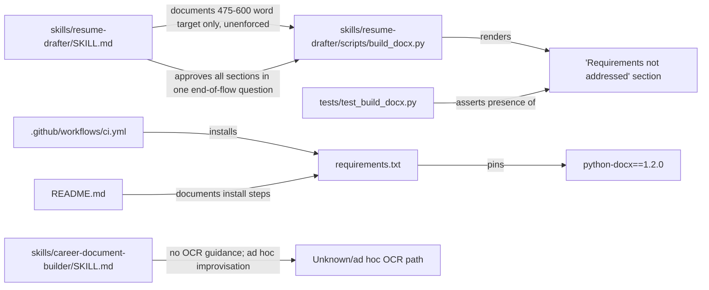
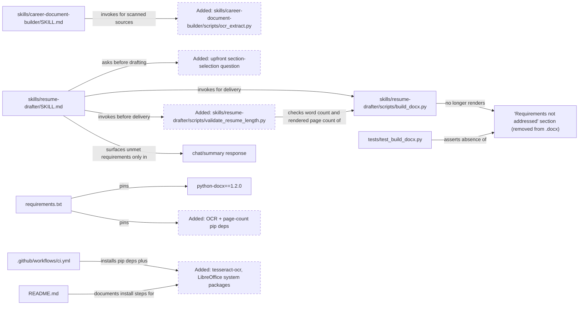
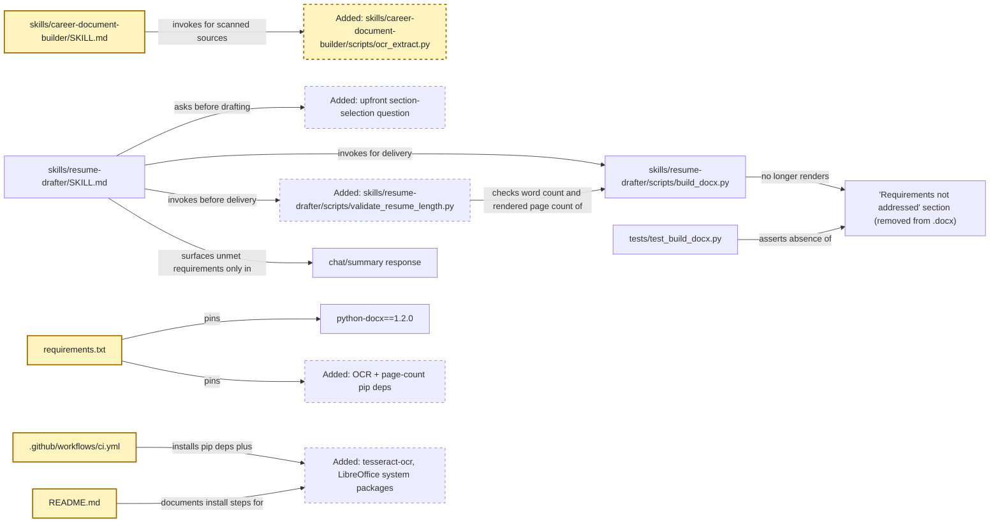
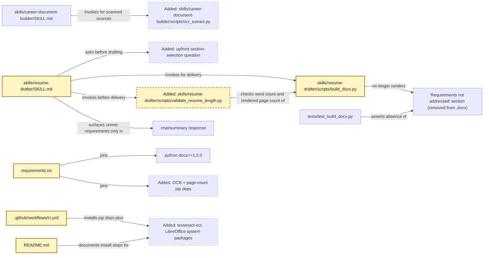
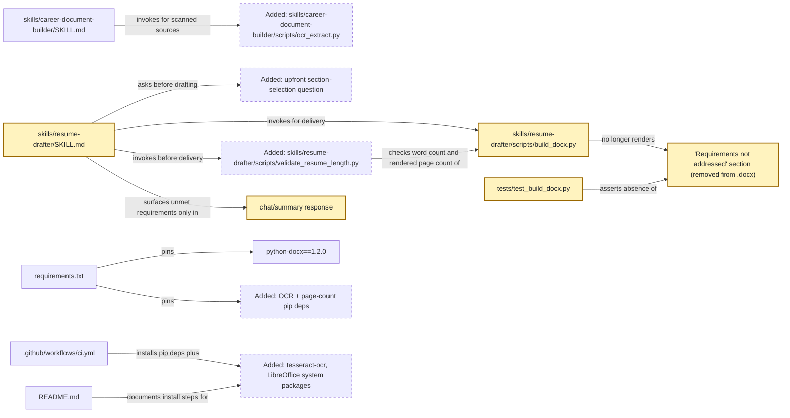
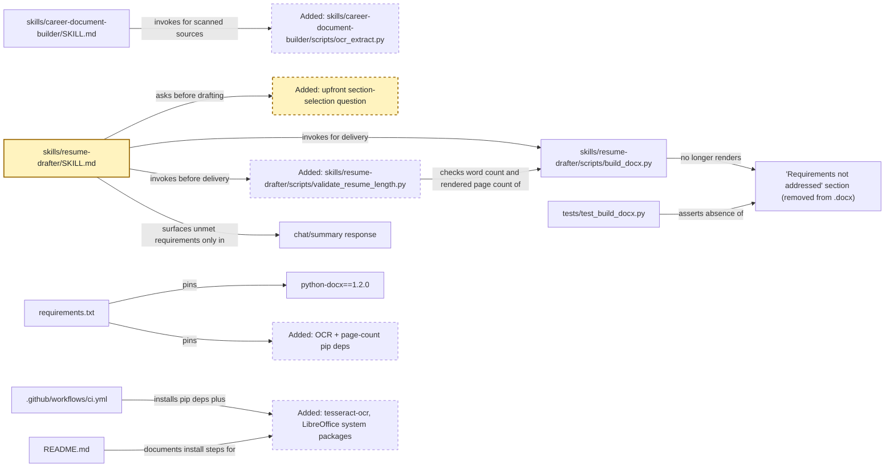

<!-- markdownlint-disable-file -->
# RPI Plan: resume-builder repeatability and length enforcement

## Task Metadata

* Task ID: resume-builder-repeatability
* Task slug: resume-builder-repeatability
* Plan date: 2026-09-20

## Executive Summary

* Bottom line: This plan adds four bundled, testable fixes to the `resume-builder` plugin so the next run does not depend on live improvisation: a pinned, cross-platform OCR script for scanned career sources (proven against both an image fixture and a scanned-PDF fixture), a hard-enforced word-and-page budget for the tailored resume (475–600 words, 2 pages, computed from a fixed `--payload`/`--docx` contract, with delivery blocked on failure absent an explicit user-approved exception), removal of the "Requirements not addressed" section from the delivered `.docx` in favor of chat-only disclosure, and an upfront question asking which optional sections (Skills and Awards) to include before drafting begins.
* Why this matters: The first real run worked only because the agent improvised a macOS-only OCR path live and never checked the documented word target, producing a 1,086-word, 4-page resume with an internal "unmet requirements" section inside it. None of that is repeatable or testable today; this plan makes each behavior a pinned dependency, a validated script, or a documented checkpoint instead of an in-the-moment decision.
* Planning result: Complete. All five decisions from the prior research artifact are confirmed by the user, so this plan proceeds directly to implementation-ready phases without a research gap.
* Confidence and uncertainty: High confidence on scope and requirements, since every phase traces to a specific, evidence-backed finding and a user-confirmed decision. Moderate uncertainty remains only on exact OCR accuracy for poor-quality scans and on the precise pinned versions the implementer selects, both flagged as implementer-resolvable details rather than blockers.

### What You May Not Know

* This repository is a public, marketplace-installable plugin (`plugin.json`, `.github/plugin/marketplace.json`) whose CI runs on `ubuntu-latest` ([`.github/workflows/ci.yml`](../../../.github/workflows/ci.yml)). Any dependency this plan adds must work in that Linux CI and be installable by any plugin user's OS, not only the macOS machine where the first run happened.
* [`scripts/validate_repo.py`](../../../scripts/validate_repo.py) already enforces an exact-pin convention (`REQUIREMENT_PIN = re.compile(r"^[A-Za-z0-9_.-]+==[^<>=!~\s]+$")`) on every line in [`requirements.txt`](../../../requirements.txt) and [`requirements-dev.txt`](../../../requirements-dev.txt). New pip dependencies from this plan must follow that same exact-pin style or the repo's own validation step will fail.
* [`skills/resume-drafter/scripts/build_docx.py`](../../../skills/resume-drafter/scripts/build_docx.py) already renders the "Requirements not addressed" section by design (lines around `payload.get("unmetRequirements")`), and [`tests/test_build_docx.py`](../../../tests/test_build_docx.py) currently asserts that section's presence — removing it is a deliberate, user-confirmed behavior change that this plan's tests must update, not merely delete.
* A render-based page-count check needs a `.docx`→PDF conversion step. Headless LibreOffice (`soffice --headless --convert-to pdf`) is the practical cross-platform choice confirmed with the user, but it is a system binary, not a `pip` package — it must be documented as an OS-level prerequisite (like the new OCR system binary) and installed explicitly in CI, the same way `tesseract-ocr` will be.

## Phase Checklist

### Before



### After



This plan replaces the first run's ad hoc, macOS-only OCR improvisation and unenforced word target with two bundled, pinned scripts (`ocr_extract.py`, `validate_resume_length.py`), removes the in-document "Requirements not addressed" section in favor of chat-only disclosure, and adds an upfront section-selection question before any content is drafted.

<!-- rpi:phase id=P01 -->
### [x] P01: Add repeatable, cross-platform OCR extraction for career-document-builder

Goals:
* `career-document-builder` has a bundled, pinned, cross-platform script for extracting text from scanned or image-based award, review, and metric sources, replacing the first run's ad hoc, macOS-only Vision-framework improvisation.
* The new OCR path runs on this repo's `ubuntu-latest` CI and on any plugin user's supported OS, not only macOS.

Dependencies:
* None



Highlighted work: `career-document-builder/SKILL.md`, the new `ocr_extract.py` script, and the pinned OCR dependency/system-package additions to `requirements.txt`, CI, and `README.md`.

<!-- rpi:task id=P01-T01 -->
#### [x] P01-T01: Bundle a pinned, cross-platform OCR extraction script

Goals:
* A callable script converts an image or image-based PDF page into extracted text using a cross-platform OCR dependency, replacing the session's one-off Vision-framework script.

Requirements:
* FR-001: `career-document-builder` provides a bundled, pinned OCR extraction path for scanned or image-based award, review, and metric sources instead of ad hoc improvisation.
* NFR-001: The OCR path must run on Linux (this repo's `ubuntu-latest` CI) and macOS, not only a macOS-specific framework.
* The script accepts one input path (an image or a PDF) and an output path, and writes extracted text; it does not depend on any macOS-only framework (for example `Vision`, `Quartz`, or `Cocoa`).
* The scanned-PDF path (an image-based PDF page with no extractable text layer) must work using only the pinned pip dependencies plus the CI-installed `tesseract-ocr` system package — no second system-level PDF dependency (for example Poppler) may be required.
* Rotation handling is automatic (the script tries the supported orientations and selects the result with the most extracted content) rather than requiring manual trial-and-error, matching the workaround the first run needed by hand.

Details:
* The first run installed `pyobjc-framework-Vision` and `pyobjc-framework-Quartz` ad hoc and hand-tested image rotation; neither is pip-installable cross-platform nor usable in this repo's `ubuntu-latest` CI.
* A cross-platform OCR path needs a system-installed OCR engine plus a pip wrapper; `pytesseract` wrapping the system `tesseract-ocr` binary is the evidence-backed candidate from research (Tesseract ships officially for Linux, Windows, and macOS). Rasterizing PDF pages for OCR without requiring a second system binary (such as Poppler) is possible with a self-contained, wheel-bundled PDF-rendering library; evaluate one against the repository's existing dependency footprint before pinning it.
* Preserve the first run's practical workaround of trying multiple rotations and keeping the best-scoring result, but automate the selection instead of requiring a human to inspect and re-run each rotation.
* Follow the existing bundled-script pattern in [skills/resume-drafter/scripts/build_docx.py](../../../skills/resume-drafter/scripts/build_docx.py) and [skills/resume-drafter/scripts/parse_job_requirements.py](../../../skills/resume-drafter/scripts/parse_job_requirements.py) for argument parsing (`argparse`), typing, and error handling style.
* Place the new script at `skills/career-document-builder/scripts/ocr_extract.py` to mirror the existing `skills/resume-drafter/scripts/` layout; create the `scripts/` subdirectory since `career-document-builder` does not yet have one.

References:
* [skills/career-document-builder/SKILL.md](../../../skills/career-document-builder/SKILL.md): current flow has no OCR, image, or PDF handling to extend.
* [skills/resume-drafter/scripts/build_docx.py](../../../skills/resume-drafter/scripts/build_docx.py): existing bundled-script conventions (argparse, typed helpers, `main()` entry point) to follow.
* [.copilot-tracking/research/2026-09-20/resume-builder-repeatability-research.md](../../research/2026-09-20/resume-builder-repeatability-research.md):
  * Finding 1 under `## Findings` documents the ad hoc OCR sequence and the CI/cross-platform gap.
  * Decision D1 under `## Decisions and Feedback` records the user's confirmed choice of a pinned, cross-platform OCR dependency.

Dependencies:
* None

<!-- rpi:task id=P01-T02 -->
#### [x] P01-T02: Document the OCR extraction flow in career-document-builder

Goals:
* `career-document-builder/SKILL.md` tells the agent to invoke the bundled OCR script for scanned or image-based sources instead of improvising a solution during the run.

Requirements:
* FR-001: `career-document-builder` provides a bundled, pinned OCR extraction path for scanned or image-based sources instead of ad hoc improvisation.
* The `SKILL.md` flow names the script's path and invocation shape and states when to use it (image files and image-based PDF pages that yield no extractable text through normal reading).
* The update preserves every existing evidence-writing rule and constraint in the skill; it only adds the OCR step to the source-inventory portion of the flow.

Details:
* Insert the new step where the flow currently inventories sources (`Flow` step 2), stating that a source without extractable text should be routed through the OCR script before fact extraction continues.
* Keep the anti-fabrication posture: OCR output is raw extracted text, not verified fact; the flow's existing ambiguity and clarifying-question rules still apply to whatever the OCR script returns.
* Do not change the skill's `allowed-tools` frontmatter beyond what shell execution of the bundled script already requires.

References:
* [skills/career-document-builder/SKILL.md](../../../skills/career-document-builder/SKILL.md): file to update; current Flow section lacks any source-format handling.
* [skills/resume-drafter/SKILL.md](../../../skills/resume-drafter/SKILL.md): existing example of documenting a bundled script's invocation shape inside a `SKILL.md` flow step.

Dependencies:
* P01-T01

<!-- rpi:task id=P01-T03 -->
#### [x] P01-T03: Pin OCR dependencies across requirements, CI, and README

Goals:
* The OCR script's pip dependencies are exact-pinned in `requirements.txt`, its system-level OCR engine is installed in CI before tests run, and `README.md` documents the OS-level prerequisite for a plugin user.

Requirements:
* NFR-002: All new pip dependencies use the exact-pin convention already enforced by `scripts/validate_repo.py`'s `REQUIREMENT_PIN` check.
* `scripts/validate_repo.py` and `pytest -q` both pass in CI with the new dependencies installed, including the P01-T04 scanned-PDF test, without installing any additional system-level PDF dependency (for example Poppler) beyond `tesseract-ocr`.
* `README.md` states the system-level OCR engine as an explicit install prerequisite, alongside the existing `python -m pip install -r requirements.txt` instruction.

Details:
* Add the chosen OCR pip package(s) to [requirements.txt](../../../requirements.txt) using the exact `package==version` form the existing `python-docx==1.2.0` line already follows.
* Add an install step for the system OCR engine (for example `tesseract-ocr`) to [.github/workflows/ci.yml](../../../.github/workflows/ci.yml) before the `Run pytest` step, since it is not installable through `pip`.
* Update [README.md](../../../README.md)'s install section to name the same system prerequisite so a plugin user knows to install it outside of `pip`.
* Confirm the new dependency lines still satisfy `scripts/validate_repo.py`'s existing checks (exact-pin regex, dependency-review workflow expectations) rather than introducing a new validation gap.

References:
* [requirements.txt](../../../requirements.txt): file to extend with the new pinned OCR dependency.
* [.github/workflows/ci.yml](../../../.github/workflows/ci.yml): CI workflow needing a system-package install step before tests.
* [README.md](../../../README.md): install instructions needing the new OS-level prerequisite.
* [scripts/validate_repo.py](../../../scripts/validate_repo.py): exact-pin (`REQUIREMENT_PIN`) and dependency-review checks the new lines must satisfy.
* [.copilot-tracking/research/2026-09-20/resume-builder-repeatability-research.md](../../research/2026-09-20/resume-builder-repeatability-research.md):
  * "What You May Not Know" documents that CI runs on `ubuntu-latest`, driving the cross-platform requirement.

Dependencies:
* P01-T01

<!-- rpi:task id=P01-T04 -->
#### [x] P01-T04: Add tests for the OCR extraction script

Goals:
* Automated tests exercise the new OCR script against at least one representative image input and at least one image-based (scanned) PDF input, verifying both return extracted text without depending on any macOS-only API or a second system-level PDF dependency.

Requirements:
* The test suite calls the bundled script (directly or via subprocess, matching the existing pattern in `tests/test_build_docx.py`) against a checked-in or generated sample image fixture and asserts it returns non-empty text.
* The test suite also calls the script against a checked-in or generated single-page, image-based (scanned, no text layer) PDF fixture and asserts it returns non-empty text, proving the scanned-PDF path this phase exists to fix actually works.
* Tests run successfully in `ubuntu-latest` CI using only the pinned pip dependencies and the CI-installed system OCR engine — no additional system-level PDF dependency (for example Poppler) may be required by either fixture.

Details:
* Follow the existing test style in [tests/test_build_docx.py](../../../tests/test_build_docx.py): a small fixture, a subprocess or direct-import call, and an assertion on the resulting text or file.
* Generate a minimal synthetic test image containing known text, and a minimal synthetic single-page image-based PDF containing known text (rather than committing a real scanned document), so both fixtures stay sanitized and license-clean.
* Do not attempt to assert exact OCR accuracy on complex layouts; assert that extraction runs successfully and returns recognizable text for each simple, controlled fixture.

References:
* [tests/test_build_docx.py](../../../tests/test_build_docx.py): existing test-style pattern (fixture path, subprocess invocation, assertion shape) to follow.

Dependencies:
* P01-T01

<!-- rpi:phase id=P02 -->
### [x] P02: Enforce the resume word budget and add a render-based two-page cap

Goals:
* The tailored resume's word count and rendered page count are validated by a script before delivery, replacing the first run's silent overshoot to 1,086 words and four pages.
* A resume that would exceed the 2-page cap is flagged before delivery rather than delivered as-is.

Dependencies:
* None



Highlighted work: the new `validate_resume_length.py` script, `resume-drafter/SKILL.md`'s length-enforcement instructions, and the pinned page-count/conversion dependency additions to `requirements.txt`, CI, and `README.md`.

<!-- rpi:task id=P02-T01 -->
#### [x] P02-T01: Add a resume length-validation script

Goals:
* A callable script computes the tailored resume body's word count and, by rendering the delivered `.docx` to PDF and counting pages, its actual rendered page count, then reports a pass/fail result against the 475–600-word target and 2-page cap.

Requirements:
* FR-002: `resume-drafter` enforces a 475–600 word body target for the tailored resume, validated before delivery.
* FR-003: `resume-drafter` enforces a maximum 2-page rendered length for the tailored resume, validated via an actual render-based page count before delivery.
* The script requires two inputs together: the rendered `.docx` path (for the page count) and the approved intermediate JSON payload path (for the word count). The word count is computed only from the JSON payload's body fields (summary, experience bullets, education, skills, awards) — never from parsing the rendered `.docx` text — so the counting boundary stays fixed and reproducible regardless of renderer formatting.
* The script's page count comes from an actual rendered artifact (a converted PDF or equivalent), not from an estimate or heuristic, consistent with `resume-drafter/SKILL.md`'s existing caveat that line and page count depend on the renderer.

  ```json
  {
    "wordCount": 0,
    "wordBudget": {"min": 475, "max": 600},
    "pageCount": 0,
    "pageCap": 2,
    "withinWordBudget": true,
    "withinPageCap": true
  }
  ```

  This is a contract: any consumer of the script's result relies on exactly these fields.

Details:
* The script's CLI accepts two required arguments, `--docx` (the rendered resume file, used only for page counting) and `--payload` (the approved intermediate JSON, used only for word counting); it never derives word count from parsing `.docx` body text, so different renderer formatting cannot change the reported word count.
* The word count excludes contact metadata (name, email, location, clearance line), matching the existing documented target's exclusion in `resume-drafter/SKILL.md`, by counting only the payload's summary, experience, education, skills, and awards text fields.
* Convert the delivered `.docx` to PDF using a headless, cross-platform conversion tool (LibreOffice's `soffice --headless --convert-to pdf` is the evidence-backed, user-confirmed candidate) and count pages with a lightweight PDF library rather than trusting a heuristic; the repository's dependency-pinning convention applies to whichever pip library is chosen for page counting.
* Keep the script single-purpose (compute and report), leaving the calling flow (in P02-T02) responsible for deciding what to do with a failing result.
* Follow the existing bundled-script conventions in [skills/resume-drafter/scripts/build_docx.py](../../../skills/resume-drafter/scripts/build_docx.py) (argparse, typed helpers, `main()` entry point).

References:
* [skills/resume-drafter/SKILL.md](../../../skills/resume-drafter/SKILL.md): existing 475–600-word target and the "line count depends on the selected font, margins, and available width" caveat this task turns into an enforced check.
* [skills/resume-drafter/scripts/build_docx.py](../../../skills/resume-drafter/scripts/build_docx.py): produces the `.docx` this script measures; existing renderer defaults (margins, fonts, sizes) determine actual page count.
* [.copilot-tracking/research/2026-09-20/resume-builder-repeatability-research.md](../../research/2026-09-20/resume-builder-repeatability-research.md):
  * Finding 2 and Finding 3 under `## Findings` document the unenforced word target and the missing page-count check.
  * Decisions D2 and D5 under `## Decisions and Feedback` record the user's confirmed render-based validation approach and the combined word-and-page standard.

Dependencies:
* None

<!-- rpi:task id=P02-T02 -->
#### [x] P02-T02: Wire length validation into the resume-drafter delivery flow

Goals:
* `resume-drafter/SKILL.md` instructs running the length-validation script after rendering and before declaring the resume delivered, and treats a failing result as a hard gate: the resume is revised and re-rendered until it passes, or the flow stops and asks the user to explicitly approve an exception before any over-budget delivery.

Requirements:
* FR-002 and FR-003: the resume-drafter flow enforces both the word budget and the page cap before delivery — a failing `withinWordBudget` or `withinPageCap` result cannot reach the normal delivery step.
* The updated flow states the concrete 2-page standard alongside the existing 475–600-word target so both are stated together as the length standard.
* A resume that fails validation is never delivered through the normal path. The flow trims content and re-renders, repeating validation, until it passes; only if the user explicitly approves an override (a distinct, named checkpoint, not the normal delivery step) may an over-budget resume be delivered, and that override and its reason are recorded in the chat/summary output.

Details:
* Update the `Resume content and formatting rules` section's word-target bullet to also state the 2-page cap and reference the validation script by name.
* Add a step to the numbered `Flow` section (after the existing "write payload and run `build_docx.py`" step) that runs the validation script and branches on its result: a pass proceeds to the existing delivery step; a fail loops back to trim content and re-render, or — only on explicit user request for an exception — asks a distinct override question before delivering the over-budget resume with its reason disclosed.
* Preserve the existing caveat that exact page count depends on font, margin, and width choices; the validation script (P02-T01) is what makes that caveat checkable rather than a disclaimer.

References:
* [skills/resume-drafter/SKILL.md](../../../skills/resume-drafter/SKILL.md): `Flow` and `Resume content and formatting rules` sections to update.
* [.copilot-tracking/research/2026-09-20/resume-builder-repeatability-research.md](../../research/2026-09-20/resume-builder-repeatability-research.md):
  * Decision D5 under `## Decisions and Feedback` records the user's confirmed combined word-and-page standard.

Dependencies:
* P02-T01

<!-- rpi:task id=P02-T03 -->
#### [x] P02-T03: Pin page-count and conversion dependencies across requirements, CI, and README

Goals:
* The page-counting pip dependency is exact-pinned in `requirements.txt`, the headless document-conversion system tool is installed in CI before tests run, and `README.md` documents the OS-level prerequisite for a plugin user.

Requirements:
* NFR-002: All new pip dependencies use the exact-pin convention already enforced by `scripts/validate_repo.py`'s `REQUIREMENT_PIN` check.
* `scripts/validate_repo.py` and `pytest -q` both pass in CI with the new dependencies installed.
* `README.md` states the system-level conversion tool as an explicit install prerequisite.

Details:
* Add the chosen page-counting pip package to [requirements.txt](../../../requirements.txt) using the exact `package==version` form.
* Add an install step for the headless conversion tool (for example LibreOffice) to [.github/workflows/ci.yml](../../../.github/workflows/ci.yml) before the `Run pytest` step.
* Update [README.md](../../../README.md)'s install section to name the same system prerequisite.
* Coordinate with P01-T03's dependency additions so `requirements.txt`, `ci.yml`, and `README.md` end up with one coherent, non-duplicated set of new lines rather than two separate uncoordinated edits.

References:
* [requirements.txt](../../../requirements.txt): file to extend with the new pinned page-counting dependency.
* [.github/workflows/ci.yml](../../../.github/workflows/ci.yml): CI workflow needing a system-package install step before tests.
* [README.md](../../../README.md): install instructions needing the new OS-level prerequisite.
* [scripts/validate_repo.py](../../../scripts/validate_repo.py): exact-pin (`REQUIREMENT_PIN`) and dependency-review checks the new lines must satisfy.

Dependencies:
* P02-T01

<!-- rpi:task id=P02-T04 -->
#### [x] P02-T04: Add tests for length validation

Goals:
* Automated tests exercise the length-validation script against a resume payload known to be within budget and one known to exceed the word budget or page cap, and assert the script reports the correct pass/fail result for each.

Requirements:
* Tests cover at least one within-budget case (both word count and page count pass) and one over-budget case (word count or page count fails), asserting the script's reported fields match the contract in P02-T01.
* Tests run successfully in `ubuntu-latest` CI using only the pinned pip dependencies and the CI-installed conversion tool.

Details:
* Follow the existing test style in [tests/test_build_docx.py](../../../tests/test_build_docx.py): build a `.docx` via `build_document`/`build_docx.py` from a known payload, then run the new validation script against that `.docx` and its source payload using the same `--docx`/`--payload` contract defined in P02-T01.
* Reuse or extend the existing [skills/resume-drafter/scripts/fixtures/sample-resume.json](../../../skills/resume-drafter/scripts/fixtures/sample-resume.json) fixture, or add a second fixture, to produce a deliberately over-budget resume for the failing case.

References:
* [tests/test_build_docx.py](../../../tests/test_build_docx.py): existing test-style pattern to follow.
* [skills/resume-drafter/scripts/fixtures/sample-resume.json](../../../skills/resume-drafter/scripts/fixtures/sample-resume.json): existing fixture to reuse or extend.

Dependencies:
* P02-T01

<!-- rpi:phase id=P03 -->
### [x] P03: Move unmet-requirement disclosure out of the rendered resume

Goals:
* The delivered `.docx` no longer contains a "Requirements not addressed" section; unmet or partially mapped job requirements are surfaced only in the chat/summary response the agent already sends alongside the file.

Dependencies:
* None



Highlighted work: `build_docx.py`'s rendering (the "Requirements not addressed" section is removed), `resume-drafter/SKILL.md`'s delivery instructions, the retargeted `chatSummary` disclosure path, and the affected tests.

<!-- rpi:task id=P03-T01 -->
#### [x] P03-T01: Remove the "Requirements not addressed" section from the rendered resume

Goals:
* `build_docx.py` no longer renders any section derived from `unmetRequirements` into the `.docx` output; that field remains available in the payload for the chat/summary step to read.

Requirements:
* FR-004: `resume-drafter` surfaces unmet or unaddressed job requirements only in the chat/summary response, never inside the rendered resume document.
* `build_document()` in `build_docx.py` no longer calls `add_heading`/`add_bullets` for `unmetRequirements`; the payload's `unmetRequirements` field itself is unchanged (still accepted and validated), only its docx rendering is removed.

Details:
* Remove the `if payload.get("unmetRequirements"):` rendering block in `build_document()` without removing the field from `load_payload()` or the payload schema described in `resume-drafter/SKILL.md`, since the field is still needed as the data source for chat-only disclosure.
* Confirm no other code path (for example a shared rendering helper) still references the removed section.

References:
* [skills/resume-drafter/scripts/build_docx.py](../../../skills/resume-drafter/scripts/build_docx.py): file to update; contains the `unmetRequirements` rendering block to remove.
* [.copilot-tracking/research/2026-09-20/resume-builder-repeatability-research.md](../../research/2026-09-20/resume-builder-repeatability-research.md):
  * Finding 4 under `## Findings` documents the exact rendering lines and the design intent behind them.
  * Decision D3 under `## Decisions and Feedback` records the user's confirmed request to relocate this disclosure.

Dependencies:
* None

<!-- rpi:task id=P03-T02 -->
#### [x] P03-T02: Update resume-drafter's delivery instructions for chat-only disclosure

Goals:
* `resume-drafter/SKILL.md` instructs delivering unmet requirements as part of the chat/summary response accompanying the `.docx`, and no longer instructs rendering them into the document itself.

Requirements:
* FR-004: unmet requirements are surfaced only in the chat/summary response.
* The updated `Flow` step 7 (or its replacement) describes delivering the `.docx` and a chat-visible unmet-requirements note together, without directing that note into the rendered file.

Details:
* Update `Flow` step 7's current wording ("Deliver the `.docx` and the visible unmet-requirements note together") to make explicit that "visible" means in the chat/summary response, not inside the document.
* Preserve the anti-fabrication intent behind the original design: the user must still see every unmet requirement, just not inside the file itself.

References:
* [skills/resume-drafter/SKILL.md](../../../skills/resume-drafter/SKILL.md): `Flow` step 7 to update.
* [.copilot-tracking/research/2026-09-20/resume-builder-repeatability-research.md](../../research/2026-09-20/resume-builder-repeatability-research.md):
  * Finding 4 under `## Findings` and Decision D3 under `## Decisions and Feedback`.

Dependencies:
* P03-T01

<!-- rpi:task id=P03-T03 -->
#### [x] P03-T03: Update tests and fixtures affected by the removal

Goals:
* The test suite reflects the new behavior: it asserts the "Requirements not addressed" section text is absent from a rendered `.docx` that includes `unmetRequirements`, and no longer asserts its presence.

Requirements:
* `tests/test_build_docx.py`'s `test_build_docx_creates_expected_sections` no longer includes `"Requirements not addressed"` in its list of expected sections; add or update an assertion confirming that text does not appear in the rendered document when `unmetRequirements` is present in the payload.
* All other existing tests in `tests/test_build_docx.py` continue to pass unmodified unless they depend on the removed section.

Details:
* Update the section list in `test_build_docx_creates_expected_sections` and add a targeted negative assertion (for example, asserting the literal heading text is not present in any paragraph) using the existing fixture at [skills/resume-drafter/scripts/fixtures/sample-resume.json](../../../skills/resume-drafter/scripts/fixtures/sample-resume.json), which already includes an `unmetRequirements` entry.
* Leave the fixture's `unmetRequirements` field in place so the negative assertion is meaningful (it proves the field is still accepted but no longer rendered).

References:
* [tests/test_build_docx.py](../../../tests/test_build_docx.py): test to update.
* [skills/resume-drafter/scripts/fixtures/sample-resume.json](../../../skills/resume-drafter/scripts/fixtures/sample-resume.json): existing fixture already containing `unmetRequirements`.

Dependencies:
* P03-T01

<!-- rpi:phase id=P04 -->
### [x] P04: Add an upfront section-selection checkpoint before drafting

Goals:
* `resume-drafter` asks the user, before drafting any section content, which optional sections (Skills, Awards) they want included in this resume, instead of presenting a fully drafted set of sections at a single end-of-flow approval.

Dependencies:
* None



Highlighted work: `resume-drafter/SKILL.md`'s new upfront section-selection question.

<!-- rpi:task id=P04-T01 -->
#### [x] P04-T01: Add an explicit section-selection question to the resume-drafter flow

Goals:
* Before any section content is drafted, the agent asks the user which optional sections (Skills and Awards, the two sections `build_docx.py` currently renders independently of Summary/Experience/Education) they want included in this specific resume, and uses that answer to scope drafting rather than deciding unilaterally.

Requirements:
* FR-005: `resume-drafter` asks the user, before drafting content, which optional sections to include in the resume.
* The new question is asked before the existing `Flow` step 4 checkpoint (which currently presents fully drafted sections for approval), not as part of or after it.
* Summary, Experience, and Education remain implicitly included (they are not optional); the question's choices are limited to Skills and Awards — the only sections `build_docx.py` currently renders independently from payload presence — matching the user's stated example of excluding Skills or Awards.

Details:
* Insert a new early `Flow` step (before drafting content, after career-document/job-requirements validation) that presents Skills and Awards as the candidate optional sections and asks which to include, using a fixed-choice format consistent with the rest of the pipeline's clarifying-question style.
* Update the existing end-of-flow approval step's wording so it no longer implies the section list itself is still an open question at that point — by then, only the drafted content within the already-chosen sections is under review.
* Do not change which sections are considered mandatory (Summary, Experience, Education); the schema and rendering in `build_docx.py` already treat Skills and Awards as independently optional based on payload presence. `build_docx.py` does not currently render a Certifications section, so this task does not offer Certifications as a choice; adding certification rendering support is out of scope here and is not implied by any current evidence.

References:
* [skills/resume-drafter/SKILL.md](../../../skills/resume-drafter/SKILL.md): `Flow` step 4 and surrounding steps to update.
* [.copilot-tracking/research/2026-09-20/resume-builder-repeatability-research.md](../../research/2026-09-20/resume-builder-repeatability-research.md):
  * Finding 5 under `## Findings` documents the observed single end-of-flow approval behavior.
  * Decision D4 under `## Decisions and Feedback` records the user's confirmed request for an upfront checkpoint.

Dependencies:
* None

## User Decisions and Requirements

### Confirmed User Direction

* Keep every RPI artifact for this task sanitized of the user's real career content; cite only mechanics (tool names, file paths, counts) as this plan and the prior research artifact already do.
* Research where repeatability could be improved, specifically a preferred OCR dependency for generating the career document (addressed by P01).
* The tailored resume must not exceed a 2-page standard, and the existing word-size rule (475–600 words) must actually be enforced, not just documented (addressed by P02).
* Requirements not addressed by the resume must not appear inside the resume document; that information belongs in the summary/chat step instead (addressed by P03).
* When generating a resume, ask the user which sections they want included (for example, the user would normally exclude Skills or Awards) before drafting (addressed by P04).
* (From prior research, confirmed) Standardize on a pinned, cross-platform OCR dependency (`pytesseract` + system `tesseract`) rather than the macOS-only Vision framework.
* (From prior research, confirmed) Enforce the 2-page standard with a render-based page-count check (convert `.docx` to PDF and count actual pages) rather than a word-budget-only heuristic.

### Planning Decisions and Feedback

| Group | Decision or feedback item | Status | Owner | Rationale or input needed | Evidence | Planning impact |
|-------|---------------------------|--------|-------|----------------------------|----------|------------------|
| D1 | Use `pytesseract` + system `tesseract-ocr` as the pinned, cross-platform OCR dependency for scanned career-document sources | confirmed | user | User selected this over keeping the macOS-only Vision framework, via `ask_user` during research | [research](../../research/2026-09-20/resume-builder-repeatability-research.md) Decision D1 | Scopes P01-T01 and P01-T03's exact dependency choice |
| D2 | Enforce the 2-page cap with a render-based page-count check (convert `.docx` to PDF, count actual pages) rather than a word-budget-only heuristic | confirmed | user | User selected this over the simpler heuristic, via `ask_user` during research | [research](../../research/2026-09-20/resume-builder-repeatability-research.md) Decision D2 | Scopes P02-T01's validation approach and P02-T03's conversion-tool dependency |
| D3 | Move `unmetRequirements` rendering out of the `.docx`; surface it only in chat/summary | confirmed | user | Directly requested; no material tradeoff identified | [research](../../research/2026-09-20/resume-builder-repeatability-research.md) Decision D3 | Scopes P03 entirely |
| D4 | Add an explicit section-selection checkpoint before drafting begins | confirmed | user | Directly requested; no material tradeoff identified | [research](../../research/2026-09-20/resume-builder-repeatability-research.md) Decision D4 | Scopes P04 entirely |
| D5 | Adopt a 475–600-word body target paired with a hard 2-page cap, both validated before delivery | confirmed | user | Directly requested; combines the existing word rule with the new page rule | [research](../../research/2026-09-20/resume-builder-repeatability-research.md) Decision D5 | Scopes P02 entirely |
| D6 | Exact pip package versions for the new OCR and page-counting dependencies (for example, the specific `pytesseract`, PDF-rasterization, and page-counting library versions) | resolved | agent | Implementer selected `pytesseract==0.3.13`, `pymupdf==1.26.5` (used for both PDF rasterization in P01 and PDF page counting in P02, avoiding a second pinned PDF library), and `pillow==11.3.0` — current, actively maintained releases satisfying `scripts/validate_repo.py`'s exact-pin check | [changes](../../changes/2026-09-20/resume-builder-repeatability-changes.md) | Resolved the exact `requirements.txt` lines added for P01-T03 and P02-T03 |

## Planning Readiness and Next Step

| Field | Record |
|-------|--------|
| Planning execution and readiness | Complete and Ready — initial standard critique run, verdict Revise, all four findings applied as direct planner corrections in this revision |
| Decision participation | user-owned; standalone manual `rpi-plan` invocation |
| Planning delegation | adaptive (default, no caller override); all four phases were kept in the primary planner because the repository is small and the phases are tightly related (shared conventions, shared dependency files, shared `SKILL.md` files) |
| Blockers | none |
| Latest critique | `.copilot-tracking/reviews/plans/2026-09-20/resume-builder-repeatability-plan-critique.md` — Complete, verdict Revise (High 1, Medium 3, Low 0); all four findings (PC-001..PC-004) disposed as direct planner corrections, no user decision required |
| Relevant research | [.copilot-tracking/research/2026-09-20/resume-builder-repeatability-research.md](../../research/2026-09-20/resume-builder-repeatability-research.md) |
| Plan | `.copilot-tracking/plans/2026-09-20/resume-builder-repeatability-plan.md` |
| Changes-record role | `.copilot-tracking/changes/2026-09-20/resume-builder-repeatability-changes.md` is implementation evidence |
| Continuation owner | user |
| Required gates or confirmations | none remaining; critique findings resolved without a residual open decision |
| Next action | Implementation complete for all four phases (see [.copilot-tracking/changes/2026-09-20/resume-builder-repeatability-changes.md](../../changes/2026-09-20/resume-builder-repeatability-changes.md)); run `/rpi-review` next |

## Goals

* Replace ad hoc, machine-specific OCR improvisation with a bundled, pinned, cross-platform script so career-document-builder produces the same result on any supported OS, including this repository's own CI.
* Make the resume's word budget and page cap enforced, checkable facts rather than documented-but-unverified targets, so a tailored resume cannot silently ship at 2x the intended length.
* Keep the delivered resume document free of internal process artifacts (the unmet-requirements list) while preserving full transparency to the user through the chat/summary step.
* Give the user upfront control over which optional resume sections are drafted, instead of discovering the agent's section choices only at final approval.

## Scope and Non-Goals

### In Scope

* `career-document-builder`'s handling of scanned/image-based sources (`skills/career-document-builder/SKILL.md` and a new bundled script).
* `resume-drafter`'s length enforcement, unmet-requirement disclosure, and section-selection checkpoint (`skills/resume-drafter/SKILL.md`, `skills/resume-drafter/scripts/build_docx.py`, and a new bundled validation script).
* Repository-level dependency, CI, and documentation updates needed to support the above (`requirements.txt`, `.github/workflows/ci.yml`, `README.md`).
* Test coverage for the new and changed behavior in `tests/test_build_docx.py` and any new test modules for the OCR and length-validation scripts.

### Non-Goals

* `job-requirements-planner`'s browser-fetch/reCAPTCHA behavior, noted only incidentally in the prior research as a Low-priority open item, not one of the user's five requested points.
* Any change to the user's actual career content, employer names, dates, or other personal identifiers.
* Persisting section-selection preferences as a per-user default across runs; each run asks the question fresh unless a future task changes that.
* OCR accuracy tuning beyond a working, testable baseline (for example, training custom OCR models or handling handwriting).

## Functional Requirements

* FR-001: `career-document-builder` provides a bundled, pinned OCR extraction path for scanned or image-based award, review, and metric sources instead of ad hoc improvisation.
* FR-002: `resume-drafter` enforces a 475–600 word body target for the tailored resume, validated before delivery, not merely documented.
* FR-003: `resume-drafter` enforces a maximum 2-page rendered length for the tailored resume, validated via an actual render-based page count before delivery.
* FR-004: `resume-drafter` surfaces unmet or unaddressed job requirements only in the chat/summary response, never inside the rendered resume document.
* FR-005: `resume-drafter` asks the user, before drafting content, which optional sections (Skills, Awards) to include in the resume.

## Non-Functional Requirements

* NFR-001: The OCR and page-count dependencies must run on Linux (this repository's `ubuntu-latest` CI) and macOS, not only a macOS-specific framework.
  * Objective threshold or evaluation condition: `pytest -q` and `python scripts/validate_repo.py` both pass in `ubuntu-latest` CI after the new dependencies and system packages are installed.
* NFR-002: All new pip dependencies use the exact-pin convention already enforced by `scripts/validate_repo.py`'s `REQUIREMENT_PIN` check.
  * Objective threshold or evaluation condition: `python scripts/validate_repo.py` passes with the new `requirements.txt` lines present.

## Risks and Open Questions

| Priority | Type | Risk, question, or planning item | Affected work | Impact | Smallest action or evidence needed | Owner |
|----------|------|-----------------------------------|----------------|--------|-------------------------------------|-------|
| M | risk | Pinning `tesseract-ocr` and LibreOffice as system-level prerequisites raises the install bar for all plugin users beyond the current pure-`pip` pattern | P01-T03, P02-T03 | Could make plugin installation more involved for users without package-manager access | Document both prerequisites clearly in `README.md`; confirm CI installs them successfully | user/planner |
| M | risk | Exact OCR accuracy on poor-quality scans (skew, low resolution, handwriting) is not guaranteed by any pinned dependency choice | P01-T01, P01-T04 | A future run could still need manual correction for very poor source quality | Accept as a residual limitation; tests validate the mechanism works on a clean fixture, not on worst-case scan quality | planner |
| L | open question | Exact pip package versions for the new OCR and page-counting dependencies are not yet selected | P01-T01, P01-T03, P02-T01, P02-T03 | Minor implementation-time decision, not a planning blocker | Implementer selects current, actively maintained versions satisfying `scripts/validate_repo.py`'s exact-pin check (Decision D6) | planner |
| L | open question | Whether section-selection preferences (P04) should be remembered as a per-user default after the first answer, instead of asked every run | P04-T01 | Minor UX friction if asked every time; explicitly out of scope per user's original request | Revisit only if the user requests persisted preferences in a future task | user |

## Dependencies

* [python-docx](../../../requirements.txt): existing pinned dependency `build_docx.py` and the new length-validation script both rely on for `.docx` construction and inspection.
* System-level `tesseract-ocr` engine: required by the new OCR script (P01) and not installable via `pip`; must be documented and CI-installed.
* System-level LibreOffice (or equivalent headless `.docx`→PDF converter): required by the new length-validation script (P02) and not installable via `pip`; must be documented and CI-installed.
* [scripts/validate_repo.py](../../../scripts/validate_repo.py): existing structural validation that every new dependency line and skill change must continue to satisfy.

## Sources

* [.copilot-tracking/research/2026-09-20/resume-builder-repeatability-research.md](../../research/2026-09-20/resume-builder-repeatability-research.md): primary research artifact; all five findings (OCR ad hoc-ness, unenforced word target, missing page-count check, in-document unmet-requirements section, single end-of-flow section approval) and all five/six decisions (D1–D5 confirmed by the user during research; D6 raised here as an implementer-resolvable detail).
* [skills/career-document-builder/SKILL.md](../../../skills/career-document-builder/SKILL.md): current flow this plan extends with an OCR step.
* [skills/resume-drafter/SKILL.md](../../../skills/resume-drafter/SKILL.md): current flow and formatting rules this plan extends with length enforcement, chat-only unmet-requirement disclosure, and an upfront section-selection question.
* [skills/resume-drafter/scripts/build_docx.py](../../../skills/resume-drafter/scripts/build_docx.py): rendering script this plan modifies (P03) and whose output the new validation script (P02) measures.
* [tests/test_build_docx.py](../../../tests/test_build_docx.py): existing test suite this plan extends and partially updates.
* [scripts/validate_repo.py](../../../scripts/validate_repo.py): structural validation, including the exact-pin convention, that governs every new dependency this plan adds.
* [.github/workflows/ci.yml](../../../.github/workflows/ci.yml): CI workflow this plan extends with new system-package install steps.
* [requirements.txt](../../../requirements.txt) and [requirements-dev.txt](../../../requirements-dev.txt): dependency files this plan extends.
* [README.md](../../../README.md): install documentation this plan extends with new OS-level prerequisites.

## Critique Disposition

* Critique candidate identity: resume-builder-repeatability; plan revision hash `3612063be5f2aab429bde457c876b6db87cc6fb1b361154f182b6b5d79262bc0` (sha256 of `.copilot-tracking/plans/2026-09-20/resume-builder-repeatability-plan.md` before this reservation)
* Critique depth and provenance: standard; default (no explicit user request for deep critique)
* Critique execution: Complete
* Verdict: Revise — all findings disposed as direct planner corrections in this same revision; no closure critique requested
* Initial attempt consumed: yes
* Recovery attempt consumed: no
* Attempt provenance: attempt ID `resume-builder-repeatability-critique-initial-01`; kind `initial`; candidate hash boundary `3612063be5f2aab429bde457c876b6db87cc6fb1b361154f182b6b5d79262bc0`; depth `standard`; output `.copilot-tracking/reviews/plans/2026-09-20/resume-builder-repeatability-plan-critique.md`; reserved 2026-09-20T21:09:21Z, immediately followed by dispatch of a fresh critique worker in the same uninterrupted parent execution
* Recovery eligibility and consent: not applicable (no interruption has occurred)

| Critique run and finding | Disposition | Action owner | Exact resolving evidence | Decision route | Plan response or residual risk |
|---------------------------|--------------|----------------|----------------------------|------------------|-----------------------------------|
| PC-001 [High]: P02-T02 allowed a warn-and-ship exception that let over-budget resumes bypass enforcement | Applied | planning parent | Revised P02-T02 Goals/Requirements/Details now require trim-and-re-render or a distinct, explicit user-approved override checkpoint before any over-budget delivery; Executive Summary updated to match | direct planner correction | Resolved; no residual risk |
| PC-002 [Medium]: P02's word-count source was ambiguous between rendered `.docx` text and the JSON payload | Applied | planning parent | Revised P02-T01 Requirements/Details fix the CLI contract to required `--docx` (page count only) and `--payload` (word count only, from summary/experience/education/skills/awards fields); P02-T02 and P02-T04 updated to the same contract | direct planner correction | Resolved; no residual risk |
| PC-003 [Medium]: P01 proved only an image OCR path, not the scanned-PDF path that motivated the phase | Applied | planning parent | Revised P01-T01 Requirements add a no-second-system-dependency constraint for scanned PDFs; P01-T03 Requirements add matching CI acceptance language; P01-T04 Goals/Requirements/Details now require a scanned-PDF fixture alongside the image fixture | direct planner correction | Resolved; no residual risk |
| PC-004 [Medium]: P04-T01 offered Certifications as an optional section without renderer evidence supporting it | Applied | planning parent | Revised P04-T01 Goals/Requirements/Details narrow the upfront choice to Skills and Awards (the only sections `build_docx.py` currently renders independently) and explicitly note Certifications rendering is out of scope | direct planner correction | Resolved; no residual risk |

## Artifact Self-Check

* [x] Executive Summary, What You May Not Know, and the Phase Checklist come first and are understandable without reading the supporting sections.
* [x] Confirmed direction, grouped decisions, readiness, goals, scope, requirements, risks, and dependencies are current and consistent with the Phase Checklist.
* [x] Planning decision participation and provenance are recorded; user-owned decisions D1–D5 have persisted answers from the prior research phase, and D6 is recorded as an agent-owned, evidence-supportable implementation detail rather than a blocker.
* [x] Planning delegation and provenance are recorded; adaptive default was followed and all phases were kept in the parent given the small, tightly related repository scope.
* [x] Functional and non-functional requirements are current, and every `FR-nnn` and `NFR-nnn` is cited by at least one task's Requirements.
* [x] Every `Pxx` has Goals, Dependencies, and a phase diagram that highlights its part of After with any labeled removal context. Every `Pxx-Txx` has Goals, Requirements, Details, References, and Dependencies.
* [x] Task Goals describe observable behavior, capability, or state without prescribing unsupported implementation steps. Details and References ground the implementer; examples are illustrative unless a requirement or contract makes them binding.
* [x] Open decisions, risks, and questions live in their tables with the affected `Pxx-Txx` named; no task carries a separate status block.
* [x] Code, commands, and symbols use backticks. Existing files and folders are Markdown links whose text is the workspace-relative path and whose destination resolves from this plan file.
* [x] Before reflects the evidence-backed pre-change baseline; After reflects the intended result of all phases. Corresponding elements and phase diagrams reuse stable node IDs, with added and removed work distinguishable without color (dashed borders plus `Added:`/removal labels).
* [x] Every emitted initialization object has the prescribed string values for `themeVariables.fontFamily` (`Arial, Helvetica, sans-serif`) and `themeVariables.fontSize` (`16px`). Diagrams rely on the renderer's default light/dark theme for ordinary nodes and use an explicit text color on the one custom (phase-highlight) fill; dual-theme rendering was not independently previewed in this text-only authoring session, so that limitation is disclosed here rather than claimed as verified.
* [x] Risks, open questions, blockers, critique findings, and accepted residual risks have owners and next actions.
* [x] Critique depth, attempt provenance and current-dispatch ownership are recorded; no attempt has been made yet, so there is nothing to retry and no terminal result exists.
* [x] Planning execution, readiness, continuation owner, gates, next action, and implementation paths are complete and consistent.
* [x] Follow-Up Items remain outside active plan completion and acceptance claims.
* Checked sections: all sections above
* Missing or limited sections: dual-theme (light/dark) rendering of the diagrams was not visually previewed in this authoring session; source styling follows the prescribed convention but was not confirmed against an actual renderer.

## Follow-Up Items

* None

## Handoff

* Authoritative implementation handoff: Planning Readiness and Next Step
