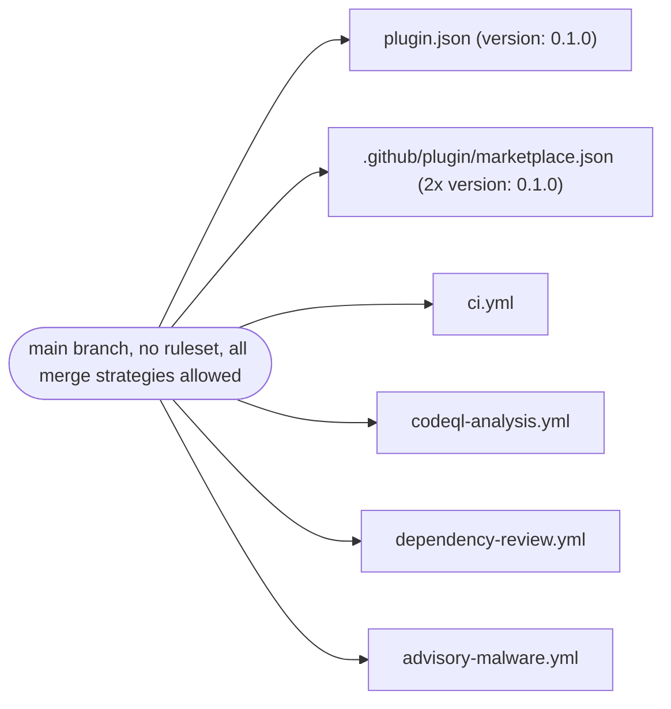
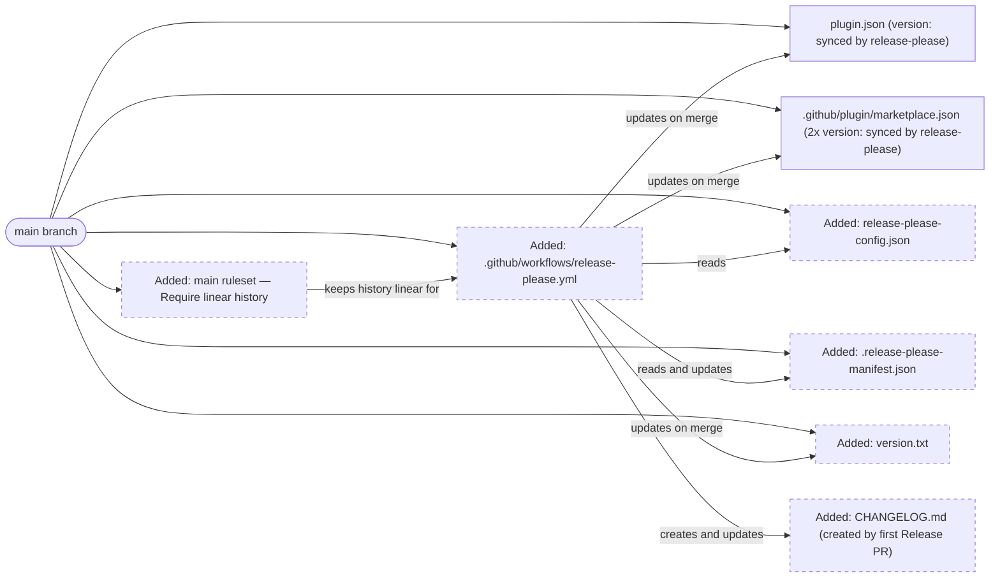
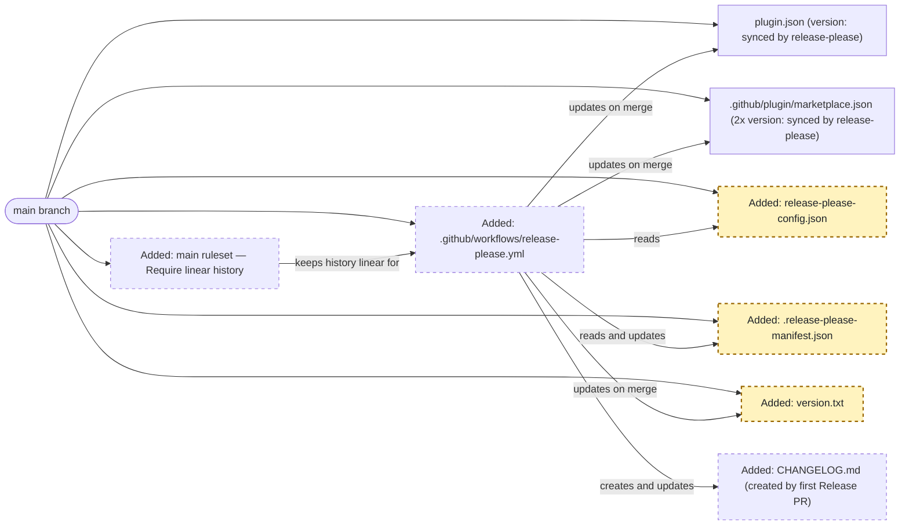
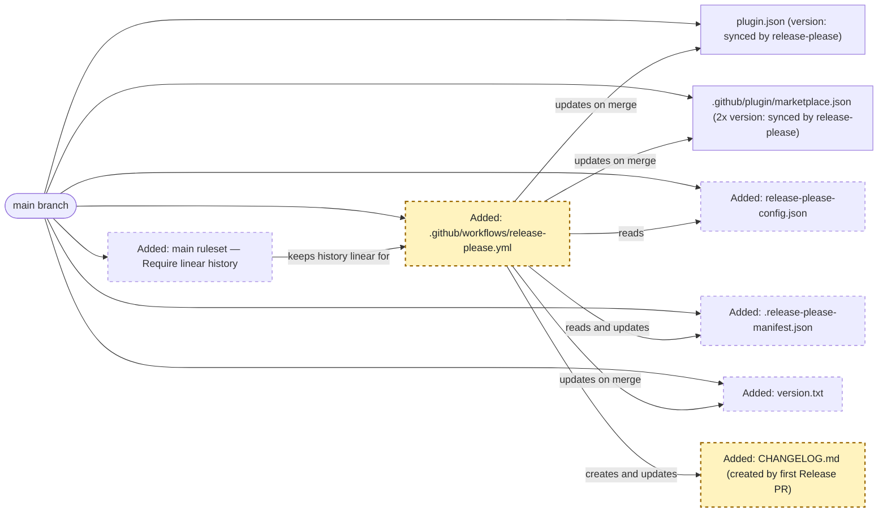
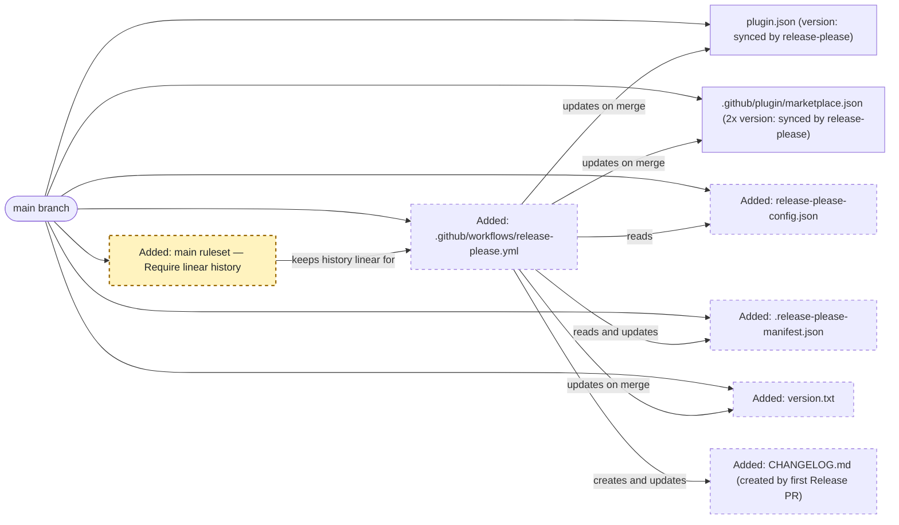

<!-- markdownlint-disable-file -->
# RPI Plan: Release pipeline for resume-builder

## Task Metadata

* Task ID: release-pipeline
* Task slug: release-pipeline
* Plan date: 2026-09-22

## Executive Summary

* Bottom line: Add a `release-please` GitHub Actions workflow so every push to `main` maintains a standing Release PR built from Conventional Commit history; merging that PR bumps `plugin.json` and both version fields in `.github/plugin/marketplace.json`, generates `CHANGELOG.md`, tags the commit, and publishes a GitHub Release. Pair it with a repository ruleset that requires linear history on `main` so the changelog stays clean.
* Why this matters: `resume-builder` currently has no release automation, no tags, and no changelog; `plugin.json` and `marketplace.json` both sit at a hand-set `"0.1.0"` with nothing keeping them in sync. This plan makes SemVer tracking automatic and evidence-based instead of manual.
* Planning result: Complete. All three phases are evidence-backed from the confirmed research decisions; no open decision blocks implementation.
* Confidence and uncertainty: High. The mechanism (manifest-driven `release-please`, JSON `extra-files` updaters, GitHub ruleset "Require linear history") is documented by the vendor and GitHub, and every file this plan touches or creates was directly inspected. The only genuinely untested step is the pipeline's first real run against this repo's actual commit history, which the implementer should treat as the practical acceptance check for Phase P02.

### What You May Not Know

* `release-please` derives the *first* release's changelog from every commit since the beginning of history unless a `bootstrap-sha` is set. This repo already has ~100+ commits with real (if inconsistent) Conventional Commit prefixes (see [.copilot-tracking/research/2026-09-22/release-pipeline-research.md](../../research/2026-09-22/release-pipeline-research.md) evidence `C4`), so an unbounded first run would produce a noisy first changelog entry. This plan pins `bootstrap-sha` to the current `main` HEAD so the pipeline only summarizes commits made *after* adoption — directly serving the user's confirmed "keep 0.1.0, continue forward" decision rather than retroactively rewriting history into the first release notes.
* GitHub repository rulesets are configured through the REST API or the web UI, not through a file the ruleset engine reads from the repository tree. Phase P03 is therefore an operational task (one `gh api` call, or the equivalent UI steps) rather than a source-file change, and it is the one task in this plan that is not reproducible by re-running `git clone` — it changes repository configuration directly.
* `CHANGELOG.md` is not hand-authored in this plan. `release-please` creates and maintains it automatically starting with the first Release PR; creating it manually ahead of time is unnecessary and would only need to be reconciled by the tool on first run.
* This plan adds a small root-level `version.txt` seeded with `0.1.0`. It is not a version the maintainer edits or reads day-to-day — `plugin.json` and `.github/plugin/marketplace.json` remain the plugin's real, consumer-facing version fields. `version.txt` exists only because `release-please`'s `simple` release type always writes its own primary version file on every release, separately from the `extra-files` JSON updaters configured for `plugin.json`/`marketplace.json`; without it present, that built-in update step would have no file to target.

## Phase Checklist

### Before



### After



Today, nothing keeps `plugin.json` and `marketplace.json` in sync and no changelog or tag exists. After this plan, a `release-please` workflow watches `main`, a manifest/config pair (plus a small plain-text `version.txt`) tells it which files to update and where to start, a ruleset keeps the commit history it depends on clean, and merging its Release PR is the one action that advances the version everywhere at once.

<!-- rpi:phase id=P01 -->
### [x] P01: Configure release-please's version-tracking manifest

Goals:
* `release-please` has an unambiguous starting version and knows to update `plugin.json` and both version fields in `marketplace.json` whenever it cuts a release, without any repo-specific scripting, and its own required primary version file (`version.txt`) exists so the `simple` strategy's built-in update step has something to write to.

Dependencies:
* None



Highlighted work: `rpconfig` (`release-please-config.json`), `rpmanifest` (`.release-please-manifest.json`), and `versiontxt` (`version.txt`).

<!-- rpi:task id=P01-T01 -->
#### [x] P01-T01: Add `release-please-config.json`

Goals:
* A single package definition at the repository root tells `release-please` to use the `simple` release type and to patch `plugin.json` and both version fields in `marketplace.json` on every release.

Requirements:
* FR-001, FR-002
* The file MUST be valid JSON and MUST validate against `release-please`'s config schema shape (a `packages` object with one entry for `"."`).
* Binding contract — the config MUST contain at least this shape:

  ```json
  {
    "bootstrap-sha": "29d48d546c128c6eb8bb2829e47a89c1886f24f1",
    "packages": {
      ".": {
        "release-type": "simple",
        "extra-files": [
          { "type": "json", "path": "plugin.json", "jsonpath": "$.version" },
          { "type": "json", "path": ".github/plugin/marketplace.json", "jsonpath": "$.metadata.version" },
          { "type": "json", "path": ".github/plugin/marketplace.json", "jsonpath": "$.plugins[0].version" }
        ]
      }
    }
  }
  ```

Details:
* `bootstrap-sha` is set to the current `main` HEAD (`29d48d546c128c6eb8bb2829e47a89c1886f24f1` at plan time) so the first Release PR only summarizes commits made after adoption, not the repo's full pre-adoption history. Confirm the actual current `main` HEAD at implementation time with `git rev-parse origin/main` (or `HEAD` if implementing directly on `main`) and use that SHA instead if it has moved.
* `release-type: simple` is the correct choice because the repository has no `package.json`, `setup.py`, or `pyproject.toml` (per [.copilot-tracking/research/2026-09-22/release-pipeline-research.md](../../research/2026-09-22/release-pipeline-research.md), evidence `C5`). The `simple` strategy always writes its own primary version file (`version.txt` by default) in addition to whatever `extra-files` are configured (per `release-please`'s `Simple` strategy source, `src/strategies/simple.ts` on the `googleapis/release-please` `main` branch, retrieved 2026-09-22, which pushes an update to `this.versionFile` on every release with `createIfMissing: false`) — see P01-T02, which creates that file so this update path has something to write to. Do not repoint `version-file` at `plugin.json` or `marketplace.json`: the strategy's built-in updater (`DefaultUpdater`) overwrites its target with the bare version string as the file's entire content, which would destroy those files' JSON structure.
* The two `marketplace.json` entries are two separate `extra-files` rows because they target two distinct JSONPath locations (`$.metadata.version` and `$.plugins[0].version`) inside the same file, per evidence `C3`.
* Do not add a `release-as` key; that would hardcode the next version and defeat Conventional-Commit-driven bumping.

References:
* [plugin.json](../../../plugin.json): the first JSON file the `extra-files` updater must target (`$.version`).
* [.github/plugin/marketplace.json](../../../.github/plugin/marketplace.json): the second file, with two separate version fields to target.
* [.copilot-tracking/research/2026-09-22/release-pipeline-research.md](../../research/2026-09-22/release-pipeline-research.md):
  * `Findings` → "release-please can update all three version locations..." documents the `extra-files`/`jsonpath` mechanism (evidence `W2`).
  * `Recommendation and Alternatives` records the confirmed choice of `release-type: simple`.
* [.copilot-tracking/reviews/plans/2026-09-22/release-pipeline-plan-critique.md](../../reviews/plans/2026-09-22/release-pipeline-plan-critique.md):
  * `PC-001` identified the `version.txt` primary-file requirement this task's Details now addresses.

Dependencies:
* None

<!-- rpi:task id=P01-T02 -->
#### [x] P01-T02: Add `version.txt`

Goals:
* `release-please`'s `simple` strategy has its own required primary version file present so its built-in update step succeeds on the first Release PR instead of targeting a non-existent file.

Requirements:
* FR-001, FR-002
* Binding contract — the file MUST be named `version.txt`, MUST live at the repository root (the same path the `simple` strategy defaults to when no `version-file` override is configured), and MUST contain exactly:

  ```
  0.1.0
  ```

Details:
* This file exists solely to satisfy `release-please`'s own internal primary-file update path for the `simple` strategy (see P01-T01 `Details:`); it is not a version source the maintainer edits, reads, or references elsewhere in this repository — `plugin.json` and `marketplace.json` remain the plugin's actual, consumer-facing version fields.
* Seed it to `0.1.0` to match the manifest (P01-T03) and the current values already in `plugin.json`/`marketplace.json` (evidence `C2`, `C3`), so the first Release PR's diff to this file reads as a clean bump rather than an unexplained jump.
* Do not add a trailing-newline requirement beyond what a normal text editor produces; `release-please`'s updater for this file writes the version string followed by a single newline.

References:
* [.copilot-tracking/reviews/plans/2026-09-22/release-pipeline-plan-critique.md](../../reviews/plans/2026-09-22/release-pipeline-plan-critique.md):
  * `PC-001` is the finding this task resolves.

Dependencies:
* None

<!-- rpi:task id=P01-T03 -->
#### [x] P01-T03: Add `.release-please-manifest.json`

Goals:
* `release-please` has a single source of truth for the package's current version, seeded to continue the repo's existing pre-1.0 numbering.

Requirements:
* FR-001
* Binding contract — the manifest MUST be exactly:

  ```json
  { ".": "0.1.0" }
  ```

Details:
* `0.1.0` matches the value already present in `plugin.json`, `marketplace.json`, and the new `version.txt` (evidence `C2`, `C3`, P01-T02), so this manifest does not change any file's current on-disk value — it only tells `release-please` where to count forward from for the *next* release.
* This directly implements the user's confirmed decision to continue pre-1.0 numbering rather than declare `1.0.0` (see `## User Decisions and Requirements` below).

References:
* [.copilot-tracking/research/2026-09-22/release-pipeline-research.md](../../research/2026-09-22/release-pipeline-research.md):
  * `Decisions and Feedback` row `D2` records the confirmed starting-version decision.

Dependencies:
* P01-T01
* P01-T02

<!-- rpi:phase id=P02 -->
### [x] P02: Add the release-please GitHub Actions workflow

Goals:
* Every push to `main` runs `release-please`, which opens or updates a Release PR; merging that PR is the single action that bumps versions everywhere, updates the changelog, tags the commit, and creates the GitHub Release — with no manual token/secret setup beyond what the repository already has.

Dependencies:
* P01



Highlighted work: `rpworkflow` (`.github/workflows/release-please.yml`) and `changelog` (`CHANGELOG.md`, created on first merge).

<!-- rpi:task id=P02-T01 -->
#### [x] P02-T01: Add `.github/workflows/release-please.yml`

Goals:
* A dedicated workflow triggers `release-please-action` on every push to `main`, scoped to exactly the permissions it needs and no more, matching the repository's existing least-privilege convention.

Requirements:
* FR-003, FR-004, NFR-001
* Binding contract — the workflow MUST declare top-level `permissions: { contents: write, pull-requests: write, issues: write }` and MUST NOT declare broader permissions (no `packages`, `actions`, `id-token`, etc.).
* The `uses:` step MUST pin `googleapis/release-please-action` to a full commit SHA with a trailing version comment, matching this repository's existing action-pinning convention.
* The step MUST NOT set an explicit `token:` input — it must rely on the default `secrets.GITHUB_TOKEN`.
* The workflow MUST trigger via `workflow_run` chained after `ci.yml` ("Validate resume-builder") completes, gated to `conclusion == 'success'`, `head_branch == 'main'`, and `event == 'push'` — not on a bare `push: branches: [main]` trigger — so release-please only opens or advances the Release PR for commits already verified green on `main`.
* The job MUST guard against acting on a stale `workflow_run` event: before invoking `release-please-action`, it MUST compare `github.event.workflow_run.head_sha` against the current tip of `refs/heads/main` and skip the action when they differ, so a delayed CI completion for an earlier commit can never cause release-please to open/advance a release for a commit that has since been superseded (and thus not yet itself CI-validated).
* The job MUST declare a `concurrency` group (e.g. `group: release-please`, `cancel-in-progress: false`) so that two overlapping `workflow_run` completions (a CI rerun for the same SHA, or a later push whose CI finishes while an earlier run is still executing) can never invoke `release-please-action` at the same time; the stale-run guard alone only filters which SHA a run acts on, it does not serialize concurrent mutations of the Release PR/manifest.
* The step MUST reference `config-file: release-please-config.json` and `manifest-file: .release-please-manifest.json` explicitly (even though these are the tool's defaults) so the workflow is self-documenting.

Details:
* Trigger via `on: workflow_run: workflows: ["Validate resume-builder"], types: [completed]`, guarded by an `if:` condition requiring `conclusion == 'success'`, `head_branch == 'main'`, and `event == 'push'`. This was changed from a bare `push: branches: [main]` trigger during implementation (see the changes record) after discovering that GitHub's anti-recursion rule prevents `GITHUB_TOKEN`-authored events (release-please's own generated branch-push and Release-PR-open) from retriggering `pull_request`-scoped workflows such as `ci.yml` and `codeql-analysis.yml` — meaning those checks would never run on the Release PR itself regardless of trigger choice on `release-please.yml`. Chaining after `ci.yml`'s completion instead means release-please only ever proposes or advances the Release PR once CI has already passed on a real push/merge to `main`, without requiring a PAT/App token.
* Race-condition guard, added after Copilot code review: `workflow_run` reports the SHA CI validated, not necessarily the current tip of `main` at the time the workflow runs. If commit A's CI is still in progress when commit B lands on `main`, A's `workflow_run` completion can fire after B is already the branch tip — without a guard, release-please would then read `main`'s current (post-B) state via the default branch, opening/advancing a release that includes commit B before B itself has passed CI. A `Guard against a stale CI run` step runs `git ls-remote` against `refs/heads/main` and compares the result to `github.event.workflow_run.head_sha`; the `release-please-action` step only executes when they match (`steps.guard.outputs.is_current == 'true'`), otherwise the run is a no-op.
* Concurrency guard, added after a second Copilot code review: the stale-run guard only filters which SHA a given run acts on — it does not stop two separately-triggered `workflow_run` completions (e.g. a manual CI rerun on the same commit, or a later push whose CI finishes while an earlier run is still mid-execution) from calling `release-please-action` at the same moment, which could race on updating the same Release PR/manifest. A job-level `concurrency: { group: release-please, cancel-in-progress: false }` queues every invocation onto a single lane so only one ever mutates release state at a time, without cancelling a run that's already in progress.
* Pin `googleapis/release-please-action` to the `v5.0.0` tag's commit SHA `45996ed1f6d02564a971a2fa1b5860e934307cf7` with a `# v5.0.0` trailing comment, following the exact pinning style already used in [.github/workflows/ci.yml](../../../.github/workflows/ci.yml) (e.g. `actions/checkout@3d3c42e5aac5ba805825da76410c181273ba90b1 # v7.0.1`). Confirm this is still the latest stable tag at implementation time and update the pin/comment together if a newer patch/minor has shipped; the repository's Dependabot `github-actions` group (per [.github/dependabot.yml](../../../.github/dependabot.yml)) will keep it current afterward.
* No PAT/custom secret is required: this repository has nothing to publish beyond the tag/changelog/GitHub Release themselves (per [.copilot-tracking/research/2026-09-22/release-pipeline-research.md](../../research/2026-09-22/release-pipeline-research.md), evidence `W3`), so the default `GITHUB_TOKEN` remains sufficient for creating the tag, changelog, and Release PR. This is a distinct point from CI running on the Release PR itself — that gap is addressed by the `workflow_run` chaining above, not by the token choice. There is still no pre-merge CI run scoped to the Release PR's own diff; the `workflow_run` gate instead ensures release-please never proposes/advances past already-green commits on `main`, and normal `push`-triggered CI still runs again immediately after the Release PR is merged.
* This workflow does not need a `PULL_REQUEST_TEMPLATE.md`, `CODEOWNERS`, or `dependabot.yml` change; it is additive and does not alter any other workflow's triggers or permissions.

References:
* [.github/workflows/ci.yml](../../../.github/workflows/ci.yml): the exact action-pinning style (`@<full_sha> # <tag>`) and `permissions:` block placement to mirror.
* [.github/dependabot.yml](../../../.github/dependabot.yml): confirms `github-actions` version updates are already tracked and will keep this new pin current.
* [.copilot-tracking/research/2026-09-22/release-pipeline-research.md](../../research/2026-09-22/release-pipeline-research.md):
  * `Findings` → "GitHub Actions permissions and token choice are simple here..." documents the default-`GITHUB_TOKEN` rationale (evidence `W3`, `C7`).

Dependencies:
* P01-T01
* P01-T02
* P01-T03

<!-- rpi:phase id=P03 -->
### [x] P03: Require linear history on `main`

Goals:
* The commit history `release-please` parses on `main` is guaranteed to be free of true merge commits, so every merged pull request contributes exactly one clean, classifiable Conventional Commit to the changelog.

Dependencies:
* None (independent of P01/P02; can be done in either order, but should be in place before the first real Release PR is merged)



Highlighted work: `ruleset` (the new `main` repository ruleset).

<!-- rpi:task id=P03-T01 -->
#### [x] P03-T01: Create a `main` repository ruleset requiring linear history

Goals:
* A repository ruleset targeting `main` enforces GitHub's "Require linear history" rule, blocking true merge commits while still permitting the squash and rebase merges the repository already allows.

Requirements:
* FR-005
* The ruleset MUST target the `main` branch (`refs/heads/main`), MUST be `ACTIVE` (not `evaluate`/disabled), and MUST include the `required_linear_history` rule.
* The repository MUST continue to allow squash merge and/or rebase merge after this change (already true per current repository settings) — GitHub requires at least one of those to be enabled for this rule to be usable.

Details:
* This is a repository-configuration change, not a file in the working tree — there is no supported "ruleset as code" file format read by GitHub's ruleset engine. Implement it with a single authenticated call, for example:

  ```bash
  gh api repos/benarculus/resume-builder/rulesets \
    --method POST \
    -f name="Require linear history on main" \
    -f target=branch \
    -f enforcement=active \
    -f 'conditions[ref_name][include][]=refs/heads/main' \
    -f 'conditions[ref_name][exclude][]=' \
    -f 'rules[][type]=required_linear_history'
  ```

  Adjust the exact invocation to whatever the implementer's tooling supports (`gh api`, the GitHub REST API directly, or the repository Settings UI under **Rules → Rulesets → New branch ruleset**); the binding requirement is the resulting ruleset's `active` `required_linear_history` rule on `refs/heads/main`, not the specific command used to create it.
* Do not disable `allow_merge_commit` at the repository-settings level as an alternative — the user explicitly asked for this to be enforced via a ruleset (see `## User Decisions and Requirements` below), because rulesets are the mechanism this maintainer already uses for branch governance.
* Verify the result with `gh api repos/benarculus/resume-builder/rulesets` (or the equivalent UI view) showing the new ruleset as `active` with the `required_linear_history` rule present.

References:
* [.copilot-tracking/research/2026-09-22/release-pipeline-research.md](../../research/2026-09-22/release-pipeline-research.md):
  * `Decisions and Feedback` row `D3` records the confirmed ruleset-based approach and evidence `W5` (GitHub's ruleset rule catalog).

Dependencies:
* None

## User Decisions and Requirements

### Confirmed User Direction

* Adopt `release-please` (manifest-driven, `release-type: simple`) as the release pipeline for `resume-builder`, per `/hve-core:rpi-research` [.copilot-tracking/research/2026-09-22/release-pipeline-research.md](../../research/2026-09-22/release-pipeline-research.md).
* Continue pre-1.0 numbering: the first automated release should start from `0.1.0`, not `1.0.0`.
* Enforce clean, linear commit history on `main` specifically through a **repository ruleset** (the "Require linear history" rule), not by disabling merge strategies in repository settings, because the user manages branch governance via rulesets.

### Planning Decisions and Feedback

No unresolved material planning decisions remain. All three decisions carried into this plan (tool choice, starting version, ruleset-based linear-history enforcement) were already confirmed during the preceding `/hve-core:rpi-research` session; no new material choice arose while planning P01–P03.

| Group | Decision or feedback item | Status | Owner | Rationale or input needed | Evidence | Planning impact |
|-------|---------------------------|--------|-------|----------------------------|----------|------------------|
| D1 | Adopt `release-please` (`release-type: simple`, manifest-driven) | confirmed | user | Carried from research; no further input needed | [.copilot-tracking/research/2026-09-22/release-pipeline-research.md](../../research/2026-09-22/release-pipeline-research.md) `Decisions and Feedback` D1 | Drives P01, P02 |
| D2 | Start the first automated release at `0.1.0` | confirmed | user | Carried from research; no further input needed | Research `Decisions and Feedback` D2 | Sets `.release-please-manifest.json` content in P01-T03 and `version.txt` content in P01-T02 |
| D3 | Enforce linear history via a repository ruleset (not repo-settings merge-strategy toggles) | confirmed | user | Carried from research; no further input needed | Research `Decisions and Feedback` D3, evidence `W5` | Drives P03-T01's implementation approach |
| D4 | `bootstrap-sha` pinned to current `main` HEAD so the first changelog only covers post-adoption commits | confirmed | agent | Direct, evidence-supported consequence of D2 ("continue 0.1.0 forward" implies not retroactively summarizing ~100 pre-adoption commits into the first release notes); no separate user question was needed because it does not change the starting version or introduce a new material trade-off | `git log` HEAD `29d48d5...` at plan time (see P01-T01 `Details:`) | Sets `bootstrap-sha` in P01-T01; implementer must reconfirm the actual HEAD SHA at implementation time |
| D5 | Add a small, seeded `version.txt` at the repository root solely to satisfy `release-please`'s `simple` strategy's own primary-file update path; keep `plugin.json`/`marketplace.json` as the actual consumer-facing version fields | confirmed | agent | Critique finding `PC-001` identified that the `simple` strategy always writes to a primary version file (`version.txt` by default) with `createIfMissing: false`, independent of the `extra-files` updaters; resolved directly from `release-please`'s own strategy source without needing a new user question, since it adds one small harmless file rather than changing the confirmed tool, starting version, or ruleset decisions | [.copilot-tracking/reviews/plans/2026-09-22/release-pipeline-plan-critique.md](../../reviews/plans/2026-09-22/release-pipeline-plan-critique.md) `PC-001`; `release-please` `src/strategies/simple.ts` and `src/updaters/default.ts` on `googleapis/release-please` `main`, retrieved 2026-09-22 | Adds P01-T02 (new task); renumbers the former P01-T02 manifest task to P01-T03; updates P01's Goals, diagrams, and P02-T01's Dependencies |

## Planning Readiness and Next Step

| Field                            | Record                                                                                                   |
|-----------------------------------|-----------------------------------------------------------------------------------------------------------|
| Planning execution and readiness | Complete and Ready                                                                                         |
| Decision participation            | user-owned; standalone `/hve-core:rpi-plan` invocation following a standalone `/hve-core:rpi-research` session, no active RPI Agent or `rpi-quick` parent detected |
| Blockers                          | none                                                                                                        |
| Latest critique                  | [.copilot-tracking/reviews/plans/2026-09-22/release-pipeline-plan-critique.md](../../reviews/plans/2026-09-22/release-pipeline-plan-critique.md) — verdict Revise, one finding `PC-001 [High]`, resolved directly by the planning parent (see `## Critique Disposition`) |
| Relevant research                 | [.copilot-tracking/research/2026-09-22/release-pipeline-research.md](../../research/2026-09-22/release-pipeline-research.md) |
| Plan                              | `.copilot-tracking/plans/2026-09-22/release-pipeline-plan.md`                                              |
| Changes-record role               | `.copilot-tracking/changes/2026-09-22/release-pipeline-changes.md` is implementation evidence               |
| Continuation owner                | user (standalone plan; no active `rpi-quick` or automatic RPI Agent parent to hand off to)                 |
| Required gates or confirmations   | Initial standard critique ran and found one High finding (`PC-001`), which the planning parent resolved directly by revision (no further critique or user question required) |
| Next action                       | Run `/rpi-implement` with `.copilot-tracking/changes/2026-09-22/release-pipeline-changes.md` as the changes-record path |

## Goals

* Automatically derive the next SemVer version for `resume-builder` from Conventional Commit history on `main`.
* Keep `plugin.json` and both version fields in `.github/plugin/marketplace.json` synchronized with that derived version on every release, with no manual editing.
* Produce a durable, dated `CHANGELOG.md` and a corresponding Git tag and GitHub Release for every version bump.
* Preserve the repository's existing PR-gated review posture: every version bump is reviewed via a Release PR before it takes effect, exactly like every other change to `main` today.

## Scope and Non-Goals

### In Scope

* Adding `release-please-config.json`, `.release-please-manifest.json`, and a small `version.txt` at the repository root.
* Adding a new `.github/workflows/release-please.yml` workflow.
* Adding a repository ruleset on `main` requiring linear history.

### Non-Goals

* Publishing the plugin to any external marketplace or package registry (no such target exists today).
* Changing `ci.yml`, `codeql-analysis.yml`, `dependency-review.yml`, or `advisory-malware.yml` triggers or permissions.
* Rewriting or squashing any existing Git history.
* Enforcing Conventional Commit message format at commit- or PR-title-lint time (tracked only as a follow-up item below).

## Functional Requirements

* FR-001: `release-please` reads a single, version-tracked package definition (`release-please-config.json`), a version manifest (`.release-please-manifest.json`), and its own primary version file (`version.txt`), all rooted at `.` (the repository root).
* FR-002: On each Release PR merge, `release-please` updates the `version` field in `plugin.json` and the `metadata.version` and `plugins[0].version` fields in `.github/plugin/marketplace.json` to the same newly derived version.
* FR-003: A GitHub Actions workflow runs `release-please-action` on every push to `main`, opening or updating a single standing Release PR reflecting unreleased Conventional Commits.
* FR-004: Merging the Release PR causes `release-please` to update `CHANGELOG.md`, tag the merge commit with the new version, and create a corresponding GitHub Release.
* FR-005: A repository ruleset on `main` enforces linear history (no true merge commits), while continuing to permit squash and rebase merges.

## Non-Functional Requirements

* NFR-001: The new release workflow's declared GitHub Actions `permissions` are the minimum needed (`contents: write`, `pull-requests: write`, `issues: write`) and introduce no broader token scope than the repository's existing workflows use by default.
  * Objective threshold or evaluation condition: the workflow file's top-level `permissions:` block contains exactly these three keys, each set to the minimum verb (`write`) it needs, and no additional permission keys.

## Risks and Open Questions

| Priority | Type            | Risk, question, or planning item | Affected work | Impact | Smallest action or evidence needed | Owner |
|----------|-----------------|-----------------------------------|----------------|--------|--------------------------------------|-------|
| L | risk | The `main` HEAD SHA recorded in this plan (`29d48d5...`) may have advanced by the time P01-T01 is implemented, which would let a few extra pre-adoption commits leak into the first changelog | P01-T01 | Cosmetic — a slightly noisier first Release PR body, not an incorrect version number | Implementer re-runs `git rev-parse origin/main` immediately before writing `release-please-config.json` and uses the current value | implementer |
| L | risk | `version.txt` (P01-T02) is a new tracked file with no purpose visible to a future contributor who is unfamiliar with `release-please`'s internals | P01-T02 | Cosmetic — could prompt a "why does this file exist" question later | P01-T02's `Details:` and this plan's `What You May Not Know` explain its purpose; consider a one-line comment is not possible in a plain version file, so rely on this plan/changes record as the explanation | downstream |
| L | risk | Not every historical commit in this repo used a Conventional Commit prefix consistently (some merge commits, docs-only commits); `release-please` silently ignores or miscategorizes non-conforming commits rather than failing | plan-wide | Low — only affects changelog completeness/wording, never the version-bump correctness for a conforming commit | none required now; consider a PR-title lint as a follow-up if changelog quality becomes a concern | downstream (tracked in Follow-Up Items) |
| L | further planning | This plan does not add commit-message linting (e.g., a Conventional-Commit PR-title check), so a malformed future commit could be silently excluded from the changelog | plan-wide | Low — matches the repository's status quo; not a regression this plan introduces | Evaluate a lightweight PR-title lint action if desired | downstream (tracked in Follow-Up Items) |

## Dependencies

* `googleapis/release-please-action@v5.0.0` (pinned by SHA `45996ed1f6d02564a971a2fa1b5860e934307cf7`): the GitHub Action that runs `release-please` in CI; no new secret is required beyond the default `GITHUB_TOKEN`.
* GitHub repository rulesets API/UI access (`gh api` or equivalent admin permission on the repository): required to create the `main` linear-history ruleset in P03-T01.

## Sources

* [.copilot-tracking/research/2026-09-22/release-pipeline-research.md](../../research/2026-09-22/release-pipeline-research.md): primary research artifact; supplies the confirmed tool choice, starting version, ruleset decision, and all `C#`/`W#` evidence cited throughout this plan.
* [plugin.json](../../../plugin.json): current version field and JSON shape the `extra-files` updater must target.
* [.github/plugin/marketplace.json](../../../.github/plugin/marketplace.json): current version fields (two locations) the `extra-files` updater must target.
* [.github/workflows/ci.yml](../../../.github/workflows/ci.yml): existing action-pinning and `permissions:` conventions this plan's new workflow follows.
* [.github/dependabot.yml](../../../.github/dependabot.yml): confirms GitHub Actions pins (including the new one) are already kept current automatically.
* `gh api repos/benarculus/resume-builder` and `gh api repos/benarculus/resume-builder/branches/main/protection` (queried live during research): confirmed current merge-strategy settings and absence of branch protection, motivating P03.
* `gh api repos/googleapis/release-please-action/tags` (queried live during planning): confirmed `v5.0.0` as the current stable tag and its commit SHA for pinning.
* `release-please` `src/strategies/simple.ts` and `src/updaters/default.ts` on `googleapis/release-please` `main` (fetched live during critique, retrieved 2026-09-22): established that the `simple` strategy requires its own primary `version.txt` update in addition to `extra-files`, and that its updater is a plain-text writer unsafe to repoint at a JSON file — resolved as `PC-001`/`D5`.

## Critique Disposition

* Critique candidate identity: `release-pipeline`; plan revision as saved after initial drafting of P01–P03, prior to any critique run
* Critique depth and provenance: `standard`; default (no explicit user request for `deep`)
* Critique execution: complete
* Initial attempt consumed: yes
* Recovery attempt consumed: no
* Attempt provenance: attempt `release-pipeline-critique-001`, kind `initial`, candidate `.copilot-tracking/plans/2026-09-22/release-pipeline-plan.md`, hash boundary = SHA-256 `a2305084d7d936cedce36864172239fabe79e1fdf8dacb782ca31f5ae1f4e74b` of all plan content preceding this `## Critique Disposition` section as saved at this reservation point, depth `standard`, output `.copilot-tracking/reviews/plans/2026-09-22/release-pipeline-plan-critique.md`, run in the same uninterrupted planner execution immediately following this reservation
* Recovery eligibility and consent: not applicable — no interrupted attempt exists

| Critique run and finding | Disposition | Action owner | Exact resolving evidence | Decision route | Plan response or residual risk |
|---------------------------|--------------|----------------|----------------------------|-------------------|-----------------------------------|
| `release-pipeline-critique-001` / `PC-001` [High]: `release-please`'s `simple` strategy always requires a primary `version.txt` update, independent of the `extra-files` JSON updaters the original draft configured, and the plan never created or accounted for that file | resolved | planning parent | New task P01-T02 ("Add `version.txt`") seeded with `0.1.0`; P01-T01's `Details:` now documents the mechanism and warns against repointing `version-file` at a JSON file; P01-T03 (renumbered manifest task) and P02-T01 dependencies updated accordingly; decision recorded as `D5` | direct correction (no significant or divergent user decision required — the fix adds one small, harmless, evidence-justified file without changing any confirmed D1–D3 direction) | No residual risk beyond the low-severity "unfamiliar file" risk recorded in `## Risks and Open Questions` |

Overall critique verdict: **Revise**, resolved directly by the planning parent in this same session without a second critique run, per the "Revise" handling contract (a Revise verdict is resolved by revision, not by re-running critique).

## Artifact Self-Check

* [x] Executive Summary, What You May Not Know, and the Phase Checklist come first and are understandable without reading the supporting sections.
* [x] Confirmed direction, grouped decisions, readiness, goals, scope, requirements, risks, and dependencies are current and consistent with the Phase Checklist.
* [x] Planning decision participation and provenance are recorded; all user-owned decisions carried forward from research have persisted answers (D1–D3), the one agent-owned technical decision on `bootstrap-sha` (D4) has an evidence-backed rationale rather than a guess, and the critique-driven agent-owned `version.txt` decision (D5) is recorded with its resolving evidence.
* [x] Functional and non-functional requirements are current, and every `FR-nnn` and `NFR-nnn` is cited by at least one task's Requirements.
* [x] Every `Pxx` has Goals, Dependencies, and a phase diagram that highlights its part of After with any labeled removal context (none needed — this plan only adds elements). Every `Pxx-Txx` has Goals, Requirements, Details, References, and Dependencies.
* [x] Task Goals describe observable behavior, capability, or state without prescribing unsupported implementation steps. Details and References ground the implementer; the `gh api` example in P03-T01 is explicitly marked illustrative, with the binding requirement stated separately.
* [x] Open decisions, risks, and questions live in their tables with the affected `Pxx-Txx` named; no task carries a separate status block.
* [x] Code, commands, and symbols use backticks. Existing files and folders are Markdown links whose text is the workspace-relative path and whose destination resolves from this plan file.
* [x] Before reflects the evidence-backed pre-change baseline (verified against direct repo inspection); After reflects the intended result of all phases. Corresponding elements and phase diagrams reuse stable node IDs (`pluginjson`, `marketplacejson`, `rpconfig`, `rpmanifest`, `versiontxt`, `rpworkflow`, `changelog`, `ruleset`), with added work distinguishable by the dashed `new` class and `Added:` labels without relying on color alone.
* [x] Every emitted initialization object has the prescribed string values for `themeVariables.fontFamily` (`Arial, Helvetica, sans-serif`) and `themeVariables.fontSize` (`16px`). All diagrams use theme-aware default styling for ordinary nodes with an explicit `color` on the one custom phase-highlight fill. Dual-theme rendering was not interactively previewed in this text-only session; source styling follows the prescribed contract.
* [x] Risks, open questions, blockers, critique findings, and accepted residual risks have owners and next actions.
* [x] Critique depth (`standard`) and provenance (default) are recorded; the initial attempt was run and its one `PC-001 [High]` finding was resolved directly by the planning parent (see `## Critique Disposition`) without a second critique run.
* [x] Planning execution, readiness, continuation owner, gates, and next action are complete and consistent — the critique's one finding was resolved directly and readiness is Ready.
* [x] Follow-Up Items remain outside active plan completion and acceptance claims.
* Checked sections: Task Metadata, Executive Summary, Phase Checklist (Before/After/phase diagrams, all tasks), User Decisions and Requirements, Planning Readiness and Next Step, Goals, Scope and Non-Goals, Functional Requirements, Non-Functional Requirements, Risks and Open Questions, Dependencies, Sources, Critique Disposition, Follow-Up Items.
* Missing or limited sections: none.

## Follow-Up Items

* Consider adding a lightweight Conventional-Commit PR-title lint (e.g., a GitHub Action) so a malformed future commit is caught before merge rather than silently under-represented in the changelog. Not part of this plan's scope; owner: user/downstream, to be planned separately if desired.

## Handoff

* Authoritative implementation handoff: Planning Readiness and Next Step
