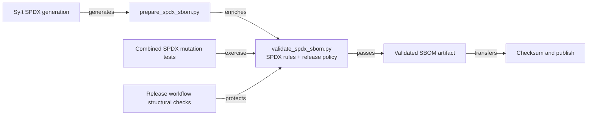
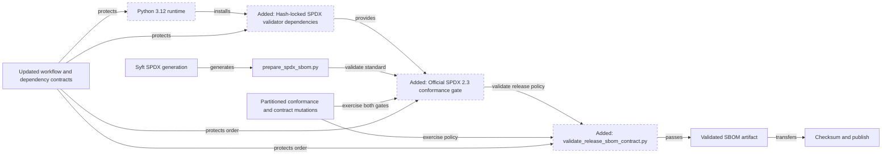
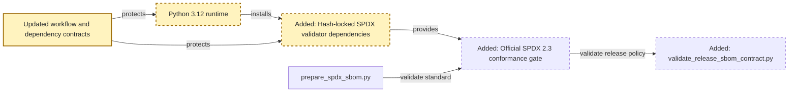
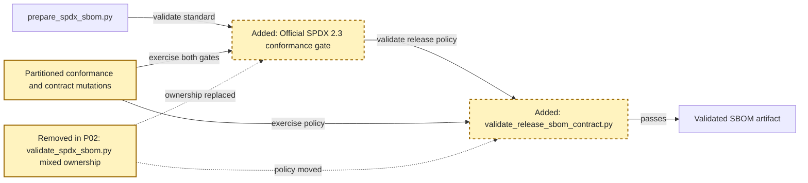
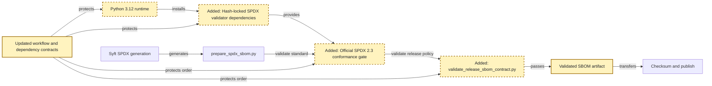

<!-- markdownlint-disable-file -->
# RPI Plan: SPDX tools migration

## Task Metadata

* Task ID: SPDX-TOOLS-MIGRATION-2026-09-25
* Task slug: spdx-tools-migration
* Plan date: 2026-09-25

## Executive Summary

* Bottom line: Plan the migration from a combined hand-written SPDX validator to official, hash-locked `spdx-tools==0.8.5` conformance validation plus a smaller repository-owned release-contract validator.
* Why this matters: The release pipeline should reject malformed SPDX 2.3 documents without repeatedly reimplementing the specification, while preserving exact product, version, supplier, dependency, and relationship guarantees.
* Planning result: Complete and implementation-ready. The standard critique returned two planner-owned findings, both resolved in this plan.
* Confidence and uncertainty: High confidence in the selected architecture, CI ownership, and task boundary. Residual uncertainty is limited to normal implementation-time resolution and review of the dependency hashes.

### What You May Not Know

* `spdx-tools==0.8.5` requires Python 3.10+, so release conformance validation must use Python 3.12 rather than the repository owner's local Python 3.9.
* A top-level package pin is not sufficient: the validator resolves to 13 Python artifacts for hosted Linux/Python 3.12, so the release-validation environment needs a complete binary-only hash lock.
* The official validator has known upstream limitations; focused regression mutations must remain even after generic schema/type checks leave repository code.

## Phase Checklist

### Before



### After



The migration replaces the single mixed validator with a deterministic official conformance gate followed by a repository-policy gate. Generation, enrichment, artifact transfer, checksum verification, and publication retain their existing relationships.

<!-- rpi:phase id=P01 -->
### [x] P01: Establish the deterministic official validator environment

Goals:
* Make official SPDX validation reproducible and isolated from application/runtime dependencies so the release gate cannot drift through unconstrained package resolution.

Dependencies:
* None



Highlighted work: add and govern the Python 3.12 validation runtime and the complete binary-only dependency lock.

<!-- rpi:task id=P01-T01 -->
#### [x] P01-T01: Add the validation-only dependency lock

Goals:
* Provide a reviewable dependency artifact that deterministically installs `spdx-tools==0.8.5` and every transitive dependency used by hosted SPDX validation.

Requirements:
* FR-001, NFR-001, NFR-004
* Add exactly one dependency artifact, `requirements-spdx-validation.txt`.
* The lock is scoped to CPython 3.12 on the hosted Ubuntu release/CI environment and contains `spdx-tools==0.8.5` plus the complete resolved transitive set.
* Every installable requirement is exact-versioned and includes approved SHA-256 hashes; source distributions are not permitted.
* Installation must succeed with the following contract:

```text
python -m pip install --require-hashes --only-binary=:all: -r requirements-spdx-validation.txt
```

* Do not add `spdx-tools` to `requirements.txt` or `requirements-dev.txt`; those files remain the application and broadly local development environments.

Details:
* The research resolved 13 wheel artifacts for Linux/Python 3.12. Implementation must regenerate and review the lock rather than copying temporary research output blindly.
* Keep the file compatible with Dependabot's existing root-level pip configuration. If Dependabot cannot maintain the new file without configuration changes, update the existing pip entry rather than adding a second ecosystem entry.
* The maximum file addition for dependency definition is one lock file; do not introduce a second package manager, virtual-environment bootstrap script, or vendored wheel directory.

References:
* [requirements.txt](../../../requirements.txt): application runtime dependency boundary that must remain unchanged.
* [requirements-dev.txt](../../../requirements-dev.txt): local/CI development dependency boundary that must not absorb the Python 3.12-only validator.
* [.github/dependabot.yml](../../../.github/dependabot.yml): existing root pip maintenance policy.
* [.copilot-tracking/research/2026-09-25/spdx-tools-migration-research.md](../../research/2026-09-25/spdx-tools-migration-research.md):
  * `Secure installation requires a dedicated hash-locked validation dependency set` defines the selected isolation and reproducibility boundary.

Dependencies:
* None

<!-- rpi:task id=P01-T02 -->
#### [x] P01-T02: Enforce the dependency and runtime contract structurally

Goals:
* Make repository validation reject incomplete locks, mutable installs, unsupported Python setup, and accidental inclusion of the validator in application dependency files.

Requirements:
* FR-006, NFR-001, NFR-004
* [scripts/validate_repo.py](../../../scripts/validate_repo.py) must validate the dedicated lock independently from the existing direct-pin checks.
* Structural rules must require `spdx-tools==0.8.5`, a complete hash on every locked artifact, binary-only installation, and absence of `spdx-tools` from `requirements.txt` and `requirements-dev.txt`.
* [`.github/workflows/ci.yml`](../../../.github/workflows/ci.yml) must install `requirements-spdx-validation.txt` under its existing Python 3.12 runtime with `--require-hashes --only-binary=:all:` before running pytest.
* Mutation coverage in [tests/test_structure.py](../../../tests/test_structure.py) must reject at least: removing a hash, loosening a version, removing or weakening the validation-lock install in CI, removing `--require-hashes`, removing `--only-binary=:all:`, changing Python 3.12, and moving `spdx-tools` into a general requirements file.
* The repository validator must not hard-code an operating-system-specific wheel filename when a semantic lock check can enforce the same policy.

Details:
* Extend the existing dependency and workflow validation patterns rather than creating a separate repository validator.
* Treat the lock and both consuming workflow commands as one contract: a fully hashed file is not sufficient if CI or release installation can ignore hashes or select source distributions.
* Test ownership: structural mutation behavior remains in `tests/test_structure.py`; no new structural test file is planned.

References:
* [scripts/validate_repo.py](../../../scripts/validate_repo.py): current exact-direct-pin and workflow contract validation.
* [tests/test_structure.py](../../../tests/test_structure.py): existing mutation-test ownership.
* [.github/workflows/ci.yml](../../../.github/workflows/ci.yml): established SHA-pinned Python 3.12 setup pattern.

Dependencies:
* P01-T01

<!-- rpi:phase id=P02 -->
### [x] P02: Separate SPDX conformance from release policy

Goals:
* Give official tooling ownership of SPDX 2.3 semantics while preserving a small, explicit repository contract for release identity and dependency completeness.

Dependencies:
* P01



Highlighted work: remove the mixed validator, add the narrowly scoped release-contract validator, and partition mutation ownership between official conformance and repository policy.

<!-- rpi:task id=P02-T01 -->
#### [x] P02-T01: Replace the mixed validator with a release-contract validator

Goals:
* Expose a custom validator whose name and behavior accurately describe only the repository-specific conditions required for publication.

Requirements:
* FR-003, FR-004, FR-005, NFR-003
* Rename `scripts/validate_spdx_sbom.py` to `scripts/validate_release_sbom_contract.py`; the old path must be removed.
* Retain validation for:
  * a JSON object that can be safely inspected after official validation;
  * exactly one `resume-builder` root package at the expected version;
  * root supplier and originator equal to `Organization: benarculus`;
  * no dependency attributed to the repository supplier;
  * every exact runtime package/version from `requirements.txt`;
  * exactly one document-to-root `DESCRIBES` relationship;
  * a root-to-each-runtime `CONTAINS` or `DEPENDS_ON` relationship.
* Remove generic ownership of SPDX version, data-license validity, creation metadata types, package-required/type rules, `filesAnalyzed`/verification-code semantics, SPDX identifier syntax/uniqueness, license syntax, URI validity, and general relationship validity.
* The command-line contract remains fail-closed:

```text
python3 scripts/validate_release_sbom_contract.py resume-builder.spdx.json <release-version>
```

Details:
* Keep stdlib-only execution so repository-policy unit tests remain runnable under local Python 3.9.
* Replace truthiness/coercion where it could obscure repository-policy errors, but do not rebuild official model validation.
* Exact removal is the old `scripts/validate_spdx_sbom.py`; maximum script additions are the single renamed replacement.
* The root `originator` check is retained because [scripts/prepare_spdx_sbom.py](../../../scripts/prepare_spdx_sbom.py) sets both supplier and originator as repository-owned metadata.

References:
* [scripts/validate_spdx_sbom.py](../../../scripts/validate_spdx_sbom.py): mixed implementation to replace.
* [scripts/prepare_spdx_sbom.py](../../../scripts/prepare_spdx_sbom.py): authoritative repository enrichment policy.
* [requirements.txt](../../../requirements.txt): exact runtime package contract.
* [.copilot-tracking/research/2026-09-25/spdx-tools-migration-research.md](../../research/2026-09-25/spdx-tools-migration-research.md):
  * `The repository validator still has a necessary but narrower role` provides the ownership matrix.

Dependencies:
* P01-T01

<!-- rpi:task id=P02-T02 -->
#### [x] P02-T02: Partition conformance and policy test ownership

Goals:
* Prove both gates reject their owned defect classes without keeping duplicate specification logic in repository code.

Requirements:
* FR-002, FR-007, NFR-003, NFR-004
* Keep [tests/test_spdx_sbom.py](../../../tests/test_spdx_sbom.py) as the canonical SBOM test module; no new test module is planned.
* Repository-policy unit tests must cover every retained condition in FR-003 through FR-005 and remain runnable when `spdx-tools` is unavailable.
* Official-conformance integration tests must run when the locked tool is installed and reject at least:
  * non-string `creationInfo.created`;
  * non-array or invalid `creationInfo.creators`;
  * duplicate SPDX identifiers;
  * missing required `downloadLocation`;
  * an SPDX version other than 2.3.
* Official-conformance integration must accept the synthetic minimally valid fixture under the supported Python 3.12 CI environment.
* Remove or replace current custom-validator tests whose only subject is generic SPDX conformance; do not preserve them as duplicate contract-validator tests.
* The required hosted Python 3.12 CI lane must install the validation lock and must not skip official-tool integration cases. Local Python 3.9 may skip only those cases with an explicit dependency/runtime reason; repository-policy tests must not skip.

Details:
* Invoke the CLI as a subprocess with `--version SPDX-2.3` so tests exercise the same fail-closed interface as the release workflow.
* Do not assert exact stderr text because known upstream parser failures can produce traceback output; assert nonzero status and the absence of artifact progression.
* Semantic coverage is owned by the official integration mutations against the synthetic fixture; regression coverage for repository policy is owned by direct function/CLI tests against the reduced script.
* Real Syft compatibility is intentionally not an ordinary pytest dependency. P03-T03 owns a checksum-verified Syft 1.52.0 generate → prepare → official validate → contract validate evidence run.
* Maximum new test files: none. The existing fixture may be simplified to official-minimum SPDX plus the repository fields needed by policy tests.

References:
* [tests/test_spdx_sbom.py](../../../tests/test_spdx_sbom.py): canonical fixture and mutation suite.
* [.copilot-tracking/research/2026-09-25/spdx-tools-migration-research.md](../../research/2026-09-25/spdx-tools-migration-research.md):
  * `Official validation should own SPDX conformance` and `Known official-validator gaps are manageable, not disqualifying` define the integration-test boundary.

Dependencies:
* P01-T01
* P02-T01

<!-- rpi:phase id=P03 -->
### [x] P03: Wire the two-gate publication boundary and finalize PR evidence

Goals:
* Ensure the release workflow can publish only an SBOM that passed deterministic official conformance and repository policy, with repository contracts, documentation, and review evidence synchronized.

Dependencies:
* P01
* P02



Highlighted work: enforce the final runtime/install/validation sequence, protect it structurally, and synchronize reviewer-facing evidence.

<!-- rpi:task id=P03-T01 -->
#### [x] P03-T01: Integrate official and repository validation into the release job

Goals:
* Make the generation job stop before artifact transfer unless the enriched SBOM passes both validators in the required order.

Requirements:
* FR-001, FR-002, NFR-001, NFR-002, NFR-004, NFR-005
* [`.github/workflows/publish-release.yml`](../../../.github/workflows/publish-release.yml) must:
  * use the repository-approved full-SHA `actions/setup-python` pin with Python 3.12 in the read-only `generate` job;
  * install `requirements-spdx-validation.txt` with `--require-hashes --only-binary=:all:`;
  * generate the SBOM and run metadata enrichment before validation;
  * run `pyspdxtools -i resume-builder.spdx.json --version SPDX-2.3`;
  * run `python3 scripts/validate_release_sbom_contract.py resume-builder.spdx.json "$RELEASE_VERSION"` only after official validation succeeds;
  * upload the artifact only after both gates succeed.
* The `generate` job must retain `contents: read`, immutable `${{ github.sha }}` checkout, no persisted credentials, no release API access, and no `continue-on-error`.
* The `resolve` and `publish` job behavior must remain unchanged except for dependency references required by the renamed validator.

Details:
* Reuse the exact `actions/setup-python` SHA/version already approved in [`.github/workflows/ci.yml`](../../../.github/workflows/ci.yml) unless repository validation establishes a newer approved pin during implementation.
* Keep the two validators as distinct named steps so failures are attributable and structural tests can protect ordering.
* Do not rely on an action wrapper for official validation; the locked CLI is the selected architecture.

References:
* [.github/workflows/publish-release.yml](../../../.github/workflows/publish-release.yml): publication workflow to update.
* [.github/workflows/ci.yml](../../../.github/workflows/ci.yml): approved Python 3.12 setup pattern.
* [.syft.yaml](../../../.syft.yaml): unchanged generation configuration.

Dependencies:
* P01-T01
* P02-T01

<!-- rpi:task id=P03-T02 -->
#### [x] P03-T02: Protect the final workflow and validation boundary

Goals:
* Make structural validation fail when either validation gate, its deterministic installation, or its pre-upload ordering is weakened.

Requirements:
* FR-006, FR-007, NFR-001, NFR-002, NFR-005
* Update [scripts/validate_repo.py](../../../scripts/validate_repo.py) to require the final setup, installation, official-validation, contract-validation, and upload sequence.
* Update [tests/test_structure.py](../../../tests/test_structure.py) with mutations covering:
  * removal or weakening of Python setup;
  * removal or weakening of hash/binary installation flags;
  * removal, version relaxation, or `continue-on-error` on official validation;
  * removal or bypass of the contract validator;
  * reordering upload before either gate;
  * restoration of the obsolete script path;
  * write permission or release API access in generation.
* Existing checks for immutable checkout, Syft configuration, artifact transfer, checksum verification, and final publication must remain active.
* Exact removals from structural expectations: the command for `scripts/validate_spdx_sbom.py`; replace it with the two-gate contract rather than retaining compatibility aliases.

Details:
* Prefer ordered step-name/command assertions over broad raw-text matching when the workflow model supports them.
* P01-T02 owns general lock semantics; this task owns how the release workflow consumes that lock and orders the gates.
* No new workflow or structural-test file is planned.

References:
* [scripts/validate_repo.py](../../../scripts/validate_repo.py): release publication contract.
* [tests/test_structure.py](../../../tests/test_structure.py): mutation-test suite.
* [.github/workflows/publish-release.yml](../../../.github/workflows/publish-release.yml): final sequence under protection.

Dependencies:
* P01-T02
* P03-T01

<!-- rpi:task id=P03-T03 -->
#### [x] P03-T03: Synchronize documentation, tracking, and pull-request review evidence

Goals:
* Give maintainers and reviewers an accurate account of the final architecture, dependency boundary, executed validation, and resolution of the open CCR finding.

Requirements:
* FR-008, NFR-005
* Update [README.md](../../../README.md) to describe official SPDX validation, the validation-only dependency lock, Python 3.12 limitation, and the reduced repository contract without overstating local Python 3.9 coverage.
* Create `.copilot-tracking/changes/2026-09-25/spdx-tools-migration-changes.md` during implementation and keep task completion evidence aligned with this plan.
* Update the existing release-pipeline changes record and [`.copilot-tracking/pr/pr.md`](../../pr/pr.md) only where the active PR architecture or validation counts change.
* Resolve the current CCR thread only after hosted evidence shows the architectural fix is present; the reply must distinguish official conformance validation from repository policy validation.
* Validation evidence must include:
  * lock installation under Python 3.12;
  * focused SPDX tests with official integration cases running, not skipped, in hosted Python 3.12 CI;
  * release structural tests;
  * `python3 scripts/validate_repo.py`;
  * full repository tests in the locally supported environment, with explicit skips;
  * a real checksum-verified Syft 1.52.0 generate → prepare → official validate → contract validate run;
  * `git diff --check`;
  * hosted PR checks after push.

Details:
* Preserve prior historical records; append or update only the portions made stale by this migration.
* The local Python 3.9 suite may not install the official validator. Report that limitation plainly and use hosted Python 3.12 and the explicit real-output validation as authoritative conformance evidence.
* The real Syft run is implementation/preflight evidence rather than an ordinary pytest dependency; do not add Syft provisioning to [`.github/workflows/ci.yml`](../../../.github/workflows/ci.yml).
* The open CCR finding concerns creation metadata typing; resolution evidence should point to official-validator rejection coverage rather than a new hand-written type check.

References:
* [README.md](../../../README.md): user-facing validation guidance.
* [.copilot-tracking/changes/2026-09-22/release-pipeline-changes.md](../../changes/2026-09-22/release-pipeline-changes.md): existing PR implementation history.
* [.copilot-tracking/pr/pr.md](../../pr/pr.md): PR-body source.
* [.copilot-tracking/research/2026-09-25/spdx-tools-migration-research.md](../../research/2026-09-25/spdx-tools-migration-research.md): selected architecture and known limitations.

Dependencies:
* P02-T02
* P03-T02

## User Decisions and Requirements

### Confirmed User Direction

* Use pinned official `spdx-tools` for SPDX 2.3 conformance.
* Reduce and rename the custom validator to `validate_release_sbom_contract.py`.
* Preserve the current Syft-based generation, metadata enrichment, read-only generation boundary, validated artifact transfer, checksum verification, and immutable publication design.
* Apply this migration within active PR #16.

### Planning Decisions and Feedback

| Group | Decision or feedback item | Status | Owner | Rationale or input needed | Evidence | Planning impact |
|-------|---------------------------|--------|-------|---------------------------|----------|-----------------|
| D1 | Validation architecture: official conformance gate plus reduced repository policy gate | Confirmed | User | Selected during research convergence | [research artifact](../../research/2026-09-25/spdx-tools-migration-research.md) | Governs all phases and tasks |
| D2 | Dependency isolation: dedicated Python 3.12 binary-only hash lock for release validation | Confirmed | Evidence and user-selected recommendation | Required to make the selected tool reproducible without broadening application dependencies | Research findings on Q3 | Governs dependency, workflow, and structural-validation tasks |
| D3 | No further planning decision walkthrough is required | Confirmed | Planner | Research resolved material alternatives and the user selected the recommendation | D1-D2 | Planning can proceed to critique without another user question |

## Planning Readiness and Next Step

| Field                            | Record |
|----------------------------------|--------|
| Planning execution and readiness | Complete and Ready; the standard critique completed and all findings are resolved |
| Decision participation           | User-owned; standalone `/rpi-plan`, with architecture selected in preceding research |
| Blockers                         | None |
| Latest critique                  | [.copilot-tracking/reviews/plans/2026-09-25/spdx-tools-migration-plan-critique.md](../../reviews/plans/2026-09-25/spdx-tools-migration-plan-critique.md) with Revise; `PC-001` and `PC-002` resolved directly |
| Relevant research                | [.copilot-tracking/research/2026-09-25/spdx-tools-migration-research.md](../../research/2026-09-25/spdx-tools-migration-research.md) |
| Plan                             | `.copilot-tracking/plans/2026-09-25/spdx-tools-migration-plan.md` |
| Changes-record role              | `.copilot-tracking/changes/2026-09-25/spdx-tools-migration-changes.md` is implementation evidence |
| Continuation owner               | User / manual RPI Agent |
| Required gates or confirmations  | Research decision, phase/task completeness, diagram source checks, standard critique, finding disposition, and artifact self-check passed |
| Next action                      | Run `/rpi-implement` with `.copilot-tracking/changes/2026-09-25/spdx-tools-migration-changes.md` |

## Goals

* Replace hand-written SPDX specification conformance checks with the official validator.
* Keep repository-owned release assertions explicit, focused, and independently tested.
* Make every Python artifact used by the release validator deterministic and hash-verified.
* Preserve least privilege and ensure no unvalidated SBOM can reach publication.
* Update the active PR evidence and resolve the current CCR finding through the architectural fix.

## Scope and Non-Goals

### In Scope

* Dedicated dependency lock and Python 3.12 setup for `spdx-tools==0.8.5`.
* Release workflow integration after metadata enrichment and before artifact upload.
* Rename and reduction of the custom SBOM validator.
* Test redistribution between official-conformance integration mutations and repository-contract unit tests.
* Repository structural validation, documentation/tracking evidence, and PR review-thread remediation.

### Non-Goals

* Changing Syft or `anchore/sbom-action` as the SBOM generator.
* Migrating to SPDX 3.0.
* Adding vulnerability scanning, VEX, signing, or a general SBOM quality score.
* Altering release authentication, tag governance, draft-resolution, publication permissions, or immutable releases.
* Making the official validator run under local Python 3.9.

## Functional Requirements

* FR-001: The generated and enriched SBOM must pass official SPDX 2.3 parsing and full-document validation before artifact upload.
* FR-002: Any official-validator parsing or validation failure must stop the generation job and prevent publication.
* FR-003: The repository validator must enforce exactly one `resume-builder` root at the expected release version with repository-owned supplier/originator policy.
* FR-004: The repository validator must enforce every exact runtime dependency version from `requirements.txt` and reject dependency supplier misattribution.
* FR-005: The repository validator must enforce the exact document-to-root and root-to-runtime relationship topology required by the release contract.
* FR-006: Structural repository validation must detect removal, weakening, reordering, or bypass of either validation gate.
* FR-007: Tests must prove official validation rejects the current CCR defect class and prove the reduced contract validator rejects repository-policy mutations.
* FR-008: The implementation record and PR description must accurately reflect the final validation architecture and executed evidence.

## Non-Functional Requirements

* NFR-001: Validation dependencies must be reproducible.
  * Objective threshold or evaluation condition: Every installed release-validation Python artifact is exact-versioned and SHA-256 hash-verified; installation uses `--require-hashes` and binary-only artifacts.
* NFR-002: The release generation job must retain least privilege.
  * Objective threshold or evaluation condition: The job remains `contents: read`, uses no draft-release API calls or persistent credentials, and uploads only after both validators pass.
* NFR-003: The responsibility boundary must remain maintainable.
  * Objective threshold or evaluation condition: The custom validator contains no generic SPDX field/type/license/URI/identifier validation already owned by `spdx-tools`.
* NFR-004: Validation must remain compatible with the supported hosted environment.
  * Objective threshold or evaluation condition: Official validation runs on explicitly configured Python 3.12 and accepts a real Syft 1.52.0 SBOM after repository enrichment.
* NFR-005: Existing release behavior outside SBOM validation must remain unchanged.
  * Objective threshold or evaluation condition: Existing release workflow structural tests continue to protect resolution, generation, transfer, checksum, and publication boundaries.

## Risks and Open Questions

| Priority | Type | Risk, question, or planning item | Affected work | Impact | Smallest action or evidence needed | Owner |
|----------|------|----------------------------------|---------------|--------|------------------------------------|-------|
| H | Risk | A partial dependency pin could leave validator behavior mutable | P01-T01, P01-T02, P03-T01 | Weakens supply-chain guarantees | Require a complete reviewed hash lock and binary-only installation | Downstream implementation |
| M | Risk | Official validator upgrades may change accepted semantics or dependency resolution | P01-T01, P02-T02, P03-T03 | Future release failures or false acceptance | Keep Dependabot coverage, focused mutations, and real-output compatibility evidence | Downstream maintenance |
| M | Risk | Script reduction could accidentally remove repository-owned assertions | P02-T01, P02-T02 | Publishes an incomplete or misattributed SBOM | Map every retained assertion to FR-003 through FR-005 before deleting generic checks | Downstream implementation |
| M | Risk | Local Python 3.9 cannot execute `spdx-tools==0.8.5` | P01-T01, P02-T02, P03-T03 | Local full-suite behavior differs from hosted CI | Keep contract tests locally runnable and make Python 3.12 official integration evidence explicit | Downstream implementation |
| L | Risk | Official parser may emit a traceback for malformed documents | P02-T02, P03-T01 | Noisy failure output | Treat any nonzero status as failure; do not depend on exact stderr formatting | Downstream implementation |

## Dependencies

* `spdx-tools==0.8.5`: selected official SPDX 2.3 validator.
* Python 3.12: supported hosted runtime for the selected validator.
* SHA-pinned `actions/setup-python`: establishes the validation runtime without changing job permissions.
* Existing Syft 1.52.0 output and `.syft.yaml`: authoritative generated input to validation.
* Existing release workflow boundaries and structural validator: must be updated without weakening unrelated protections.

## Sources

* [.copilot-tracking/research/2026-09-25/spdx-tools-migration-research.md](../../research/2026-09-25/spdx-tools-migration-research.md): selected architecture, empirical validation, alternatives, risks, and user decision.
* [.github/workflows/publish-release.yml](../../../.github/workflows/publish-release.yml): current generation and publication boundary.
* [scripts/validate_spdx_sbom.py](../../../scripts/validate_spdx_sbom.py): current mixed validator to split and rename.
* [scripts/prepare_spdx_sbom.py](../../../scripts/prepare_spdx_sbom.py): metadata enrichment that must precede both validation gates.
* [tests/test_spdx_sbom.py](../../../tests/test_spdx_sbom.py): current fixture and mutation coverage to redistribute.
* [scripts/validate_repo.py](../../../scripts/validate_repo.py): structural workflow contract.
* [tests/test_structure.py](../../../tests/test_structure.py): workflow mutation-test patterns.

## Critique Disposition

* Critique candidate identity: SPDX-TOOLS-MIGRATION-2026-09-25; saved candidate SHA-256 `af6fe56c5b01fe6c420f498294133bfb6af47b40584704941afb5ab6ca20b629` before reservation metadata
* Critique depth and provenance: Standard; default
* Critique execution: Complete
* Initial attempt consumed: Yes
* Recovery attempt consumed: No
* Attempt provenance: Attempt `SPDX-TOOLS-MIGRATION-2026-09-25-INITIAL-01`; kind `initial`; candidate hash boundary `af6fe56c5b01fe6c420f498294133bfb6af47b40584704941afb5ab6ca20b629`; standard depth; output `.copilot-tracking/reviews/plans/2026-09-25/spdx-tools-migration-plan-critique.md`; current uninterrupted reservation-to-activation run
* Recovery eligibility and consent: Not applicable

| Critique run and finding | Disposition | Action owner | Exact resolving evidence | Decision route | Plan response or residual risk |
|--------------------------|-------------|--------------|--------------------------|----------------|-------------------------------|
| Initial `PC-001`: hosted CI could skip official integration | Resolved | Planning parent | P01-T02 now requires the hash-locked install in `.github/workflows/ci.yml` and structural mutations; P02-T02 forbids hosted skips | Direct correction | Required branch CI now owns official-validator execution |
| Initial `PC-002`: real Syft compatibility lacked a test owner | Resolved | Planning parent | P02-T02 assigns synthetic official mutations to CI; P03-T03 assigns the checksum-verified real Syft chain to implementation/preflight evidence | Direct correction | No Syft provisioning is added to ordinary CI |

## Artifact Self-Check

* [x] Executive Summary, What You May Not Know, and the Phase Checklist come first and are understandable without reading the supporting sections.
* [x] Confirmed direction, grouped decisions, readiness, goals, scope, requirements, risks, and dependencies are current and consistent with the Phase Checklist.
* [x] Planning decision participation and provenance are recorded; user-owned and user-retained groups have persisted answers, while agent-owned groups have evidence-backed rationales or honest blockers.
* [x] Functional and non-functional requirements are current, and every `FR-nnn` and `NFR-nnn` is cited by at least one task's Requirements.
* [x] Every `Pxx` has Goals, Dependencies, and a phase diagram that highlights its part of After with any labeled removal context. Every `Pxx-Txx` has Goals, Requirements, Details, References, and Dependencies.
* [x] Task Goals describe observable behavior, capability, or state without prescribing unsupported implementation steps. Details and References ground the implementer; examples are illustrative unless a requirement or contract makes them binding.
* [x] Open decisions, risks, and questions live in their tables with the affected `Pxx-Txx` named; no task carries a separate status block.
* [x] Code, commands, and symbols use `backticks`. Existing files and folders are Markdown links whose text is the workspace-relative path and whose destination resolves from this plan file.
* [x] Before reflects the evidence-backed pre-change baseline; After reflects the intended result of all phases. Corresponding elements and phase diagrams reuse stable node IDs, with added and removed work distinguishable without color.
* [x] Every emitted initialization object has the prescribed string values for themeVariables.fontFamily and themeVariables.fontSize. All diagrams use theme-aware styling, with explicit text colors on custom fills. Dual-theme preview was unavailable, so only source styling and non-color labels were verified.
* [x] Risks, open questions, blockers, critique findings, and accepted residual risks have owners and next actions.
* [x] Critique depth, attempt provenance and current-run ownership are recorded; no recovery or closure critique ran, and all findings are disposed.
* [x] Planning execution, readiness, continuation owner, gates, next action, and implementation paths are complete and consistent.
* [x] Follow-Up Items remain outside active plan completion and acceptance claims.
* Checked sections: All plan sections, requirements, phase/task blocks, links, dependencies, diagrams, risks, sources, critique evidence, finding dispositions, and final readiness.
* Missing or limited sections: Dual-theme diagram rendering was unavailable; source styling and non-color labels were verified.

## Follow-Up Items

* None

## Handoff

* Authoritative implementation handoff: Planning Readiness and Next Step
