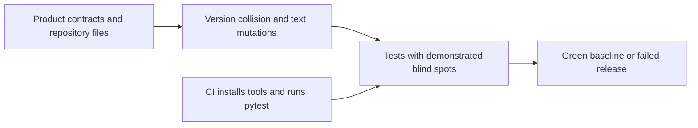
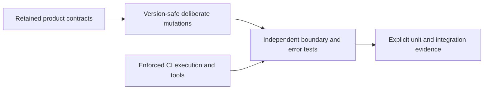
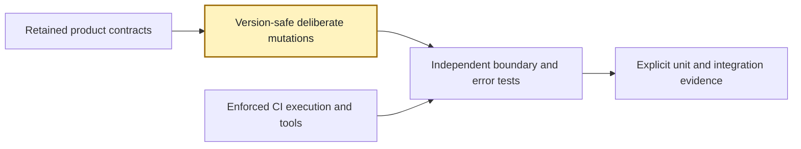
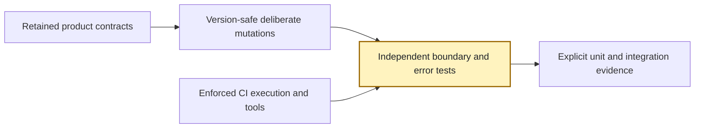
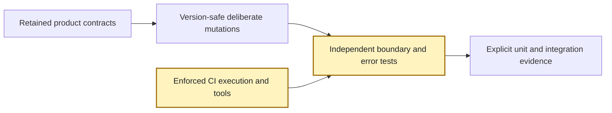
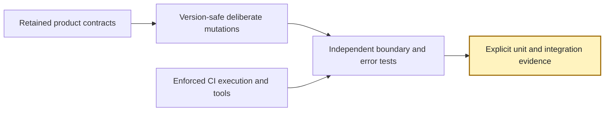

<!-- markdownlint-disable-file -->
# RPI Plan: Test maintainability

## Task Metadata

* Task ID: `test-maintainability-2026-10-06`
* Task slug: `test-maintainability`
* Plan date: `2026-10-06`
* Current checklist: four phases, seven tasks.
* Candidate revision: `candidate-2`; planner correction after the single critique of `candidate-1`
* Plan path: `.copilot-tracking/plans/2026-10-06/test-maintainability-plan.md`

## Executive Summary

The plan fixes release-version fixture collisions, makes policy mutations deliberate and diagnosable, adds independent regression oracles and boundary/error cases, and prevents hosted CI from silently losing test coverage. Four phases sequence fixture reliability, behavioral protection, CI enforcement, and integrated verification.

Planning is complete and the plan is implementation-ready. The single standard critique returned `Revise` for one missing SPDX CLI-failure requirement; that planner-owned correction is now resolved without increasing the test ceilings. Research provides high-confidence examples of the gaps; native-tool results and final release-branch execution remain implementation evidence to obtain, not planning claims of success. Product rendering, length policy, parser rules, SPDX behavior, and release metadata stay unchanged.

Full-plan implementation is complete: all tasks are checked, 67 cases were added with all original cases retained, and the available suite passed 182 cases with 15 explicit integration skips. Source review is eligible; fully provisioned hosted validation remains pending before any integration/merge/release-success claim.

### What You May Not Know

* The checkout remains the `0.1.0` baseline; PR #18 contains `0.2.0`. A correct fixture fix must work for both and for future versions without changing release metadata.
* Fixed synthetic SPDX versions and reviewed action/hash expectations are intentional; blindly deriving everything from production would erase independent expectations.
* Native integrations skipped locally. Unit-level evidence can be obtained here; a fully provisioned Python 3.12 hosted run is required before claiming complete integration success.
* Delivering this branch does not update PR #18 automatically. Pushing, merging, or applying commits to that PR requires separate user direction.

## Phase Checklist

### Before



### After



The same components gain reliable fixtures, independent checks, and explicit execution guarantees. No components or tests are removed; new cases live in existing modules.

<!-- rpi:phase id=P01 -->
### [x] P01: Establish release-safe, deliberate fixtures

Goals:
* Release metadata can advance without invalidating negative fixtures, and policy mutations fail clearly if their target disappears.

Dependencies:
* None.



Highlighted work: fixtures. These diagrams locate planned outcomes, not completed work.

<!-- rpi:task id=P01-T01 -->
#### [x] P01-T01: Remove release-version collisions

Goals:
* All four drift cases represent actual mismatches at every supported release baseline.

Requirements:
* `FR-001`, `NFR-001`, `NFR-002`.
* Actual seed/plugin/marketplace-metadata/marketplace-plugin drift is rejected independently; synchronized versions are accepted at `0.1.0`, `0.2.0`, `0.3.0`, and `1.0.0`.
* Existing negative-test intent and production equality enforcement remain; no manifest/version changes are part of this task.

Details:
* Existing fixtures inject `0.2.0`. Use either a guaranteed-different valid version derived from the baseline or isolated synchronized metadata; the choice is local implementation judgment.
* Assert that the injected value differs before invoking the validator. Keep a real repository smoke check and exercise version scenarios in temporary fixtures, not by editing tracked files.
* Ownership: existing four drift cases are modified, not removed. Maximum additions: eight collected cases for synchronized/negative multi-version coverage; field-specific rejection remains covered by the existing four.
* Smallest check: `python -m pytest -q tests/test_structure.py -k release_please_config`.

References:
* [tests/test_structure.py](../../../tests/test_structure.py): drift functions and `load_validator`.
* [scripts/validate_repo.py](../../../scripts/validate_repo.py): `validate_release_please_config`.
* [.copilot-tracking/research/2026-10-06/test-maintainability-research.md](../../research/2026-10-06/test-maintainability-research.md): F1 and C15.

Dependencies:
* None.

<!-- rpi:task id=P01-T02 -->
#### [x] P01-T02: Make negative fixture mutations intentional

Goals:
* Fixture failures distinguish an absent mutation target from a policy rejection failure.

Requirements:
* `FR-002`, `NFR-001`, `NFR-002`.
* Every existing exact-text mutation in structure tests has a checked precondition and changes the intended input; raw-source contracts remain testable.
* Release-config semantic mutations remain effective after formatting-only JSON changes.

Details:
* Prefer parsed changes for release-config JSON. Preserve raw text for action-version comments, hashes, exact source contracts, and inline workflow-script cases.
* A small shared checked-replacement helper within the test module is appropriate where it reduces repeated preconditions. Do not create a generalized mutation framework or rewrite production validators.
* Avoid accidental multi-target changes; declare whether one or all matches are intended. Existing workflow parser scalar conventions must be preserved.
* Ownership: all existing negative-policy cases stay. Maximum additions: two helper/precondition cases plus two formatting-equivalence cases, four collected cases total.
* Smallest check: `python -m pytest -q tests/test_structure.py`.

References:
* [tests/test_structure.py](../../../tests/test_structure.py): exact `.replace()` mutations.
* [release-please-config.json](../../../release-please-config.json): semantic config source.
* [.copilot-tracking/research/2026-10-06/test-maintainability-research.md](../../research/2026-10-06/test-maintainability-research.md): F2, C16.

Dependencies:
* `P01-T01`.

<!-- rpi:phase id=P02 -->
### [x] P02: Protect independently observable behavior

Goals:
* Tests fail when parsing, dependency inclusion, exact length policy, OCR selection, or output exclusion regresses, without depending on an erroneous production oracle.

Dependencies:
* `P01`.



Highlighted work: suite.

<!-- rpi:task id=P02-T01 -->
#### [x] P02-T01: Establish independent parser and SPDX oracles

Goals:
* Invalid requirements are rejected and incomplete runtime-package parsing cannot validate itself.

Requirements:
* `FR-003`, `FR-004`, `NFR-001`, `NFR-002`.
* Job parser rejection cases cover non-object root, missing/invalid source, each required array's type, incomplete/non-object items, and missing/non-object constraints.
* A controlled requirements file yields independently specified normalized package names and exact versions; malformed non-exact pins fail.
* An SBOM missing a required dependency fails against an independent expected package set, including a dependency other than the current hard-coded PyMuPDF case.
* SBOM preparation rejects missing/duplicate/wrong-version root metadata without altering the input file.
* SPDX preparation CLI invalid argument count, malformed JSON, and unreadable/missing input produce nonzero exit with the established usage or `SPDX SBOM preparation failed:` diagnostic; no success-shaped output.

Details:
* Keep existing valid shared-fixture parsing and SPDX official conformance cases. Fixtures may still reuse the helper when separate tests independently establish its contract.
* Use synthetic requirements content and explicit expected maps rather than copying current runtime versions throughout tests. Do not require a new JSON schema framework.
* Preserve fixed synthetic SPDX `0.2.0`; no indiscriminate replacement of version/hash literals.
* CLI failure probes invoke the existing script with temporary inputs via `sys.executable`; assert status and diagnostic category rather than environment-specific filesystem wording. Fit these failure assertions within the eight SPDX-case allowance using coherent existing-case extensions or grouped scenarios, not additional case-budget expansion.
* Ownership: parser cases remain in [tests/test_build_docx.py](../../../tests/test_build_docx.py); package parser/preparer/contract cases remain in [tests/test_spdx_sbom.py](../../../tests/test_spdx_sbom.py). No removals. Maximum additions: 12 parser cases and eight SPDX cases, 20 collected cases total.
* Smallest combined check: `python -m pytest -q tests/test_build_docx.py tests/test_spdx_sbom.py`.

References:
* [skills/resume-drafter/scripts/parse_job_requirements.py](../../../skills/resume-drafter/scripts/parse_job_requirements.py): supported validation.
* [docs/shared/job-requirements-schema.md](../../../docs/shared/job-requirements-schema.md): producer/consumer contract.
* [scripts/validate_release_sbom_contract.py](../../../scripts/validate_release_sbom_contract.py): `expected_runtime_packages` and contract.
* [scripts/prepare_spdx_sbom.py](../../../scripts/prepare_spdx_sbom.py): enrichment preconditions.
* [.copilot-tracking/research/2026-10-06/test-maintainability-research.md](../../research/2026-10-06/test-maintainability-research.md): F3/F4, C17/C19.

Dependencies:
* `P01-T02`.

<!-- rpi:task id=P02-T02 -->
#### [x] P02-T02: Protect length endpoints and rendered-content parity

Goals:
* Exact documented length limits, machine-readable reports, and output exclusion remain stable under future renderer changes.

Requirements:
* `FR-005`, `FR-006`, `NFR-001`, `NFR-002`.
* `474`/`601` body words fail; `475`/`600` pass. One/two pages pass and three fail independently of word budget.
* Under-minimum, over-maximum, and page-only failure produce nonzero status; passing reports preserve all values and types in the existing JSON contract.
* Alias/date/award/skill examples agree between counted body fields and actual rendered body paragraphs, excluding contact metadata and section headings.
* Actual unmet-requirement IDs/content remain absent from DOCX; invalid payload shape and experience ordering remain explicitly rejected.
* The existing report is a contract, not an illustrative example:

```json
{
  "wordCount": 475,
  "wordBudget": {"min": 475, "max": 600},
  "pageCount": 2,
  "pageCap": 2,
  "withinWordBudget": true,
  "withinPageCap": true
}
```

Details:
* Use temporary synthetic payloads and stub page counting for exact boundary cases. Retain the two real LibreOffice integrations and existing page-only failure tests.
* Assertions must pin documented endpoints independently, not derive expected bounds only from production constants.
* Add conversion-failure/missing-PDF cases without requiring LibreOffice; distinguish valid subprocess completion from absence of its promised artifact.
* Ownership: length tests in [tests/test_validate_resume_length.py](../../../tests/test_validate_resume_length.py); DOCX/exclusion/invalid-order cases in [tests/test_build_docx.py](../../../tests/test_build_docx.py). No removals. Maximum additions: 12 length cases and eight renderer cases, 20 collected cases total.
* Count expected body words using an independent test-side oracle; don't just call `count_words` or its private helpers to generate expectations.

References:
* [skills/resume-drafter/scripts/validate_resume_length.py](../../../skills/resume-drafter/scripts/validate_resume_length.py): counting/conversion/report behavior.
* [skills/resume-drafter/scripts/build_docx.py](../../../skills/resume-drafter/scripts/build_docx.py): aliases and rendering.
* [skills/resume-drafter/SKILL.md](../../../skills/resume-drafter/SKILL.md): 475-600-word/two-page gate.
* [.copilot-tracking/research/2026-10-06/test-maintainability-research.md](../../research/2026-10-06/test-maintainability-research.md): F5/F8, C18-C20.

Dependencies:
* `P01-T02`.

<!-- rpi:task id=P02-T03 -->
#### [x] P02-T03: Protect OCR decisions without system dependencies

Goals:
* Contributors can detect confidence/rotation/page-error regressions even when Tesseract is unavailable.

Requirements:
* `FR-007`, `NFR-001`, `NFR-002`.
* Tests establish valid-confidence averaging, exclusion of negative sentinel rows, no-word result, highest-confidence selection, no-word length tiebreak, and the supported 180-degree candidate.
* Out-of-range PDF pages and `--page` on image input raise the existing explicit errors.
* Dependency-free cases run without Tesseract while existing six real OCR cases remain optional locally and required in hosted CI.

Details:
* Stub `pytesseract.run_and_get_multiple_output` for deterministic text/TSV responses; keep real Pillow rotations and small PyMuPDF documents when useful.
* Do not assert exact natural OCR output across all environments or replace integrations with mocks. Do not prescribe new behavior for malformed TSV beyond current supported input.
* Ownership: [tests/test_ocr_extract.py](../../../tests/test_ocr_extract.py). No removals. Maximum additions: 10 collected cases.
* Smallest check: `python -m pytest -q tests/test_ocr_extract.py`.

References:
* [skills/career-document-builder/scripts/ocr_extract.py](../../../skills/career-document-builder/scripts/ocr_extract.py): `_mean_confidence`, `ocr_best_rotation`, page errors.
* [.copilot-tracking/research/2026-10-06/test-maintainability-research.md](../../research/2026-10-06/test-maintainability-research.md): F6, C13.

Dependencies:
* `P01-T02`.

<!-- rpi:phase id=P03 -->
### [x] P03: Enforce the hosted execution contract

Goals:
* CI cannot pass structural policy checks after losing its test runner or mandatory integration prerequisites.

Dependencies:
* `P02`.



Highlighted work: CI policy and suite's integration gates.

<!-- rpi:task id=P03-T01 -->
#### [x] P03-T01: Guard runner execution and native-tool requirements

Goals:
* Hosted validation runs the complete mandatory suite and reports absent native tools as failures, while local missing-tool skips stay intentional.

Requirements:
* `FR-008`, `NFR-001`, `NFR-002`, `NFR-003`.
* Structural checks reject removing, conditionally disabling, or allowing failure of the required pytest invocation and native-tool provisioning.
* Inherited/step pytest-selection or hosted-gating overrides and non-root working directories cannot bypass the full-suite contract; folded YAML is accepted without treating literal shell line breaks as whitespace.
* The existing Python 3.12/hash-locked SPDX environment and read-only CI permissions remain protected.
* With `GITHUB_ACTIONS=true`, absent Tesseract/LibreOffice fails explicitly. With native binaries absent locally, only relevant integrations skip; dependency-free cases still execute.
* Missing-tool gating is directly testable without globally installing/removing executables or executing a failing real suite.

Details:
* Extend [scripts/validate_repo.py](../../../scripts/validate_repo.py) with semantic checks scoped to the validation job rather than pinning every unrelated CI field.
* Match required runner/system commands deliberately; accept harmless whitespace/folded representation, reject bypasses, and retain existing reviewed install semantics.
* Follow `official_validator()` missing-tool failure as prior art. A small helper may live in `tests/conftest.py` if shared gating genuinely improves clarity; scope it to OCR/LibreOffice integration tests, not the whole suite. Existing per-module helpers are also valid.
* Current CI already provisions tools, so workflow edits should be unnecessary unless the implementation's verified invocation requires one; no broad workflow redesign.
* Ownership: [tests/test_structure.py](../../../tests/test_structure.py) for CI mutations; gating checks in existing OCR/length modules or the narrowly shared helper. No removals. Maximum additions: eight CI policy cases and four hosted/local gating cases, 12 collected cases.
* Smallest combined check: `python -m pytest -q tests/test_structure.py tests/test_ocr_extract.py tests/test_validate_resume_length.py`.

Guidance:
* [tests/test_structure.py](../../../tests/test_structure.py) now exposes `checked_replace(..., count=...)`; use it for raw-source CI mutations with declared match intent.

References:
* [.github/workflows/ci.yml](../../../.github/workflows/ci.yml): canonical hosted job.
* [scripts/validate_repo.py](../../../scripts/validate_repo.py): `validate_spdx_validation_lock` and `main`.
* [tests/test_spdx_sbom.py](../../../tests/test_spdx_sbom.py): `official_validator` prior art.
* [.copilot-tracking/research/2026-10-06/test-maintainability-research.md](../../research/2026-10-06/test-maintainability-research.md): F7, C21/C22.

Dependencies:
* `P02-T01`, `P02-T02`, `P02-T03`.

<!-- rpi:phase id=P04 -->
### [x] P04: Establish integrated, maintainable evidence

Goals:
* The delivered change documents how to verify it, preserves existing protections, and makes local/integration limits explicit.

Dependencies:
* `P03`.



Highlighted work: verification and documentation evidence.

<!-- rpi:task id=P04-T01 -->
#### [x] P04-T01: Verify preserved contracts and document execution

Goals:
* Maintainers have reproducible checks and an honest record of which environments actually passed.

Requirements:
* `FR-009`, `NFR-001`, `NFR-003`, `NFR-004`.
* All original 130 collected cases remain represented; no test removals or weaker assertions. Maximum aggregate additions: 74 collected cases, including parametrization expansions, from the locked task budgets.
* Structural validation and full available suite pass on the working branch; release-version scenarios pass for synchronized metadata while true drift still fails.
* Fully provisioned hosted Python 3.12 evidence has no missing-tool skips before claiming all mandatory integrations passed. If not available, record that gate as pending rather than claiming complete integrated validation.
* Reviewed production action hashes, dependency pins, plugin versions, public JSON shapes, OCR selection, and renderer behavior are unchanged except the explicitly scoped CI enforcement in `P03-T01`.

Details:
* First use task-specific runners, then `python scripts/validate_repo.py` and `python -m pytest -q -rs`. Repository has no configured lint/type-check tool; do not invent one.
* Re-run bounded in-memory counterfactuals or equivalent direct assertions: dependency omission, exact endpoint regression, and removed pytest/native provisioning must fail the new protections. Temporary sources must never replace tracked implementations.
* README contributor guidance should distinguish optional local skips from mandatory hosted execution and retain install prerequisites.
* Canonical targets: the five test modules, optional scoped test helper, repository validator, and README. Generated targets: temporary JSON/YAML/DOCX/PDF only, never committed.
* Implementation records actual commands/results/skip reasons in the changes record. No automatic push, merge, rerun, or release action is authorized.
* If fixing a genuine product bug is necessary to satisfy a newly written case, pause affected work for a user decision rather than quietly widening behavior.

Guidance:
* [tests/conftest.py](../../../tests/conftest.py) now owns `_require_native_tool` and runtime `requires_tesseract`/`requires_soffice` fixtures; contributor guidance should distinguish their local skips from hosted failures.

References:
* [README.md](../../../README.md): contributor test instructions.
* [tests](../../../tests): existing suite.
* [.github/workflows/ci.yml](../../../.github/workflows/ci.yml): hosted prerequisites.
* [.copilot-tracking/research/2026-10-06/test-maintainability-research.md](../../research/2026-10-06/test-maintainability-research.md): coverage map and evidence limitations.

Dependencies:
* `P03-T01`.

## User Decisions and Requirements

### Confirmed User Direction

* Address the previously identified release test failure and check all tests for maintainability and continued improvement.
* Use the completed all-test research as the basis for this planning stage.
* Planning produced the approved plan; the subsequent `/hve-core:rpi-implement` invocation authorizes full-plan source implementation within its boundaries.

### Planning Decisions and Feedback

| Group | Decision | Status | Owner | Rationale | Evidence | Impact |
|-------|----------|--------|-------|-----------|----------|--------|
| D1 | Plan focused improvements for all demonstrated test gaps, not only the release unblock | Confirmed direction | User | Original request explicitly included all tests | Research F1-F8 | Whole suite in scope |
| D2 | Preserve runtime behavior; choose local fixture implementation idioms within binding outcomes | Settled | Planner | Evidence supports tests/contracts, not a product rewrite | Research alternatives | No material intake decision |
| D3 | Standard critique depth | Settled | Contract default | No explicit deep-critique request | rpi-plan contract | One final-candidate assessment |
| D4 | Fixture isolation versus guaranteed-different versions is local implementation judgment | Settled | Planner | Both evidence-backed alternatives satisfy the same outcomes | Research F1 alternatives | `P01-T01`; no architecture choice |
| D5 | No material planning walkthrough required | Settled | Planner | Confirmed all-test direction resolves scope; no new feature/behavior changes selected | D1/D2 | Proceed to critique without acknowledgment prompt |

## Planning Readiness and Next Step

| Field | Record |
|-------|--------|
| Planning execution and readiness | Complete; Ready for implementation. Single standard critique complete; PC-001 resolved in candidate-2 |
| Decision participation | user-owned; standalone invocation |
| Blockers | No source-review blocker; hosted integration evidence pending before complete integration acceptance |
| Latest critique | [.copilot-tracking/reviews/plans/2026-10-06/test-maintainability-plan-critique.md](../../reviews/plans/2026-10-06/test-maintainability-plan-critique.md): Complete / Revise; sole finding PC-001 resolved by planner, no repeat assessment |
| Relevant research | [.copilot-tracking/research/2026-10-06/test-maintainability-research.md](../../research/2026-10-06/test-maintainability-research.md) |
| Plan | `.copilot-tracking/plans/2026-10-06/test-maintainability-plan.md` |
| Changes-record role | [.copilot-tracking/changes/2026-10-06/test-maintainability-changes.md](../../changes/2026-10-06/test-maintainability-changes.md) contains completed-task and actual validation evidence |
| Continuation owner | user |
| Required gates or confirmations | Planning gates passed: critique consumed, finding disposed, summary synchronized, self-check complete. Hosted runtime evidence remains an implementation gate |
| Next action | Full-plan implementation complete; eligible standalone source review: /rpi-review. Hosted integration gate explicitly pending |

## Goals

* Release-independent negative fixtures and independent regression oracles.
* Durable parser, OCR, renderer, and length-policy coverage.
* Hosted CI cannot silently omit required integration work.

## Scope and Non-Goals

### In Scope

* Existing five test modules, scoped fixture helpers, CI structural validation, native-tool test gating, and contributor test documentation.
* No new research activation: current evidence answers the planning-critical questions.
* Test ownership/additions are locked per task: eight + four + twenty + twenty + ten + twelve = 74 maximum added collected cases. This is a scope ceiling, not a target to fill.
* Exact removals: none. Existing tests may be refactored while retaining their semantic coverage.

### Non-Goals

* Product behavior changes, broad framework/renderer rewrites, new dependencies, agent behavior evaluations, automatic push/merge/release operations, or global native-tool installation.
* Production scripts other than the scoped repository CI validator remain read-only implementation targets unless an explicit subsequent decision changes scope.

## Functional Requirements

* `FR-001`: True version drift is rejected independently of the current release; synchronized metadata succeeds.
* `FR-002`: Negative fixture mutations establish their preconditions and preserve semantic/raw-source policy coverage.
* `FR-003`: Requirements-parser invalid-input boundaries are independently protected.
* `FR-004`: SPDX package parsing and preparation have independent expected outcomes, not self-confirming oracles; CLI failures retain nonzero status and explicit diagnostics.
* `FR-005`: Inclusive 475-600-word/two-page policy and report/error outcomes are protected.
* `FR-006`: Rendered output excludes actual unmet content and maintains independently checked body-word parity.
* `FR-007`: OCR confidence/rotation/page-error logic has deterministic native-tool-free coverage.
* `FR-008`: Hosted CI retains mandatory test execution/provisioning and fails absent integration prerequisites.
* `FR-009`: Documentation and implementation evidence distinguish actual local, hosted, and release-scenario results.

## Non-Functional Requirements

* `NFR-001`: Preserve product behavior and intentional policy tripwires; no weakened assertions, dependency additions, or exact test removals.
* `NFR-002`: Fixtures are isolated, deterministic, and readable, and expectations remain independent of the behavior under test.
* `NFR-003`: Mandatory hosted integrations never succeed through missing-tool skips; local optional availability is reported explicitly.
* `NFR-004`: Changes remain scoped to owned canonical targets; generated test artifacts are temporary and no secrets are stored.

## Risks and Open Questions

| Priority | Type | Item | Affected work | Impact | Smallest action | Owner |
|----------|------|------|---------------|--------|-----------------|-------|
| High | Existing blocker | PR #18 needs the eventual test fix applied separately | `P01-T01`, `P04-T01` | Local implementation does not update release PR | User-directed merge/apply and subsequent CI outside this plan's automatic actions | User |
| Medium | Environment | Native tools and official SPDX unavailable here | `P04-T01` | Cannot claim full integration success locally | Provisioned hosted evidence; carry pending gate if unavailable | Implementer |
| Medium | Test design | Shared production-derived expectations can hide regressions | `P02-T01`, `P02-T02` | False confidence | Independent synthetic expected maps and endpoint values | Implementer |
| Medium | Behavioral discovery | New tests expose an unresearched product defect | `P02-T01` through `P02-T03` | May exceed preserved-behavior scope | Stop affected work and request a scoped decision | User |
| Low | Maintenance | Added parametrization exceeds locked case budgets | All test tasks | Unbounded work | Prefer consolidating overlapping cases; obtain decision before expanding ceiling | Implementer |
| Low | Diagram preview | Dual-theme rendered previews not available | Plan-wide | Source styling is not visual evidence | Source initialization checked; preserve readable labels/custom colors | Planner |

## Dependencies

* Existing runtime/dev dependencies and pytest patterns; no new packages.
* Native Tesseract, LibreOffice, and official SPDX validator in Python 3.12 CI for integrated acceptance.
* User direction for remote actions; standalone planning/implementation do not imply authorization to alter PR #18.

## Sources

* [.copilot-tracking/research/2026-10-06/test-maintainability-research.md](../../research/2026-10-06/test-maintainability-research.md): F1-F8, C1-C22, W1-W2.
* HVE planning extensions survey: no available non-lifecycle skill/subagent description requires activation for this test-planning topic. Domain security/performance/privacy planners do not match. Existing Python guidance is scoped to test idioms; lifecycle research is not reactivated without a gap.
* Shared tracking conventions: stable task identity, relative artifact links, no line-number locators.

## Critique Disposition

* Critique depth and provenance: `standard`; default.
* Critique execution: `Complete`; verdict `Revise`; one medium finding, now resolved.
* Initial attempt consumed: yes.
* Recovery attempt consumed: no.
* Attempt provenance: initial attempt `test-maintainability-20261006-initial-01`; task `test-maintainability-2026-10-06`; candidate `candidate-1`.
* Saved-content SHA256 boundary before reservation metadata: `933479f39142eaa64e26d0ef0a14a83fb8f0363f3591289b8f93916cccf5349d`. Only this Critique Disposition reservation metadata was changed afterward.
* Output: `.copilot-tracking/reviews/plans/2026-10-06/test-maintainability-plan-critique.md`.
* Current-run provenance: uninterrupted planning execution in session `f9571e87-e6b8-41ac-aabd-9b6aba0eec53`; persist/read-back/activation sequence owns this initial reservation. No parent state exists. A later run cannot replay it.
* Recovery eligibility and consent: not applicable.
* Assessment provenance: synchronous fresh-context critique invocation returned Complete/Revise; saved output read back and reconciled with its return. Original reservation/hash remains above. No retry or closure critique.
* Final plan response: candidate-2 adds bounded CLI failure assertions and synchronizes summary/readiness; all case ceilings and confirmed scope retained.
* Reconciliation note: the activation/critique prose counted eight tasks, but the actual candidate consistently contains seven marked tasks across four phases. All seven are covered by the critique table and implemented; no missing task or scope change. Preserve the critique as historical assessment evidence.

| Critique run and finding | Disposition | Action owner | Exact resolving evidence | Decision route | Plan response or residual risk |
|--------------------------|-------------|--------------|--------------------------|----------------|--------------------------------|
| initial-01 / PC-001 | Resolved | Planning parent | `P02-T01` Requirements explicitly cover invalid arguments/malformed JSON/unreadable input with nonzero status and existing diagnostics; Details retain eight-case SPDX ceiling | Direct correction; no divergent user decision | `FR-004` and summary/readiness synchronized; native runtime gate remains explicit |

## Artifact Self-Check

* [x] Reader-first summary and Phase Checklist precede decision/readiness/supporting records.
* [x] Every phase/task has the required blocks and stable markers; dependencies are acyclic.
* [x] All `FR-001` through `FR-009` and `NFR-001` through `NFR-004` appear in task Requirements.
* [x] Scope, test ownership, exact removals, maximum additions, canonical/generated targets, semantic and regression coverage are locked.
* [x] Existing source links are relative; identifiers and commands use backticks.
* [x] Before/After/phase diagrams use stable nodes and prescribed theme variables; custom fill has explicit text color. No new component is falsely represented as pre-existing.
* [x] Confirmed all-test direction is preserved; no unresolved intake/planning decisions require a walkthrough.
* [x] One final-candidate critique consumed and dispositions resolved.
* [x] Summary/readiness reconciled with actual critique evidence.
* Checked sections: all plan sections, relative links, task blocks, diagram source settings, recorded critique output and PC-001 resolution.
* Missing or limited evidence: dual-theme rendering not verified; hosted runtime results belong to implementation.

## Follow-Up Items

* None

## Handoff

* Authoritative implementation handoff: Planning Readiness and Next Step.
* Standalone continuation owner: user; full-plan implementation complete, all current markers checked; exact eligible command `/rpi-review`.
* Implementation evidence: [.copilot-tracking/changes/2026-10-06/test-maintainability-changes.md](../../changes/2026-10-06/test-maintainability-changes.md); no remote actions authorized.
